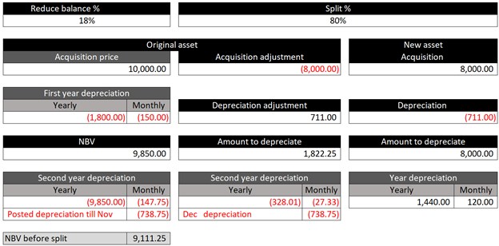

---
# required metadata

title: Reduce balance depreciation after a split
description: This topic describes the method that is used in Fixed assets to calculate depreciation after an asset is split by using the reduce balance method.
author: moaamer
ms.date: 11/17/2020
ms.topic: article
ms.prod: 
ms.technology: 

# optional metadata

ms.search.form: 
# ROBOTS: 
audience: Application User
# ms.devlang: 
ms.reviewer: roschlom

# ms.tgt_pltfrm: 
ms.custom: 4464
ms.assetid: 5f89daf1-acc2-4959-b48d-91542fb6bacb
ms.search.region: Global
# ms.search.industry: 
ms.author: moaamer
ms.search.validFrom: 2020-11-17
ms.dyn365.ops.version: 10.0.14
---

# Reduce balance depreciation after a split

[!include [banner](../includes/banner.md)]

This topic describes the method that is used in Fixed assets to calculate depreciation after an asset is split to another asset by using the reduce balance method. The depreciation year that is configured in the asset book is the fiscal year. For more information, see [Reduce balance depreciation](reduce-balance-depreciation.md) and [Split a fixed asset](tasks/split-fixed-asset.md).

If you split a fixed asset during a fiscal period that is later than the period when the asset was acquired, the reduced balance depreciation will account for the asset's net book value (NBV) for the previous year. It will also account for the acquisition and depreciation adjustment transactions that were generated from the transaction that split the asset. This behavior assumes that the asset was acquired in one fiscal year and split in a later fiscal year. The amount that must be depreciated for the original asset after the split reflects the asset's NBV before the asset was split, and the acquisition and depreciation adjustment transaction that was posted for the split.

For example, the following conditions are in effect:

- The fiscal period is from June 30 to July 1.
- The reducing balance percentage is 18 percent, and an asset is acquired in June 2019 at an acquisition price of $10,000.
- The depreciation of the first fiscal year equals $18,000, the monthly depreciation equals $150, and the asset is then depreciated until November 2019, in the amount of $738.75.
- In November 2019, 80 percent of the asset is split to another fixed asset.

The amount to depreciate for the original asset is $1,822.25. This amount equals the NBV before the split transaction is posted ($9,111.25), plus the acquisition adjustment that is generated during posting of the split transaction (-$8,000), plus the depreciation adjustment that is generated during the split transaction ($711). Therefore, the depreciation for the second year is (1,822.25 × 18 percent) ÷ 12 = $27.33.

The amount to depreciate for the new fixed asset in the first year is (8,000 × 18 percent) ÷ 12 = $120.

[!INCLUDE[footer-include](../../includes/footer-banner.md)]