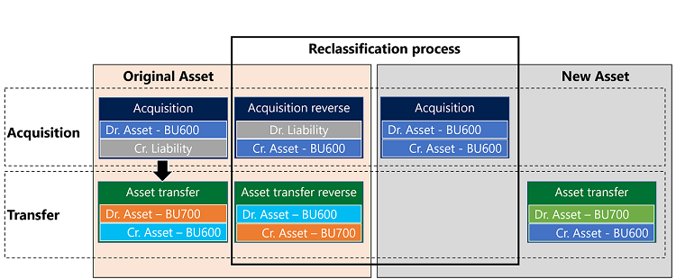

# Reclassify fixed assets

[!include [banner](../../includes/banner.md)]

To reclassify a fixed asset, you must transfer it to a new fixed asset group or assign a new fixed asset number to it in the same group. 

When a fixed asset is reclassified:

- All books for the existing fixed asset are created for the new fixed asset. Any information that was set up for the original fixed asset is copied to the new fixed asset. The status of the books for the original fixed asset is Closed. 

- The new books for the new fixed asset contain the date of the reclassification in the **Acquisition date** field. The date in the **Depreciation run date** field is copied from the original asset information. If the depreciation has already started, the **Date when depreciation was last run** field displays the date of the reclassification. 

- The existing fixed asset transactions for the original fixed asset are canceled and regenerated for the new fixed asset.

- When an asset that has a transfer transaction has been reclassified, the system will display a message in the **Action center** to indicate that a transfer transaction wasn't completed during the reclassification process. It's necessary to complete a transfer transaction to move the existing reclassification transactions to the appropriate financial dimensions. 

   During the reclassification process, the system runs the following actions to reclassify the asset balance from the original asset to the new asset. 
   
   - The reclassification process copies the data from the original fixed asset book to the new fixed asset book.

   - The reclassification transaction uses information from the original posted acquisition that includes financial dimension information that is included in the acquisition transaction.  
   
   - At the same time, the reclassification process reverses the original asset acquisition and asset transfer transaction. 

The following diagram and procedure provide an example of the reclassification process. 

Follow these steps to reclassify a fixed asset:

1. Go to **Fixed assets > Periodic tasks > Reclassification.**
2. In the **Fixed asset group** field, select the group to reclassify.
3. In the **Fixed asset number** field, select the fixed asset to reclassify.
4. In the **New fixed asset group** field, select a group to transfer the fixed asset to.
    * If the new fixed asset group is attached to a number sequence, the **New fixed asset number** field is updated with the number from the new fixed asset group number sequence. Otherwise, the **New fixed asset number** field is updated with the number from the number sequence that is set up on the **Fixed asset parameters** page. If a number sequence is not set up on the **Fixed asset parameters** page, enter a number in the **New fixed asset number** field.  
5. In the **Reclassification date** field, enter a date.
6. In the **Voucher series** field, enter or select a value.
7. Select **OK**.

[!INCLUDE[footer-include](../../../includes/footer-banner.md)]
