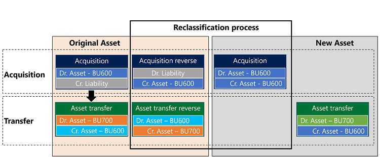

# Reclassify fixed assets

[!INCLUDE [banner](../../includes/banner.md)]

To reclassify a fixed asset, transfer it to a new fixed asset group or assign a new fixed asset number to it in the same group.

When you reclassify a fixed asset:

- The system creates all books for the new fixed asset. It copies any information that you set up for the original fixed asset to the new fixed asset. The status of the books for the original fixed asset is **Closed**.

- The new books for the new fixed asset contain the date of the reclassification in the **Acquisition date** field. The system copies the date in the **Depreciation run date** field from the original asset information. If the depreciation already started, the **Date when depreciation was last run** field displays the date of the reclassification.

- The system cancels and regenerates the existing fixed asset transactions for the original fixed asset for the new fixed asset.

- When you reclassify an asset that has a transfer transaction, the system displays a message in the **Action center** to indicate that a transfer transaction wasn't completed during the reclassification process. You need to complete a transfer transaction to move the existing reclassification transactions to the appropriate financial dimensions.

   During the reclassification process, the system runs the following actions to reclassify the asset balance from the original asset to the new asset.

  - The reclassification process copies the data from the original fixed asset book to the new fixed asset book.

  - The reclassification transaction uses information from the original posted acquisition that includes financial dimension information that is included in the acquisition transaction.  

  - At the same time, the reclassification process reverses the original asset acquisition and asset transfer transaction.

The following diagram and procedure provide an example of the reclassification process.

Follow these steps to reclassify a fixed asset:

1. Go to **Fixed assets > Periodic tasks > Reclassification.**
1. In the **Fixed asset group** field, select the group to reclassify.
1. In the **Fixed asset number** field, select the fixed asset to reclassify.
1. In the **New fixed asset group** field, select a group to transfer the fixed asset to.
    - If the new fixed asset group is attached to a number sequence, the system updates the **New fixed asset number** field with the number from the new fixed asset group number sequence. Otherwise, the system updates the **New fixed asset number** field with the number from the number sequence that you set up on the **Fixed asset parameters** page. If you don't set up a number sequence on the **Fixed asset parameters** page, enter a number in the **New fixed asset number** field.  
1. In the **Reclassification date** field, enter a date.
1. In the **Voucher series** field, enter or select a value.
7. Select **OK**.

[!INCLUDE[footer-include](../../../includes/footer-banner.md)]
