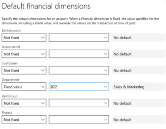
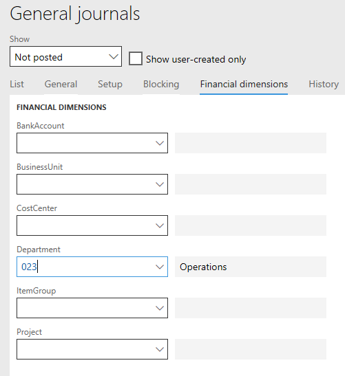
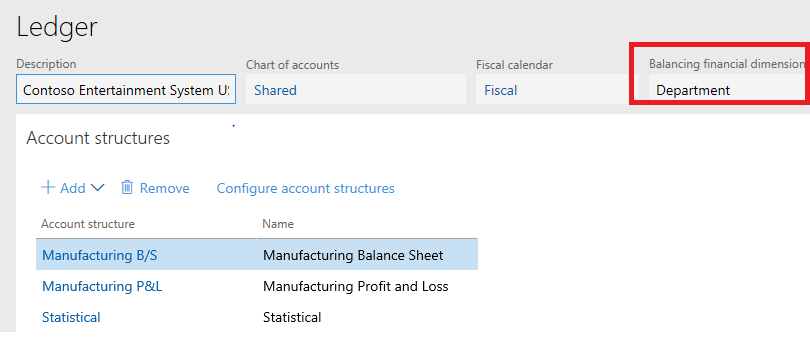
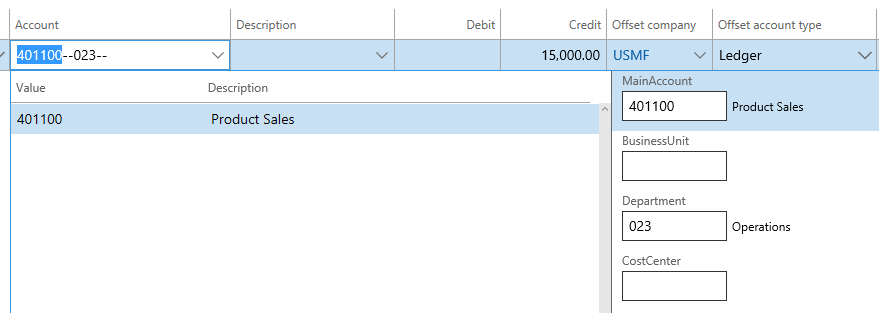

---
# required metadata

title: Financial dimensions and posting 
description: This article explains the components that make up the chart of accounts and how the components work together.
author: aprilolson
ms.date: 10/24/2022
ms.topic: article
ms.prod: 
ms.technology: 

# optional metadata

ms.search.form: LedgerChartofAccounts,DimensionDetails
# ROBOTS: 
audience: Application User
# ms.devlang: 
ms.reviewer: twheeloc
# ms.tgt_pltfrm: 
ms.assetid: c64eed1d-df17-448e-8bb6-d94d63b14607
ms.search.region: Global
# ms.search.industry: 
ms.author: aolson
ms.search.validFrom: 2016-02-28
ms.dyn365.ops.version: July 2017 update

---

# Financial dimensions and posting 

[!include [banner](../includes/banner.md)]

When you plan and set up your chart of accounts, you must consider how the various components will work together when you post a document or journal. These components include account structures, advanced rules, and balancing and fixed dimensions. This article explains what each component is and how the components work together.

## Chart of accounts and financial dimension components

A rich, rule-based system is used to define valid combinations of main accounts and financial dimension values. This section gives a brief overview of the functionality of each component and explains where you can find the component.

### Account structures

An account structure is required when you set up your ledger. You must define and activate at least one account structure, and you must assign it to the ledger. The account structure must have the main account in it. You can define the order of segments that works best for the business. After the main account is defined, the system can determine the account structure that is used. By putting the main account first or near the front of a structure, you can help limit the values and also help the system apply the last known valid value as a default value. You can have up to 10 additional financial dimensions in the account structure. The account structure defines which dimension values are valid in combination with other values. It also defines whether dimension values must be entered.

### Advanced rules

Advanced rules are an optional component when you set up the chart of accounts. You can add as many advanced rules as you want to an account structure. Advanced rules are often used to handle scenarios where additional financial dimensions must be tracked when specific criteria are met. For example, if you use a Travel expense account, you might want to track additional information, such as the event that the employee is traveling for. If there are multiple advanced rules, they are applied in alphabetical order, based on the names of the rules. The segments that a rule adds can be applied only after the segments of the account structure.

### Balancing dimension

You can optionally define a balancing financial dimension. On the **Ledger** page, you can define the financial dimension that should be balanced. Then, whenever transactions are posted to that financial dimension, the system automatically creates and posts entries to make the financial dimension balanced.

### Default/fixed financial dimensions on the main account

Default dimensions come from various places, such as master records (for example, customer or vendor records), document headers, and the main account. This article focuses on default dimensions on the main account by legal entity. You can define whether a main account has a **Not fixed** or **Fixed** value for each financial dimension that is used across all account structures for the ledger. If a financial dimension is **Not fixed**, it uses a default value, but that value can be overwritten. This behavior applies to all default values in the system, even default values that come from master records. If a financial dimension is set to a **Fixed** value, that value is always applied, regardless of whether it came from somewhere as a default value or the user entered it.

## Order in which default dimensions are applied during posting

People often have questions about the order that the various components run in. It's very important that you understand the order that default dimensions are applied in, because this behavior affects the approach that you take to setup.

> [!NOTE]
> This information applies only to the application of default dimensions in the application. If you import data by using Microsoft Excel or the Data Management Framework, the behavior differs.

### Example 1

**Account structure**

| Main account            | Business unit           | Department              | Cost center             |
|-------------------------|-------------------------|-------------------------|-------------------------|
| All values are allowed. | All values are allowed. | All values are allowed. | All values are allowed. |

**Main account**

| Main account | Name          | Legal entity | Department                                 |
|--------------|---------------|--------------|--------------------------------------------|
| 401100       | Product Sales | USMF         | Fixed – 022 Sales and Marketing department |

The following illustration shows the fixed default dimension that is set on main account 401100.

For this very basic example, we will enter a general journal where the Department dimension is set to use the default value **023** (Operations). We will enter and post a ledger account. The following illustration shows the default financial dimension on the general ledger header.

The default dimension on the journal header will cause department 023 to be applied by default on the sales account line. The following illustration shows the general journal line, where the **023** default dimension value from the header is applied.

However, when the line is posted, the fixed dimension is applied, and the line is posted to department 022. The following illustration shows the posted voucher, where the fixed dimension is applied for the sales account.

### Example 2

This example uses the same setup as the first example. However, we will add a second component and use the Department dimension as a balancing dimension. In the following illustration, **Department** is set as the balancing financial dimension for the USMF ledger.

When the same journal header setup is used, and the same transaction is posted, the fixed dimension is applied first. Then the balancing logic is applied to help guarantee that every department has a balanced entry. The following illustration shows voucher transactions that include the balancing entry after the fixed dimension is applied.

### Example 3

In this example, we will add an advanced rule. The advanced rule specifies that if sales account 401100 and department 022 (Sales and Marketing) are used, the system should track an additional segment that is named Customer.

This example is important because of the order. The account structure is determined after the main account is entered. If you refer to the account structure setup, the system can determine that the main account, business unit, department, and cost center are relevant. At this point, the advanced rule hasn't been triggered, because fixed dimensions aren't applied until default dimensions have been applied for the journal voucher during posting. In the following illustration, the Customer segment isn't present, because the criteria for the advanced rule haven't been met.

The posting won't be successful, because the fixed dimension was applied at the end of the process. Dimension validation determines that the Customer segment is required if the main account is 401100 and the department is 022. Posting can't occur because of the validation error. The following illustration shows the message that appears after dimension validation determines that Customer is a required segment.

In this example, you must overwrite the default value so that the advanced rule is triggered and you can enter the Customer segment. However, this solution isn't always possible, and some users aren't even aware of the posting rules. Therefore, it's important that you understand the order that default dimensions are applied in when you set up your chart of accounts.

To achieve what you want in this example, you can change the configuration in several ways. For example, you can create a new account structure for sales accounts and include the Customer segment in the structure. You can also add more rows in an existing account structure, and specify the main account and valid department values. Then, in the additional customer structure, you might find it useful to have a separate account structure of sales accounts where the Customer segment is present.

## Additional resources 

Some of the following resources refer to an earlier version of our software. However, much of the information about the application of default dimensions and many of the concepts are the same in the earlier version, and the references are still valid.

[Balanced journals for interunit accounting](example-balanced-journals-interunit-accounting.md)

[Plan your chart of accounts](plan-chart-of-accounts.md) 

[Planning your chart of accounts in AX 2012 blog](/archive/blogs/axsa/planning-your-chart-of-accounts-in-ax-2012-part-1-of-7) – This link goes to part 1 of a seven-part series.

[Dimension defaulting in accounting distributions](/archive/blogs/ax_gfm_framework_team_blog/dimension-defaulting-in-accounting-distributions-part-1-introduction)

[Dimension defaulting in Dimensions framework](/archive/blogs/ax_gfm_framework_team_blog/dimension-defaulting-part-1-financial-dimensions-discovery)

[!INCLUDE[footer-include](../../includes/footer-banner.md)]
