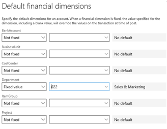
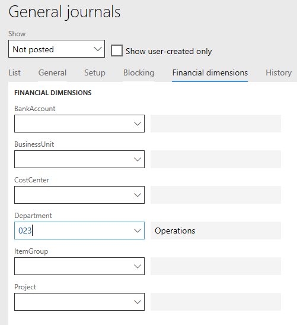
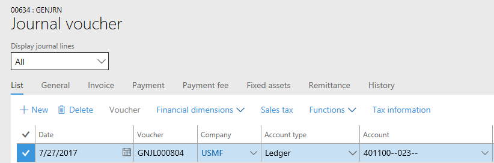
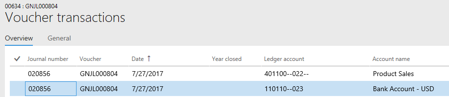
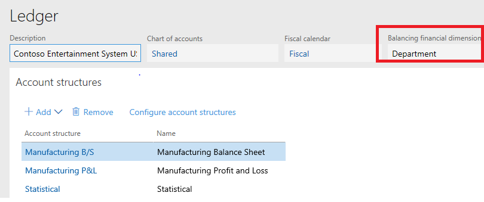
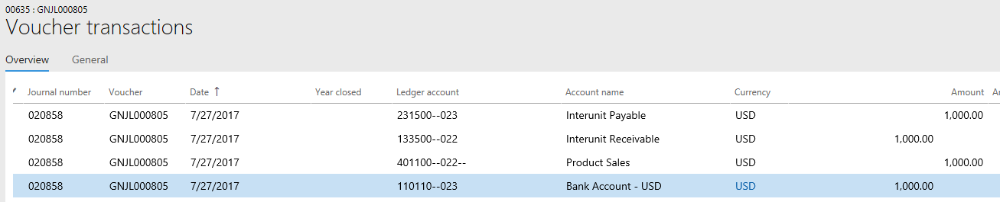
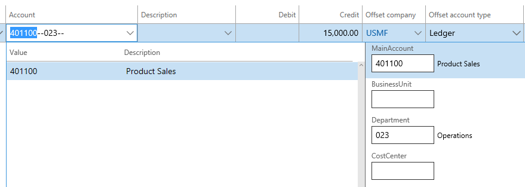
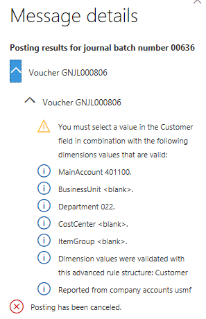

# Default dimensions

[!include [banner](../includes/banner.md)]

Default dimensions come from various places, such as master records (for example, customer or vendor records), document headers, and the main account. This article explains how default and fixed dimension values work on main accounts and how dimensions are applied during posting. For information about how account structures, advanced rules, and balancing dimensions define valid combinations of main accounts and dimension values, see [Financial dimensions](financial-dimensions.md).

## Default and fixed financial dimensions on the main account

You can define whether a main account has a **Not fixed** or **Fixed** value for each financial dimension that is used across all account structures for the ledger. If a financial dimension is **Not fixed**, it uses a default value, but that value can be overwritten. This behavior applies to all default values in the system, even default values that come from master records. If a financial dimension is set to a **Fixed** value, that value is always applied, regardless of whether it came from somewhere as a default value or the user entered it.

## Default dimension values

In addition to fixed and default dimensions on main accounts described above, you can also configure dimensions to automatically copy values from master records.

You can use values from master records, such as customer and vendor, as default values in new dimensions. When you create the new dimensions, you enter the master record ID in the dimension values for those master records. For example, when you create a new customer, you enter the customer ID in the customer dimension. When you create sales orders, invoices, or other documents that require a customer ID, the existing defaulting rules add the customer ID to the document.

A setting in the dimension controls this feature. This setting is named **Copy values to this dimension on each new [Dimension name] created**, where **[Dimension name]** is the name of the dimension. By default, the feature is turned off. However, you can turn it on at any time.

If records already exist for the dimension, turning on the feature updates the master records. However, existing documents and transactions aren't updated.

If you're using a template to create a master record, make sure that the template value for the master dimension is blank. For example, if you're creating customers from a template, make sure that the customer dimension in the template is blank. The customer dimension value defaults from the new customer number when you create the new customer.

> [!NOTE]
> You can intentionally default a dimension value to blank by assigning a fixed dimension value of blank on a main account (via *Legal entity overrides*).
>
> If you don't intend for a blank dimension value to be defaulted, ensure that the dimension's fixed value is set to **Not fixed**, or provide a valid fixed value that complies with the account structure.

## Order in which default dimensions are applied during posting

People often have questions about the order that the various components run in. It's very important that you understand the order that default dimensions are applied in, because this behavior affects the approach that you take to setup.

> [!NOTE]
> This information applies only to the application of default dimensions in the application. If you import data by using Microsoft Excel or the Data Management Framework, the behavior differs.

> [!NOTE]
> Derived dimensions are applied at data-entry time, when a user manually enters a driving dimension value on a page, not during posting. This means derived dimensions run before the posting-time sequence described in the examples below. For more information, see [Derived dimensions](derived-dimensions.md).

### Example 1

**Account structure**

| Main account            | Business unit           | Department              | Cost center             |
|-------------------------|-------------------------|-------------------------|-------------------------|
| All values are allowed. | All values are allowed. | All values are allowed. | All values are allowed. |

**Main account**

| Main account | Name          | Legal entity | Department                                 |
|--------------|---------------|--------------|--------------------------------------------|
| 401100       | Product Sales | USMF         | Fixed – 022 Sales and Marketing department |

The following illustration shows the fixed default dimension that is set on main account 401100.

For this very basic example, we will enter a general journal where the Department dimension is set to use the default value **023** (Operations). We will enter and post a ledger account. The following illustration shows the default financial dimension on the general ledger header.

The default dimension on the journal header will cause department 023 to be applied by default on the sales account line. The following illustration shows the general journal line, where the **023** default dimension value from the header is applied.

However, when the line is posted, the fixed dimension is applied, and the line is posted to department 022. The following illustration shows the posted voucher, where the fixed dimension is applied for the sales account.

### Example 2

This example uses the same setup as the first example. However, we will add a second component and use the Department dimension as a balancing dimension. In the following illustration, **Department** is set as the balancing financial dimension for the USMF ledger.

When the same journal header setup is used, and the same transaction is posted, the fixed dimension is applied first. Then the balancing logic is applied to help guarantee that every department has a balanced entry. The following illustration shows voucher transactions that include the balancing entry after the fixed dimension is applied.

### Example 3

In this example, we will add an advanced rule. The advanced rule specifies that if sales account 401100 and department 022 (Sales and Marketing) are used, the system should track an additional segment that is named Customer.

This example is important because of the order. The account structure is determined after the main account is entered. If you refer to the account structure setup, the system can determine that the main account, business unit, department, and cost center are relevant. At this point, the advanced rule hasn't been triggered, because fixed dimensions aren't applied until default dimensions have been applied for the journal voucher during posting. In the following illustration, the Customer segment isn't present, because the criteria for the advanced rule haven't been met.

The posting won't be successful, because the fixed dimension was applied at the end of the process. Dimension validation determines that the Customer segment is required if the main account is 401100 and the department is 022. Posting can't occur because of the validation error. The following illustration shows the message that appears after dimension validation determines that Customer is a required segment.

In this example, you must overwrite the default value so that the advanced rule is triggered and you can enter the Customer segment. However, this solution isn't always possible, and some users aren't even aware of the posting rules. Therefore, it's important that you understand the order that default dimensions are applied in when you set up your chart of accounts.

To achieve what you want in this example, you can change the configuration in several ways. For example, you can create a new account structure for sales accounts and include the Customer segment in the structure. You can also add more rows in an existing account structure, and specify the main account and valid department values. Then, in the additional customer structure, you might find it useful to have a separate account structure of sales accounts where the Customer segment is present.

## Additional resources 

Some of the following resources refer to an earlier version of our software. However, much of the information about the application of default dimensions and many of the concepts are the same in the earlier version, and the references are still valid.

[Balanced journals for interunit accounting](example-balanced-journals-interunit-accounting.md)

[Plan your chart of accounts](plan-chart-of-accounts.md) 

[Planning your chart of accounts in AX 2012 blog](/archive/blogs/axsa/planning-your-chart-of-accounts-in-ax-2012-part-1-of-7) – This link goes to part 1 of a seven-part series.

[Dimension defaulting in accounting distributions](/archive/blogs/ax_gfm_framework_team_blog/dimension-defaulting-in-accounting-distributions-part-1-introduction)

[Dimension defaulting in Dimensions framework](/archive/blogs/ax_gfm_framework_team_blog/dimension-defaulting-part-1-financial-dimensions-discovery)

[!INCLUDE[footer-include](../../includes/footer-banner.md)]
