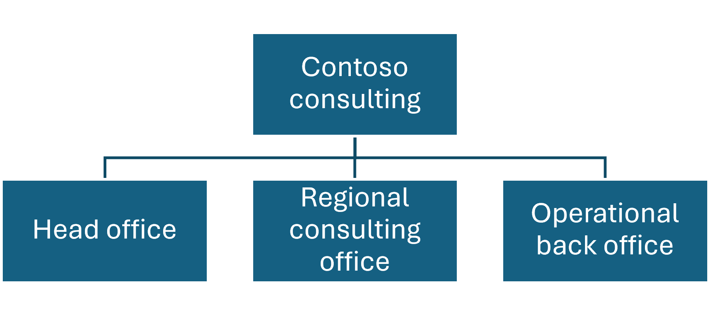

# Establishments and registration IDs in General journals

Starting in Dynamics 365 Finance version 10.0.48, you can enable the **Establishment and Registration ID governance on invoices** feature in Feature management to control how establishments and registration IDs are applied to invoices across finance workflows. 

This feature introduces validation rules that determine:
 - Whether an **Establishment** must be specified on an invoice
 - Which **Registration IDs** are required for each invoice party
 - When invoice posting is blocked because required regulatory identifiers are missing
 - How registration IDs are resolved and immutably stored at posting time

These validations apply consistently across all invoice entry points, including invoices that originate from General journals.

## What is an establishment?

In Dynamics 365 Finance, an **establishment** represents an operational unit of a legal entity that performs business activities on a stable basis and might require its own regulatory identifiers for invoicing or reporting.  

A single legal entity can have one or more establishments. Although these establishments share the same legal identity, they can maintain separate operational identities for invoicing and compliance purposes. 

Establishments are modeled by:
 - Using existing Operating units
 - Including those operating units in an organizational hierarchy that is assigned the **Enterprise establishment structure** purpose

Only operating units that are explicitly included in this hierarchy are treated as valid establishments by the system. 

For more information, see Establishments. 

## General ledger invoice scenarios

General journals in the General ledger can be used to create invoices for customers in Accounts receivable and vendors in Accounts payable. When the establishment governance feature is enabled, invoices created from General ledger journals are subject to the same establishment and registration ID requirements as invoices that originate from other modules. This includes any journals that have been created but not posted. Once the feature is enabled, review all open journals for the Registration IDs and Establishments. If they are setup to default to new journals they will automatically populate when posting the existing journals. 

Module-specific invoice parameters determine whether:
 - An **Establishment** must be specified on the invoice
 - Establishment-level registration IDs must be validated during posting

For example, when the **Require establishment on customer invoice** parameter or **Require establishment on vendor invoice** is enabled:
 - The **Establishment** field becomes available on the General journal, Invoice tab
 - The system attempts to default the establishment from financial dimensions
 - Posting is prevented if an establishment is not specified
 - The establishment value cannot be changed after the invoice is posted 

During posting, the system uses invoice party applicability rules to validate that required registration IDs exist for the legal entity, establishment,customer or vendor invoiced on the transaction. These rules will resolve the correct identifiers based on party role and address purpose and store those identifiers on the posted invoice for audit and compliance purposes.

### Example 

Three operating units are setup using the business unit as the operating unit type. 
 - 252 Head office
 - 253 Regional consulting office
 - 254 Operational back office

The business unit is a financial dimension used in the account structure for the ledger. The three operating units are then added to the Enterprise establishment structure in Organization hierarchies. 

[]

To default the Establishment from a customer or vendor to the general journals, set the business unit in the Financial dimension fastTab on the customer or vendor to one of the three operating units setup; 252, 253, or 254. Alternatively, a financial dimension can also be added when entering the general journal. 

The above is just an example of how Establishments can be setup using an operating unit tied to a financial dimension called business unit. Any dimension can be used for this purpose if it is an operating unit type. 

## Registration IDs on invoices

Many countries or regions require registration numbers—such as VAT IDs, company registration numbers, or branch identifiers—to appear on invoices. Starting in Dynamics 365 Finance version 10.0.48, Dynamics 365 Finance provides a unified framework for managing these identifiers across legal entities, customers, vendors and establishments.

If required registration IDs are not configured for an applicable invoice party, invoice posting is blocked until the required information is provided.

After posting, applicable registration IDs are stored immutably on the invoice and used for compliance, reporting, and downstream processing. 

When **Require registration IDs on customer invoices** is set to **Yes** in Accounts receivable parameters > Updates tab > Invoice fastTab, any customer invoices posted from General journals will require the Registration IDs. 

When **Require registration IDS on vendor invoice** is set to **Yes** in Accounts payable parameters > Invoice tab, any vendor invoices posted from General journals will require the Registration IDs. 

For more information, see Configure Registration IDs. 

