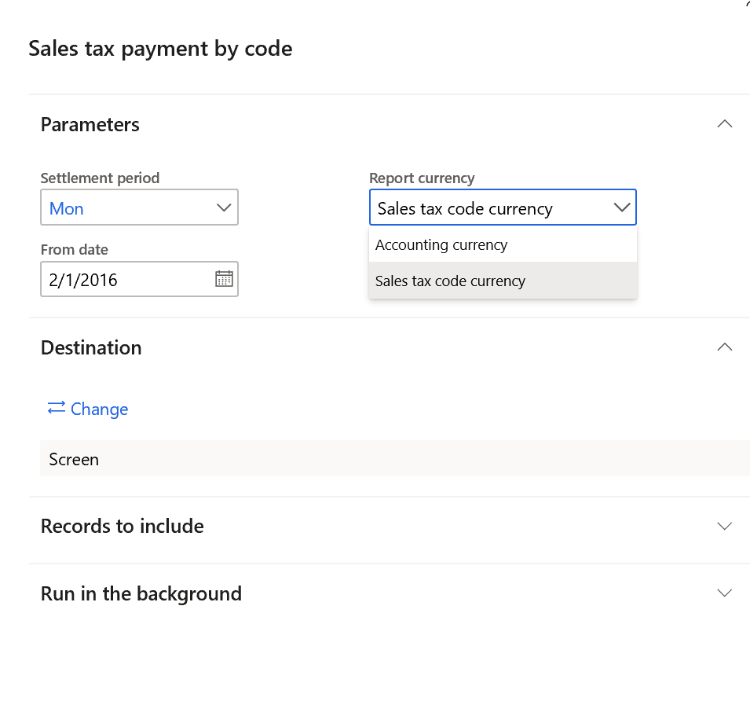

---
# required metadata
title: Print Sales tax payment by code report in accounting or in tax code currency
description: This topic provides information about the settings and actions that are required to print Sales tax payment by code report in accounting or in tax code currency
author: anasyash
manager: AnnBe
ms.date: 04/08/2020
ms.topic: article
ms.prod: 
ms.service: dynamics-ax-applications
ms.technology: 

# optional metadata
ms.search.form:  
audience: Application User
# ms.devlang: 
ms.reviewer: kfend
ms.search.scope: Core, Operations
# ms.tgt_pltfrm: 
# ms.custom: 
ms.search.region: Global
# ms.search.industry: 
ms.author: anasyash
ms.search.validFrom: 2020-04-08
ms.dyn365.ops.version: 10.0.11

---

# Print Sales tax payment by code report in accounting or in tax code currency

You can print the **Sales tax payment by code** report in **Tax \> Inquiries and
reports \> Sales tax reports \> Sales tax payment by code.** By default, report
amounts are generated in the accounting currency of the legal entity for all
reporting codes which are set up on the **Sales tax reporting codes** page.

Starting from the Monthly update 10.0.11, you can also generate this report to
show amounts in the currencies of sales tax codes for all reporting codes which
are assigned to sales tax codes on **Sales tax codes** page.

## Activate the feature

On the **Feature management** workspace, activate the feature with name
**Generate the Sales tax payment by code report in the sales tax code currency**

## Run the report

Go to **Tax \> Inquiries and reports \> Sales tax reports \> Sales tax payment
by code.**

In the field **Report currency** select:

-   **Accounting currency,** to print report amounts in the accounting currency

-   **Sales tax code currency**, to print report amounts in currencies of sales
    tax codes.

    You can see report example below:

Report identifies that the Reporting code **101** has currency EUR if sales tax code
to which the reporting code is assigned, has **Sales tax currency** field set as
‘EUR’
