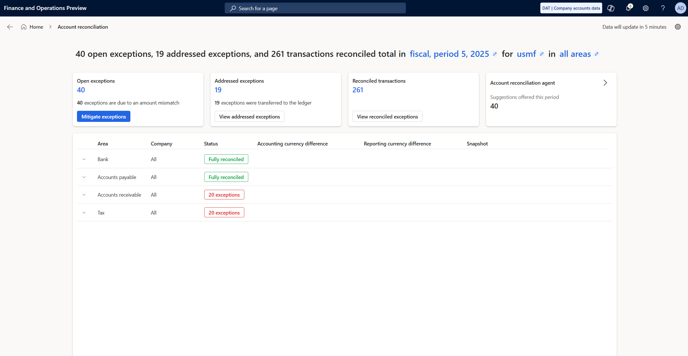

# Account reconciliation

The Account reconciliation feature is available as of Microsoft Dynamics 365 Finance version 10.0.44. This feature is used to reconcile your general ledger with the accounts payable, accounts receivable, tax, and bank subledgers. It replaces the old reactive SQL Server Reporting Service (SSRS) reports.

Users can view reconciled data and automated data analysis on a defined schedule. Therefore, the processing can be set up so that it's done only in the background or during off-hours.

Any exceptions that occur are shown. Users can then take direct action to address each exception. If the Microsoft Copilot–powered agent is enabled, it suggests the most likely action to take. Therefore, it helps save time during the account reconciliation process at the end of each period.

## Account reconciliation workspace

To open the **Account reconciliation** workspace, go to **Workspaces** \> **Account reconciliation**. Tiles in the upper part of the workspace show summaries of open exceptions for the current period, addressed exceptions, automatically reconciled transactions, and agent-recommended actions. Use the filter options at the top of the workspace to adjust the data that is shown. For example, you can change from the current fiscal period to the previous fiscal period.

The grid in the lower part of the workspace shows details about each combination of a module (area) and a legal entity (company) that has transactional data for the selected period. If there are exceptions, the **Status** column shows the number of exceptions that must be addressed (in red). After all exceptions are addressed, the **Status** column shows a status of **Fully reconciled** (in green).

## Copilot agent for account reconciliation

Learn how to set up and configure the Account Reconciliation Agent in [Set up and configure the Account Reconciliation Agent](acct-rec-agent.md).

## Address exceptions

If any exceptions must be addressed, select **Mitigate exceptions** on the **Open exceptions** tile in the upper part of the workspace to view all exceptions for all modules across all legal entities. To open the **Mitigate exceptions** page, select the number of exceptions (in red) for a specific module and legal entity.

On the **Open exceptions** page, you can view the details of each exception and take appropriate action to address it. The actions that are available vary, depending on the exception.

If the exception is **In Subledger not in ledger**, the following actions are available:

- **Create journal entry** – Go to the general journal, where you can create an adjusting entry to address the exception. The journal is created and needs to be posted through a batch process or manually.
- **Link transactions** – Open the **Link transactions** page, where you can link transactions that are in the subledger but not in ledger and transactions that are in the ledger but not in the subledger. In Dynamics 365 Finance version 10.0.46, an improved linking experience is available.
- **Accept without change** – Accept the exception as is, and clear it. This action is often used when the difference is a small amount or a rounding difference.
- **View exception history** – View the history of the exception.

If the exception is **In Ledger not in subledger**, the following actions are available:

- **Reverse general ledger voucher** – Create a reversing entry for the ledger voucher. In Dynamics 365 Finance version 10.0.46 allows the user to reverse transactions directly from the workspace without being navigated back to the original transaction page.
- **Link transactions** – Open the **Link transactions** page, where you can link transactions. In Dynamics 365 Finance version 10.0.46, an improved linking experience is available.
- **Accept without change** – Accept the exception as is, and clear it. This action is often used when the difference is a small amount or a rounding difference.
- **Create adjusting journal entry** – Go to the general journal, where you can create an adjusting entry to address the exception. In Dynamics 365 Finance version 10.0.46, the journal is created and needs to be posted through a batch process or manually.

If the exception is **Amount mismatch**, the following actions are available:

- **Accept without change** – Accept the exception as is, and clear it. This action is often used when the difference is a small amount or a rounding difference.
- **Create adjusting journal entry** – Go to the general journal, where you can create an adjusting entry to address the exception. In Dynamics 365 Finance version 10.0.46, the journal is created and needs to be posted through a batch process or manually.

### Undo an action

If you previously marked an exception as addressed but want to change the way that you addressed it, you can undo the last action. When you undo an addressed exception, the exception is moved back to the list of open exceptions. You can then take action again.

To undo an addressed exception, select **Undo**. You're prompted for a reason. Enter a reason, and then select **OK** to continue.

## Snapshots

The last column of the grid in the lower part of the workspace shows a snapshot of data for the selected combination of a module and legal entity for the selected period. The snapshot provides a final summary of all data for the period, including automatically reconciled transactions and any exceptions that were addressed. The snapshot is available only for ledger calendar fiscal periods that are marked as on hold or permanently closed, and that are fully reconciled. The snapshot is generated through the same background process and on the same schedule.

## Configuration

To view the settings and configuration for the account reconciliation feature, use the **Settings** button (gear symbol) in the upper right of the workspace. On the **Account reconciliation configuration** page, you can enable or disable the reconciliation processing for each module. The **Start date** can be used to set the date for transactions to be evaluated by the process automation. For example, if you have reconciled through the month of August using your prior process, consider setting the **Start date** to September 1 to evaluate only transactions in periods you have yet to reconcile. In addition, you can view the accounts that are used for each module for each legal entity, and add and remove accounts. The list of accounts is taken from the existing posting profile setup and the bank and tax account setup in each legal entity.

## Frequently asked questions

### What should I do if the workspace doesn't show any data?

- A message in the upper right of the workspace indicates the time of the last processing run and the next one. The message resembles the following example:

    > Data last updated 30 minutes ago, next update in 1 hour.

- For testing purposes, you can adjust the frequency and the time of the next processing run in the process automation. Look in the background processes for the **Automatic account reconciliation process** process. For production use, consider the impact of the time and frequency of processing runs, and set an appropriate schedule.
- On the batch jobs page, confirm that the status of the **Process automation polling system** system batch job is **Waiting**, not **Withhold**.

### I selected the action to create a journal, but I didn't actually create or post the journal. The voucher now appears on the page for addressed exceptions. What should I do?

Review the addressed exceptions, and select **Undo** to move the exception back to the list of open exceptions. It can then be reprocessed.
