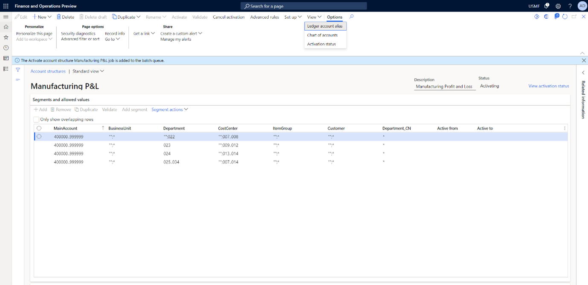
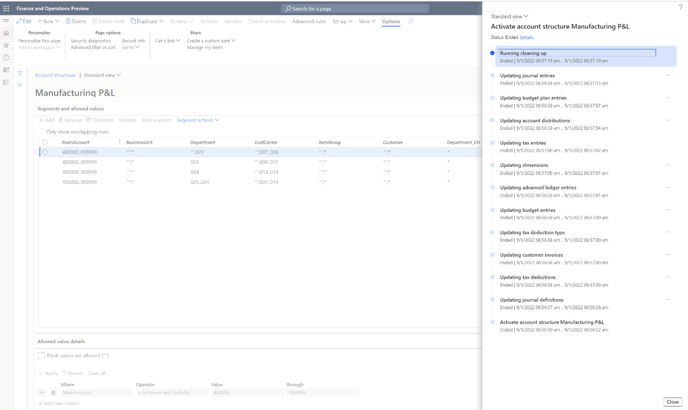

---
# required metadata

title: Account structure activation performance enhancement
description: This article explains the new performance enhancement for the account structure activation process.
author: RyanCCarlson2
ms.date: 10/31/2022
ms.topic: conceptual
ms.prod: 
ms.technology: 

# optional metadata

ms.search.form: 
audience: Application User
# ms.devlang: 
ms.reviewer: kfend
# ms.tgt_pltfrm: 
# ms.custom: 
ms.search.region: Global 
# ms.search.industry: 
ms.author: rcarlson
ms.search.validFrom: 2022-10-08
ms.dyn365.ops.version: 10.0.31

---

# Account structure activation performance enhancement

[!include [banner](../includes/banner.md)]
[!include [banner](../includes/preview-banner.md)]

This performance enhancement lets you activate account structures more quickly by running multiple transaction updates at the same time. In addition, the structure itself is marked as active after it's validated, and transaction processing can continue while existing unposted transactions are updated to the new structure. Because transactions updates might take some time, you can track the status of your activation by selecting **View activation status** above the grid on the **Account structures** page. You can also view your activation status by selecting **View** on the Action Pane and then selecting **Activation status** on the drop-down menu.

After you select **View activation status**, a dialog box appears that shows the individual tasks that are running as part of the activation process. For each task, you can view the status and, after the task is completed, the completion date and time.

## Account structure activation tips

The account structure activation dialog box that appears when you select **Activate** for a draft account structure has a tab section that is named **Update unposted transactions**. This section includes an option that is named **Force update**. You can select this option to update all unposted transactions to the current structure. However, you should use this option only when an error has occurred or Microsoft Support has directed you to use it.

Here are some of the factors that can affect the performance of the activation process:

- A large number of unposted journal records
- A large number of open source document records such as free text invoices, vendor invoices, and related documents that use the source document framework and have open accounting distributions
- The amount of data in TaxUncommitted
- The amount of open budget data
- Import of journal data while activation tasks are still running

[!INCLUDE[footer-include](../../includes/footer-banner.md)]
