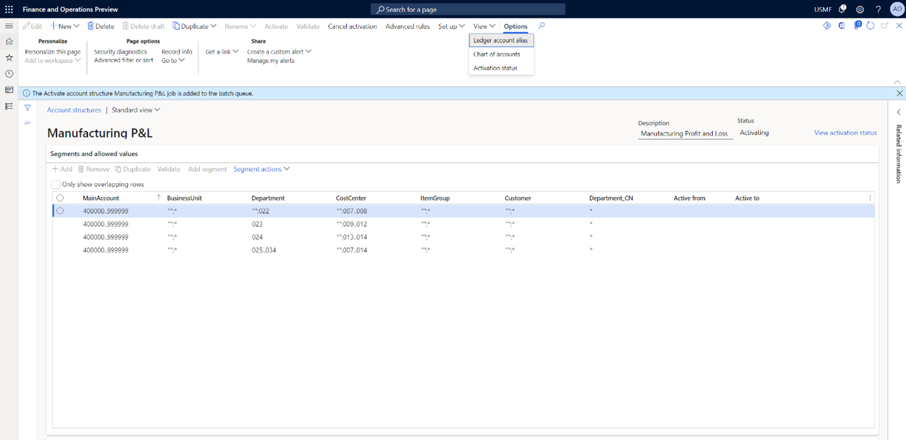
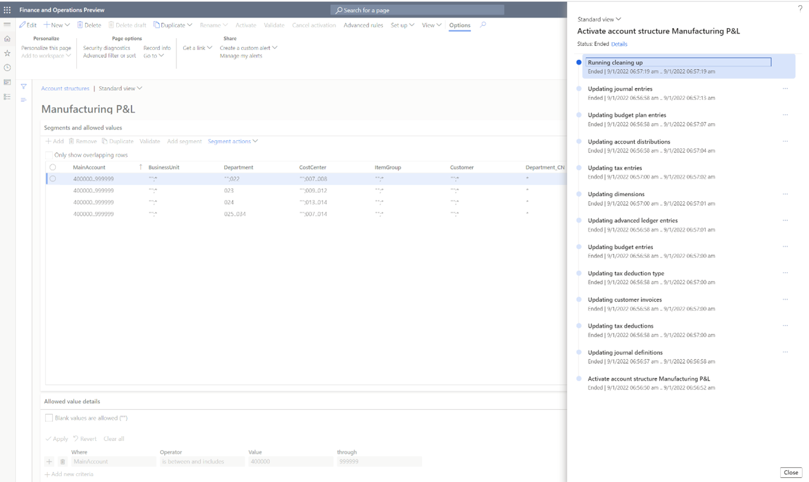

# Account structure activation performance enhancement

[!include [banner](../includes/banner.md)]

This performance enhancement helps you activate account structures faster by running multiple transaction updates at the same time. After the structure validates, the system marks the structure as active. Transaction processing can continue while the system updates existing unposted transactions to the new structure. Because transaction updates might take some time, you can track the status of your activation by selecting **View activation status** in the grid on the **Account structures** page. You can also view your activation status by selecting **View** on the Action Pane and then selecting **Activation status** on the drop-down menu.

When you select **View activation status**, a dialog box appears that shows the individual tasks that are running as part of the activation process. For each task, you can view the status and, after the task completes, the completion date and time.

## Account structure activation tips

The account structure activation dialog box that appears when you select **Activate** for a draft account structure has a tab section named **Update unposted transactions**. This section includes an option named **Force update**. Select this option to update all unposted transactions to the current structure. However, use this option only when an error occurs or Microsoft Support directs you to use it.

Here are some of the factors that can affect the performance of the activation process:

- A large number of unposted journal records
- A large number of open source document records such as free text invoices, vendor invoices, and related documents that use the source document framework and have open accounting distributions
- The amount of data in TaxUncommitted
- The amount of open budget data
- Import of journal data while activation tasks are still running

[!INCLUDE[footer-include](../../includes/footer-banner.md)]
