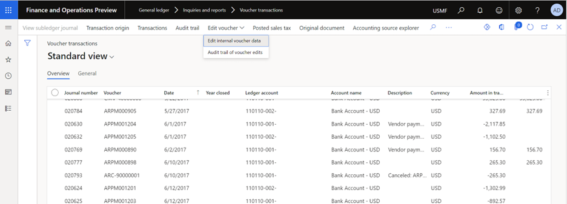
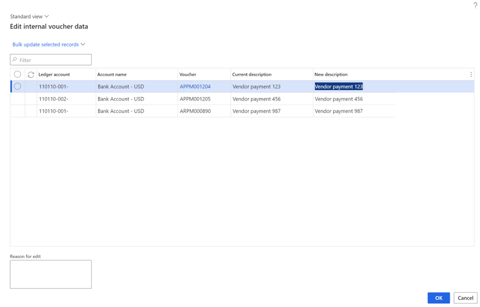
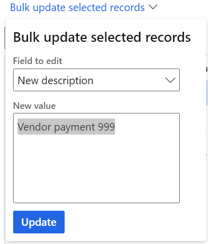

# Allow edits to internal data on general ledger vouchers

[!include[banner](../includes/banner.md)]

When you post accounting entries to the general ledger, use the **Description** field to store internal notes or documentation. If the information is incorrect, it can cause confusion and make period-end closing more difficult. This feature helps the accounting manager or accounting supervisor fix mistakes by editing the **Description** field on posted vouchers in the general ledger.

Changes to posted vouchers in the general ledger are limited to data that's internal in nature. This feature will never allow you to edit data such as amounts, posting dates, ledger accounts, and the transaction currency. Changes to that data affect the external reporting of financial statements and must be done only through new general ledger vouchers.

## Edit internal data on general ledger vouchers

Before internal data on general ledger vouchers can be edited, the user who edits posted vouchers must be assigned to the Accounting manager or Accounting supervisor role. You can add permissions to other roles too, by customizing the security roles.

You can edit data only from the **Voucher transactions** page.

1. Go to **General ledger** > **Inquiries and reports** > **Voucher transactions**.
1. In the **SysQuery** dialog box, enter search criteria to select vouchers.
1. Select the lines for the vouchers that you want to edit, and then select **Edit voucher** > **Edit internal voucher data**.

    

On the **Edit internal voucher data** page, you see the following data for each line that you selected:
  
- Ledger account
- Account name
- Voucher
- Current description
- New description

    

> [!NOTE]
> You can edit only the **New description** field. By default, the value matches the value of the **Current description** field, so that you can quickly fix minor mistakes in the description.

1. Modify the **New description** field on each row, or delete the description from each row.

   Alternatively, if you need to update multiple rows with the same value, follow these steps:

      1. Select the rows to edit, and then select **Bulk update selected records**.
      1. In the **Field to edit** field, select the field to edit. Currently, the lookup includes only the **New description** field.
      1. In the **New value** field, enter a new description.
      1. Select **Update**. All the selected records are updated with the new value.

      

1. In the **Reason for edit** field, enter a note to explain why you made the edit. This note appears on the **Audit trail of voucher edits** page.

   You can make multiple edits to the same voucher, and each edit is tracked.

## Audit trail of voucher edits

The system maintains an audit trail to track changes made through this feature. You can access the audit trail of voucher edits in two ways:

- Go to **General ledger** > **Inquiries and reports** > **Voucher transactions**. On **Voucher inquiries**, select **Edit voucher** > **Audit trail of voucher edits**. The audit trail shows only the selected voucher record.

    By opening the inquiry in this way, you can focus on all edits that were made to a single voucher record.
  
- Go to **General ledger** > **Periodic tasks** > **Audit trail of voucher edits**. In the dialog box, enter criteria to specify the vouchers that you want to view the audit trail of edits for. To view the audit trail for all vouchers, leave the criteria blank, and select **OK**.

    By opening the inquiry in this way, you can filter for edits that were made on a specific date or by a specific user.

The **Audit trail of edits** page shows the following information:

- **Created date and time** – The date and time of the edit.
- **Reason for edit** – The reason that the user entered for the edit.
- **Created by** – The user who made the edit.

To view the details of each audit trail, drill down on the **Created date and time** value. The **View edited voucher properties** page shows the same information as the original edit page, including the previous description and the updated description.

[!INCLUDE[footer-include](../../includes/footer-banner.md)]
