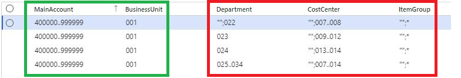
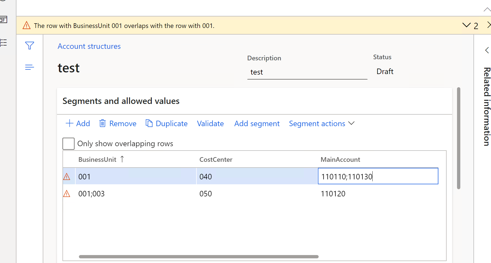
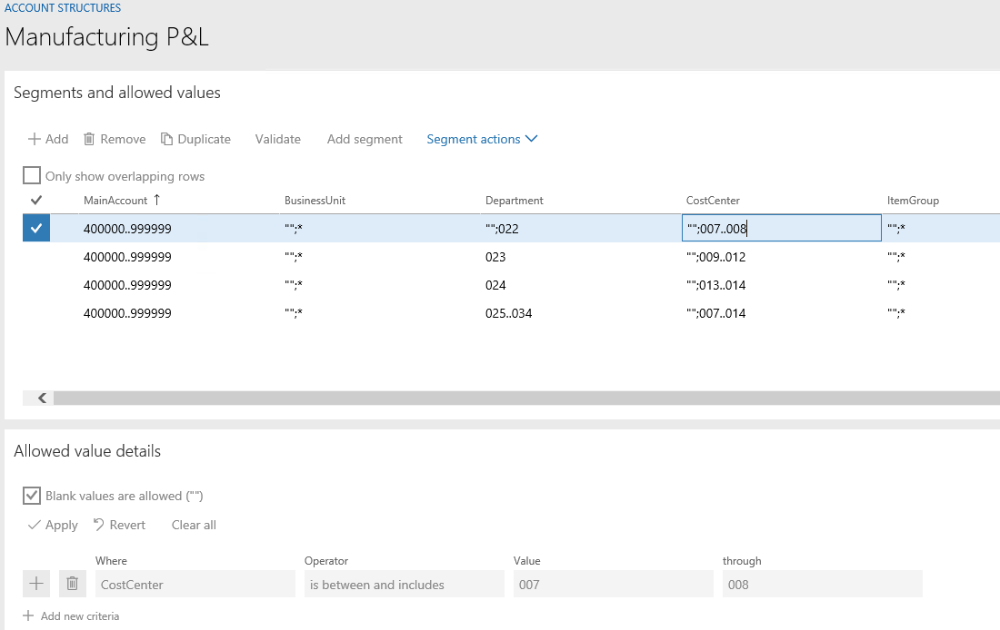
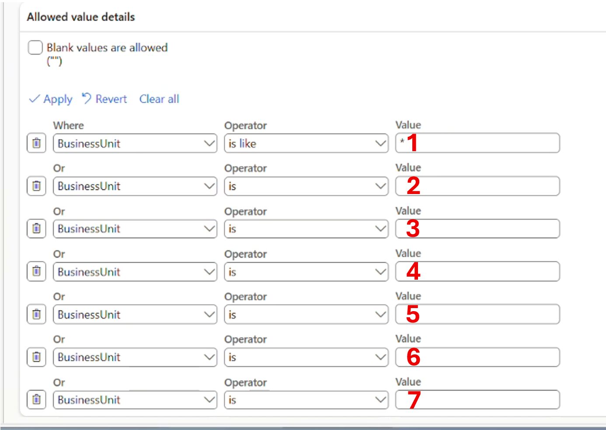
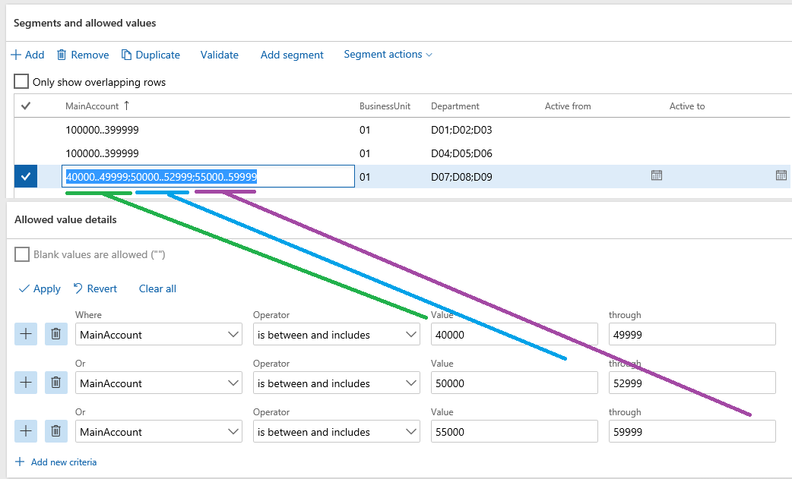
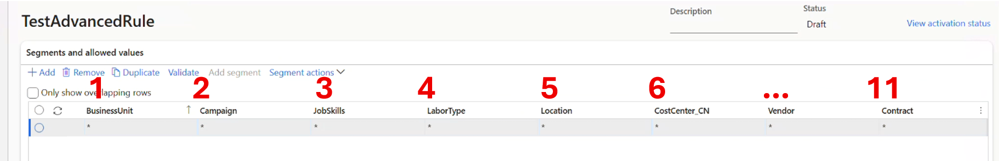

# Account structures overview

[!include[banner](../includes/banner.md)]

Account structures use the main account and financial dimensions to create a set of rules that determine the order and values used when entering the account number. You can set up as many account structures as you need for your business. Assign the account structures to a company's ledger setup so you can share them. For a detailed definition, see the [glossary entry for account structure](/dynamics365/guidance/business-processes/glossary#a).

## Account structures are trees presented as tables

An account structure is stored internally as a tree, but the configuration page displays it as a flat table (grid) for maximum compatibility with export to Excel. Understanding this tree structure helps explain some behaviors you may encounter when working with account structures.

### How changes propagate across rows

Because the grid is a flattened view of a tree, a single row in the grid represents a path from the root of the tree down to a leaf. Multiple rows can share the same parent branch while differing only in their rightmost (leaf) segments.

When you change a value on a segment that is shared across multiple rows — typically one of the leftmost segments — the change is applied to every row that shares that branch. This is by design: those rows are all part of the same branch of the tree, so editing the branch updates all of its leaves.

For example, if four rows all share the same **Business Unit** value of \* (all values), and you change **Business Unit** to `001` on any single row, all four rows update to `001`.

In this example, all four rows share the same **MainAccount** (400000..999999) and **BusinessUnit** (001) values — highlighted in the green box. These two columns form a shared branch of the tree. Because all four rows share this branch, changing the **BusinessUnit** value on any single row updates all four rows at once.

The columns highlighted in the red box — **Department**, **CostCenter**, and **ItemGroup** — are the leaf segments where the four rows differ from each other. Because each row has different values in these columns (for example, departments 022, 023, 024, and 025..034), they represent separate leaves on the same branch. Changing a value in these columns affects only that individual row, not the others.

The underlying tree for this example looks like this:

- **400000..999999** (MainAccount — shared root)
  - **001** (BusinessUnit — shared branch)
    - **"";022** → **"";007..008** → **"";**\*
    - **023** → **009..012** → **"";**\*
    - **024** → **"";013..014** → **"";**\*
    - **025..034** → **"";007..014** → **"";**\*

If this behavior isn't what you want, you can work around it by copying the values from the existing row to a new row with the desired value, and then deleting the old row if it's no longer needed.

### Overlapping criteria

For any combination of segment values, there must be exactly one valid path — both within a single structure and across all structures on the same ledger. If more than one path can match the same input, the system reports an **overlapping criteria** error during activation.

#### Within a single structure

Overlapping criteria within a structure commonly occurs when:

- A segment column is moved to a different position, causing ranges that were previously distinct to now create multiple valid paths.
- Two rows share the same parent values but have overlapping (not identical) criteria on a middle segment.

For example, if two rows both allow **Business Unit** `001` but lead to different **Cost Center** criteria, the system can't determine which branch to follow.

To fix this, consolidate the criteria so that each combination of segment values follows a single path. For instance, merge the overlapping cost center values into a single row using a range like `040;050`.

#### Across account structures

The same rule applies across structures. When you activate a structure, the system compares its criteria against all other **active** structures on the same ledger. If two structures allow the same main account value (or overlapping ranges), activation fails.

A common source of confusion is that activation always compares the **draft** being activated against the **active** versions of other structures — not their drafts. If you have multiple structures in draft mode at the same time, the form shows the draft versions, but activation checks against the active versions you can no longer see on screen.

#### Moving values between structures

To move a main account value from one structure to another without triggering an overlap, use a two-pass approach: **remove first, then add**.

For example, suppose AS1 (active) allows `100..199` and AS2 (active) allows `200..299`, and you want to move account `250` to AS1 and `150` to AS2:

1. Edit both structures to **remove** the values you're moving (exclude `150` from AS1 and `250` from AS2).
2. Activate both structures. The moved values are temporarily unavailable.
3. Edit both structures again to **add** the values to their new homes (`250` to AS1, `150` to AS2).
4. Activate both structures again.

> [!NOTE]
> The **Validate** button on the account structure form performs a limited check and may pass even when overlapping criteria exist. The full overlap detection only runs during activation, when the system builds all possible tree paths. Validation is not a substitute for activation.

## Specifying valid dimensions with account structures

### Creating and applying criteria

The **Segments** and **Allowed values details** section provides a grid for entering the rules that the system follows during validation when posting. You can type directly in the cells in the grid, import the rules from Excel, or use the **Allowed value details** section for guidance.

The **Allowed value details** section guides you through creating criteria by using **Operators** such as begins with, is between, includes, and many others.

Allowed values default on to a journal or accounting distribution entry page when the account structure setup doesn't provide any other possible values to select.

Here's an example of the **Profit and loss account structure**.

|Main account          | Business unit    |Department          | Cost center    |
|----------------------|-----------|----------------------|-----------|
|400000..999999 | 002 | 022 | 014 |

When you enter a journal and select an account in the profit and loss range, if you select business unit `002`, the system defaults values `022` and `014` on the account control. This behavior also occurs with the accounting distribution page.

> [!NOTE]
> If you can't enter blank segments in a ledger account, check whether the account structure or any advanced rules restrict blank segments. If either one disallows blank segments, the ledger account fails validation.

#### More than seven criteria per line

Each line in the grid can hold up to seven criteria for a given segment. This limit is based on factors such as column width, how the data is stored, and performance of the **Allowed value details** control.

If you need more than seven criteria, select **Duplicate in the Segment** and **Allowed values section**. This copies the criteria to a new line, where you can type over or modify the **Allowed value details** section to add the extra criteria.

> [!NOTE]
> An upgrade from Microsoft Dynamics AX 2012 isn't supported when you specify more than seven criteria. You must correct this issue before you complete the upgrade to finance and operations apps.

### Valid and invalid characters in criteria

All criteria in account structures are compared as **strings**, not numbers. This is an important distinction that affects how ranges work.

#### Numeric value ranges are string-based

Because ranges are compared as strings, values of different lengths can produce unexpected results. For example, the value `1000000` (seven digits) falls within the string range `100000..399999` (six digits), even though numerically 1,000,000 is far larger than 399,999.

This is because string comparison works character by character from left to right — the same way sorting a column of text numbers in Excel produces the order: 1, 10, 11, 12, ..., 19, 2, 20, ...

If you need to use ranges with values of different lengths, prefix shorter values with leading zeros to ensure consistent string comparison. For example, use the range `0100000..0399999` instead of `100000..399999` so that `1000000` no longer falls within it.

#### Using the correct delimiter

When entering multiple criteria values directly in the grid, use **semicolons** ( ; ) to separate values — not **commas** ( , ).

Commas are valid characters within a dimension value. If you use commas as separators, the system treats the entire comma-separated string as a single value and truncates it to the 30-character maximum for dimension values. This causes characters to be silently clipped from the right side of your entry.

For example, if you enter `40000,49999,50000,52999,55000,59999` in the **MainAccount** column using commas, the system interprets the entire string as a single "through" value: `40000` through `49999,50000,52999,55000,5999` (truncated at 30 characters). The **Allowed value details** section shows this as a single criterion — "is between and includes 40000 through 49999.50000..52999.55000..5999" — instead of the six separate values you intended.

The **Allowed value details** section at the bottom of the form always uses semicolons. If your criteria appear collapsed into a single entry, check whether commas were entered instead of semicolons.

#### Wildcards can't be used in ranges

Don't use wildcard characters (asterisks) inside a range. A range is intended to specify all values between two string values of the same length. For example, to allow all accounts between 100000 and 399999, enter `100000..399999` — not `100*..399*`.

When a wildcard appears inside a range, the system looks for values that literally contain an asterisk character, which typically matches nothing. Instead, use wildcards with the appropriate operators in the **Allowed value details** section:

- `500*` with the **Begins with** operator — matches all values that start with `500` (for example, 500100, 500200).
- `*500` with the **Ends with** operator — matches all values that end with `500` (for example, 100500, 200500).
- `*500*` with the **Is like** operator — matches all values that contain `500` anywhere (for example, 150000, 250099).

> [!TIP]
> Don't rely solely on the collapsed criteria string in the grid to understand how the system interprets your criteria. Always check the **Allowed value details** section below it, which converts each criterion into a readable sentence.

### Maximum number of segments

You can use up to 11 segments in an account structure: one main account and up to 10 additional financial dimensions.

If you already have 11 segments in a structure, the **Add Segment** button is disabled. To add more dimensions beyond this limit, use advanced rules, which allow up to 16 total segments.

If you need more than 11 segments, thoroughly evaluate your setup and requirements, as it impacts the user experience. Consider whether a segment could be derived in a reporting scenario by using a hierarchy instead of during data entry, or by using a user-defined field. For example, if you want to report on location but you can determine location by department or cost center, you don't need location as a financial dimension.

> [!NOTE]
> If you plan to budget against a financial dimension, include it in an account structure. Budgeting doesn't currently use advanced rules.

### Main account

The main account is required in every account structure but doesn't need to be the first segment. The main account value identifies which account structure applies during account number entry. Because of this, a main account value can only exist in one structure assigned to the ledger — otherwise the system can't determine which structure to use and reports an overlap.

> [!TIP]
> Make the main account the first segment or as close to the front of the account structure as possible. This gives users the best guided experience during account entry, because the system identifies the correct structure earlier in the process. Verify that any third-party solutions you use support the main account in the first position.

## Example

To illustrate a best practice for setting up an account structure, assume that a company wants to track their balance sheet accounts (100000..399999) at the account and business unit financial dimension level. For revenue and expense accounts (400000..999999), they track financial dimensions Business Unit, Department, and Cost center. If they make a sale, they also like to track Customer. Using this scenario, it's recommended to have two account structures assigned to the company's ledger - one for Balance sheet accounts, and one for Profit and Loss accounts. To optimize the user experience and validation, Customer should be an advanced rule that is only used when a sales account is used.

### Balance sheet account structure

|Main account          | Business unit    |
|----------------------|-----------|
|100000..399999 | \*;"&nbsp;"|

### Profit and loss account structure

|Main account          | Business unit    |Department          | Cost center    | &nbsp; |
|----------------------|------------------|--------------------|-----------|---|
|400000..999999 | \*;"&nbsp;"| \*;"&nbsp;"| \*;"&nbsp;"| \*;"&nbsp;"|

**Advanced rule for adding a Customer**

Criteria: Where Main account is between 400000 and 499999, then add customer. It can't be left blank.

|Customer         |
|-----------------|
|\* |

In this simplified example, all values and blank are allowed so \* and "&nbsp;" are used.

For more information, see [Plan your chart of accounts](plan-chart-of-accounts.md), [Financial dimensions](financial-dimensions.md), and [Enter account and dimension combinations (segmented entry control)](enter-account-dimension-combinations-segmented-entry-control.md).

[!INCLUDE[footer-include](../../includes/footer-banner.md)]
