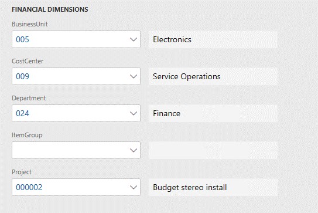

# Default dimensions

[!include [banner](../includes/banner.md)]

Default dimensions are preset financial dimension values that the system automatically applies to transactions. They reduce manual data entry and help ensure consistency across financial records. Default dimensions come from various places, such as master records (for example, customer or vendor records), document headers, and the main account.

This article explains how default and fixed dimension values work on main accounts and how dimensions are applied during posting. For information about how account structures, advanced rules, and balancing dimensions define valid combinations of main accounts and dimension values, see [Financial dimensions](/dynamics365/finance/general-ledger/financial-dimensions).

## Enter default dimensions

You can enter default financial dimensions on more than 250 pages, including master records such as customer, vendor, and item records. These dimensions appear on a **Financial dimensions** FastTab that lists them together with values and descriptions. The following **Financial dimensions** FastTab shows five dimensions: BusinessUnit, CostCenter, Department, ItemGroup, and Project.

Your company's ledger configuration determines which dimensions you can default. Default dimensions include all dimensions defined in the account structures associated with the current company's ledger, along with any active advanced rules for those structures.

For more information about how the system determines which dimensions are available, see [Default financial dimensions](/dynamics365/fin-ops-core/dev-itpro/financial/dimension-defaulting).

## Default and fixed financial dimensions on the main account

You can define whether a main account has a **Not fixed** or **Fixed** value for each financial dimension that is used across all account structures for the ledger. If a financial dimension is **Not fixed**, it uses a default value, but you can overwrite that value. This behavior applies to all default values in the system, even default values that come from master records. If you set a financial dimension to a **Fixed** value, the system always applies that value, regardless of whether it came from somewhere as a default value or the user entered it.

## Copy default dimension values from master records

In addition to fixed and default dimensions on main accounts, you can configure dimensions to automatically copy values from master records such as customers and vendors. When you copy a dimension value, it becomes the default on documents that reference that master record. For example, when you create a new customer, you enter the customer ID in the customer dimension. When you then create sales orders or invoices for that customer, the system defaults the customer ID into the customer dimension on the document.

### Enable the setting

A setting on the financial dimension controls this feature: **Copy values to this dimension on each new [Dimension name] created**, where **[Dimension name]** is the name of the dimension. By default, this setting is turned off. You can turn it on at any time.

If records already exist for the dimension when you enable this setting, the system updates the master records. However, existing documents and transactions aren't updated.

### Template considerations

If you use a template to create master records, make sure the template value for the master dimension is blank. For example, if you create customers from a template, leave the customer dimension in the template blank. The customer dimension value then defaults from the new customer number when you create the customer.

### Blank dimension values

You can intentionally default a dimension value to blank by assigning a fixed dimension value of blank on a main account (via *Legal entity overrides*).

If you don't intend for a blank dimension value to be defaulted, ensure that the dimension's fixed value is set to **Not fixed**, or provide a valid fixed value that complies with the account structure.

### Supported entities for copy values on create

The **Copy values to this dimension on each new [DimensionName] created** toggle is only available for entity-backed dimensions that you configure to support this feature. The toggle appears disabled (greyed out) on the dimension details form for dimensions that don't support it.

The following entity-backed dimensions support copy values on create out of the box:

- Asset
- Bank account
- Customer group
- Customer
- Position
- Worker
- Item
- Project invoice
- Project
- Retail channel
- Retail store
- Retail terminal
- Vendor

Custom dimensions and entity-backed dimensions that aren't in this list don't support this feature by default. To enable copy values on create for a custom or unsupported entity-backed dimension, a developer must configure the dimension to support it. For more information, see [Enable copy values on create for financial dimensions](/dynamics365/fin-ops-core/dev-itpro/financial/enable-copy-values-dimension-on-create).

## Additional resources

For information about how defaults cascade during journal entry, see [Default dimension values in financial journals](/dynamics365/finance/general-ledger/dimensions-default-values).

For information about the order in which default dimensions are applied during posting, including examples with fixed dimensions, balancing dimensions, and advanced rules, see [Financial dimensions and posting](/dynamics365/finance/general-ledger/default-dimensions#order-in-which-default-dimensions-are-applied-during-posting).

For more information about default dimensions in customizations, see [Default financial dimensions](/dynamics365/fin-ops-core/dev-itpro/financial/dimension-defaulting).

[!INCLUDE[footer-include](../../includes/footer-banner.md)]
