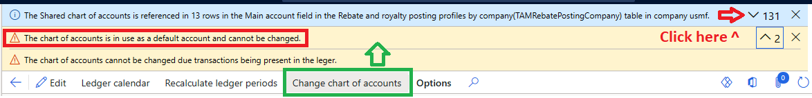
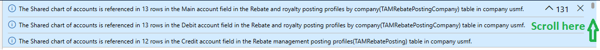

# Configure ledgers

[!include [banner](../includes/banner.md)]

This article provides information about how to configure ledgers for each legal entity. It includes information about how to select currencies, fiscal calendars, the chart of accounts, and the account structures that you use with each legal entity.

## Selecting the chart of accounts

For each legal entity in Microsoft Dynamics 365 Finance, you must configure details about the ledger. The **Ledger** page lets you select the chart of accounts and the account structures that you use for the selected legal entity. You can share your chart of accounts and the account structures by configuring the **Ledger** page in each legal entity to use the same chart of accounts and account structures. You can also share part of the configuration in each legal entity and have specific configurations in each legal entity.

If your legal entities must have different charts of accounts or different account structures, consider using the legal entity override feature. By using the same chart of accounts and account structures for multiple legal entities, and then managing any exceptions through legal entity overrides, you can simplify maintenance over time.

To configure the chart of accounts for a legal entity, go to **General ledger \> Ledger setup \> Ledger**. On the **Ledger** page, select **Chart of accounts**, and then, in the list, select the chart of accounts to use.

For more information about how to plan and configure the chart of accounts and main accounts, see [Plan the chart of accounts](plan-chart-of-accounts.md).

## Changing the chart of accounts

> [!IMPORTANT]
> If you post transactions in the legal entity, you can't change the chart of accounts.

If you don't post transactions, you might still see an error like one of the following errors when you try to change the chart of accounts:

This error occurs when one or more posting profiles in the legal entity have default accounts that reference the current chart of accounts. Because main accounts are specific to a chart of accounts, the system can't automatically map them to accounts in a different chart of accounts. You must clear the posting profiles before you can make the change.

Expand the error message bar at the top of the page to see a detailed list of every affected posting profile table, field, and company.

After expanding, scroll through all affected rows:

For each table and field listed, go to the corresponding posting profile and clear the default account. After you remove all references, retry changing the chart of accounts. After the change is complete, you must re-enter the default accounts by using main accounts from the new chart of accounts.

> [!WARNING]
> Do not bypass the posting profile validation for chart of accounts changes through customizations or direct data modifications. These checks protect the integrity of your general ledger. Circumventing them can result in data corruption that is typically discovered during reporting or year-end close and can be extraordinarily difficult to repair, if it can be repaired at all.

> [!NOTE]
> The **Bank account** table contains a main account field that's required and can't be cleared in the application. If the bank account table is listed as a blocker, contact Microsoft support for assistance.

## Selecting account structures

You can configure each legal entity in Dynamics 365 Finance to use one or more account structures. Each account structure defines the financial dimensions, and the combinations of main accounts and financial dimensions, that are allowed when posting transactions. You can use the same account structures in more than one legal entity.

If you use multiple account structures, select only account structures that don't have overlapping combinations of main accounts and financial dimensions. For example, suppose you configure one account structure to add a business unit for main accounts between 1000 and 1999. In another account structure, you add a Department financial dimension for main accounts that begin with 1. In this case, you can add only one of the account structures in the same legal entity.

To configure account structures for your ledger, on the **Ledger** page, in the **Account structures** section, select **Add**, select an account structure in the list, and then select **Select**. It takes a few minutes to add and save the account structures. When you save the changed account structure to the ledger, the system starts synchronizing all the unposted transactions. You must wait until the change finishes for the current ledger in the legal entity before you can make an account structure change for a ledger in another legal entity. The account structures that you select must be active. Otherwise, the details of the account structures aren't effective in the legal entities where they're linked.

To remove an account structure, on the **Ledger** page, on the **Account structures** FastTab, select **Remove**. Note that, if you remove an account structure from your ledger, you don't remove any transactions that were posted by using the configuration of that account structure.

For more information about how to set up your account structures, see [Configure account structures](configure-account-structures.md).

## Configuring calendars for the ledger

Another component of the ledger is the fiscal calendar. You must select a fiscal calendar for each legal entity. You can use the same fiscal calendar in more than one legal entity. When you select a fiscal calendar for the ledger, the system makes a copy. This copy is referred to as the ledger calendar. By using the ledger calendar, you can select the status of the periods and the modules in each period.

To access and update the calendar for the selected legal entity, on the **Ledger** page, select **Ledger calendar** on the action pane.

To select the calendar, select **Fiscal calendars**, and then select the calendar in the list. If you change the fiscal calendar after posting transactions in the legal entity, you must select **Recalculate ledger periods**. Then, in the dialog box that appears, you can update the ledger balances for the periods in your calendar. Run the **Recalculate ledger periods** process in **Batch** mode, and run it when non-critical processes are occurring in your system. Depending on the number of transactions and financial dimension combinations, this process can take some time.

If you don't select a fiscal calendar for a legal entity, you receive an error message when you try to post a transaction in that legal entity.

For more information, see [Fiscal calendars, fiscal years, and periods](../budgeting/fiscal-calendars-fiscal-years-periods.md).

## Using a balancing financial dimension

After you select the chart of accounts and add one or more account structures, you can optionally select a single financial dimension to use as the balancing financial dimension. The dimension that you select must exist in all the account structures. It must also be balanced in all accounting entries. In other words, the debits and credits must be equal for the main account and the balancing financial dimension. The system automatically creates transactions to balance the entries, based on the main accounts that you specify in the **Interunit - credit** and **Interunit - debit** fields on the **Accounts for automatic transaction** page.

For more information about balancing entries, see [Balanced journals for interunit accounting](example-balanced-journals-interunit-accounting.md).

## Configuring currencies for the ledger

Use the **Ledger** page to control and define the currencies for transactions posted to the general ledger. You must specify the accounting currency in the **Accounting currency** column. This currency appears in the general ledger on all vouchers. You can also select a second currency in the **Reporting currency** column. If you select a reporting currency, the system records all transactions in that currency in the **Reporting currency** column in the general ledger on all vouchers.

If you post transactions in a different currency, the system automatically converts the transaction amount from the transaction currency into the accounting currency and reporting currency on the voucher. On the **Ledger** page, in the **Accounting currency exchange rate type** field, select the type of exchange rate that is configured for the exchange rates. This exchange rate type converts values from the transaction currency to the accounting currency on a voucher. If you select a reporting currency, set the **Reporting currency exchange rate type** field to indicate the exchange rate that converts values from the transaction currency to the reporting currency on a voucher.

If you're using budgeting functionality, set the **Budget exchange rate type** field to indicate the exchange rate that converts budget transactions from one currency to another.

If you use two currencies, or if you use a single currency but post transactions in a different currency, you must configure the **Accounts for currency revaluation** FastTab on the **Ledger** page. On this FastTab, you define the default realized and unrealized gain and loss accounts that the system uses by default when posting transactions if no account is specified on the **Currency revaluation accounts** page. Use the **Currency revaluation accounts** page to configure different accounts for realized and unrealized gains and losses for each currency.

Realized gains and losses are profits and losses from completed transactions. The system records them on the profit and loss statement. Unrealized gains and losses are profits and losses that have materialized but the transaction isn't completed. In other words, you posted an invoice, but the invoice isn't yet settled and paid. The system records unrealized gains and losses on the balance sheet.

For more information about how to use two currencies, see [Dual currency](dual-currency.md).

[!INCLUDE[footer-include](../../includes/footer-banner.md)]
