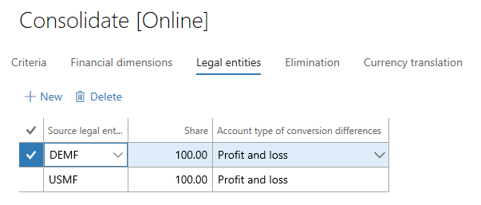
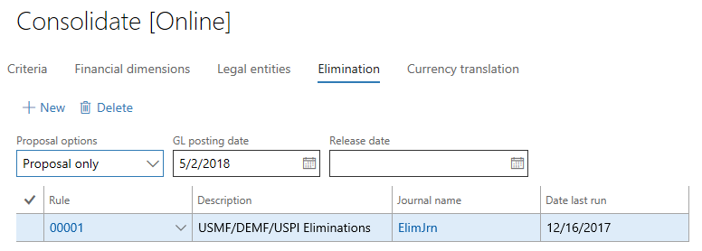

---
# required metadata

title: Online financial consolidations
description: This topic describes online financial consolidations in General ledger.
author: aprilolson
ms.date: 07/09/2018
ms.topic: article
ms.prod: 
ms.technology: 

# optional metadata

ms.search.form: 
audience: Application User
# ms.devlang: 
ms.reviewer: roschlom
# ms.tgt_pltfrm: 
# ms.custom: 
# ms.assetid: 
ms.search.region: Global
# ms.search.industry: 
ms.author: aolson
ms.search.validFrom: 2018-5-31
ms.dyn365.ops.version: 8.0.1

---

# Online financial consolidations

[!include [banner](../includes/banner.md)]

This topic describes online financial consolidations in General ledger. Before you read this topic, be sure to read the [Financial consolidations and currency translation overview](financial-consolidations-currency-translation.md) topic.

After you've completed your setup, you enter the details of the consolidation on the **Consolidate [Online]** page. When you've finished, you can click **OK** or **Batch** to process the consolidation.

## Criteria
On the **Criteria** tab of the **Consolidate [Online]** page, you define the accounts, the periods, and the type of data that is being consolidated.

Here is an explanation of the various fields on this tab:

- **Description** – Enter a precise description for the period that you're consolidating.
- **Main account** – Use the fields in this section to define the main accounts that will be processed.

    - **From** and **To** – Specify a range of accounts to process. If you leave these fields blank, all accounts from all companies will be moved to the consolidation company. Therefore, if you're consolidating four companies, and each company has a different chart of accounts, all accounts from all four companies will be created in the consolidation company.
    - **Use consolidation account** – If you set this option to **Yes**, the **Select consolidation account from** field becomes available. In this field, select whether all accounts should be consolidated to the consolidation account that is set on the **Main accounts** page, or whether you want to select the account from one of the consolidation account groups.
    - **Consolidation account group** – Select the group to use for the main account mapping for the consolidation.

- **Consolidation period** – Use the fields in this section to define the consolidation period.

    - **From** and **To** – Specify a range of dates for the consolidation. If you leave these fields blank, the consolidation will be processed for all periods that are defined in the ledger calendar for the company. We don't recommend that you leave these fields blank.
    - **Include actual amounts** – Set this option to **Yes** to consolidate your actual data.
    - **Include budget amounts** – Set this option to **Yes** to consolidate data from the budget register.
    - **Rebuild balances during consolidation** – We don't recommend that you set this option to **Yes**. Instead, rebuild balances as a separate batch job.

- **Budget models** – If you've selected to consolidate budget data, use the fields in this section to define the budget models.

    - **From** and **To** – Specify the range of models to use.
    - **Budget rate type** – Select the type of budget rate to use for currency translation of budget data.

## Financial dimensions
On the **Financial dimensions** tab, you define the dimensions that should be included in the consolidation company. To select a dimension, set the **Specification** field to **Dimension**, and then define the order of the dimension in the consolidation company.

Regardless of the order that you define, **Main account** will always be the first segment.

## Legal entities
On the **Legal entities** tab, you define the companies that should be included in the consolidation company. You also define the ownership percentage of those companies. If you specify less than 100-percent ownership, the specified percentage will be rolled up to the consolidation company. For any translation differences, the **Account type for conversion differences** field is used to select the main account from the setup on the **Accounts for automatic transactions** page.

## Elimination
On the **Elimination** tab, you have three options for processing eliminations:

- Select the elimination rule, and then, in the **Proposal options** field, select **Proposal only**. This option will process the elimination during the consolidation process, but it won't post everything in one step. You can post the journal later.
- Select the elimination rule, and then, in the **Proposal options** field, select **Post only**. This option will process the elimination during the consolidation process and will post everything in one step.
- Run an elimination proposal separately from the consolidation process by using the elimination journal.

For more information about eliminations, see [Elimination rules](./elimination-rules.md).

## Currency translation
On the **Currency translation** tab, you define the legal entity, account and exchange rate type, and rate. Three options are available in the **Apply exchange rate from** field:

- **Consolidation date** – The date of the consolidation will be used to get the exchange rate. This rate is equivalent to the spot or month-end rate. You will see a preview of the rate, but you can't edit it.
- **Transaction date** – The date of each transaction will be used to select an exchange rate. This option is most often used for fixed assets and is often referred to as a historical rate. You can't see a preview of the rate, because there will be many rates for the various transactions in the account range.
- **User defined rate** – After you select this option, you can enter the exchange rate that you want. This option can be useful for average exchange rates or if you're consolidating against a fixed exchange rate.

## Additional resources

For more information about consolidation and currency translations, see the parent topic of this topic, [Financial consolidations and currency translation overview](./financial-consolidations-currency-translation.md).

For information about scenarios where you might generate consolidate financial statements, see [Generate consolidated financial statements](./generating-consolidated-financial-statements.md).

[!INCLUDE[footer-include](../../includes/footer-banner.md)]