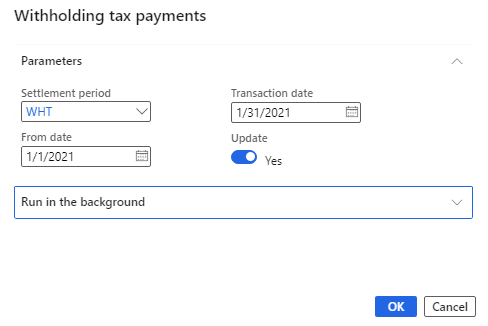

# Create a withholding tax payment

The Withholding tax payment job procedure settles withholding tax balances from Accounts payable on withholding tax accounts, and offsets them to the withholding tax settlement account for a given period. This article lists the steps for setting up a withholding tax payment.

> [!NOTE]
> Withholding tax offset (from accounts receivable) isn't taken into account when a withholding tax payment is calculated.

1. Go to **Navigation pane > Modules > Tax > Declarations > Withholding tax > Withholding tax payment**.
1. In the **Settlement period** field, select the drop-down button to open the lookup.
1. In the list, select the link in the row you want.
1. In the **From date** field, enter a date.
1. In the **Transaction date** field, enter a date.
1. Select **Update** to post the withholding tax payment voucher to the withholding tax settlement account.
1. Select **OK**.

[!INCLUDE[footer-include](../../includes/footer-banner.md)]
