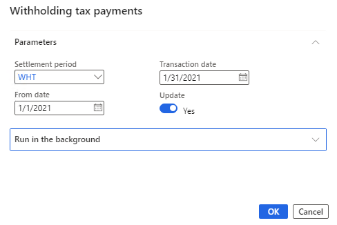

---
# required metadata

title: Create a withholding tax payment
description: The Withholding tax payment job procedure settles withholding tax balances from Accounts payable on withholding tax accounts, and offsets them to the withholding tax settlement account for a given period. This article lists the steps for setting up a withholding tax payment.
author: kailiang
ms.date: 01/12/2021
ms.topic: article
ms.prod: 
ms.technology: 

# optional metadata

ms.search.form: 
# ROBOTS: 
audience: Application User
# ms.devlang: 
ms.reviewer: kfend
# 
# ms.tgt_pltfrm: 
ms.assetid: b4b406fa-b772-44ec-8dd8-8eb818a921ef
ms.search.region: Global
# ms.search.industry: 
ms.author: kailiang
ms.search.validFrom: 2020-01-12
ms.dyn365.ops.version: AX 10.0.16

---

# Create a withholding tax payment

The Withholding tax payment job procedure settles withholding tax balances from Accounts payable on withholding tax accounts, and offsets them to the withholding tax settlement account for a given period. This article lists the steps for setting up a withholding tax payment.

> [!NOTE] 
> Withholding tax offset (from accounts receivable) is not taken into account when a withholding tax payment is calculated.

1. Go to **Navigation pane > Modules > Tax > Declarations > Withholding tax > Withholding tax payment**.
2. In the **Settlement period** field, click the drop-down button to open the lookup.
3. In the list, click the link in the selected row.
4. In the **From date** field, enter a date.
5. In the **Transaction date** field, enter a date.
6. Select **Update** to post withholding tax payment voucher to the withholding tax settlement account.
7. Click **OK**.

[!INCLUDE[footer-include](../../includes/footer-banner.md)]
