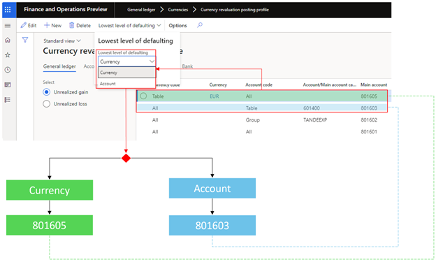

---
# required metadata

title: Currency revaluation posting profiles
description: This article provides information about currency revaluation posting profiles.
author: moaamer
ms.date: 01/10/2023
ms.topic: article
ms.prod: 
ms.technology: 

# optional metadata

ms.search.form: LedgerClosingSheet
# ROBOTS: 
audience: Application User
# ms.devlang: 
ms.reviewer: twheeloc
# ms.tgt_pltfrm: 
ms.assetid: c64eed1d-df17-448e-8bb6-d94d63b14607
ms.search.region: Global
# ms.search.industry: 
ms.author: moaamer
ms.search.validFrom: 2022-11-28
ms.dyn365.ops.version: AX 10.0.0

---

# Currency revaluation posting profiles

A currency revaluation posting profile lets you post a currency revaluation adjustment to different accounts per module (**General ledger**, **Accounts payable**, **Accounts receivable**, and **Bank**). For each module, you can post to a more granular level, where you can define a currency revaluation posting account per currency code and the lowest level of ledger account, vendor, customer, or bank. The differentiation can be for unrealized gain or loss for all modules. The realized gain or loss is available only for Accounts payable and Accounts receivable.

> [!NOTE]
> If no currency revaluation posting profile is configured, the accounts that are selected on the **Accounts for currency revaluation** FastTab of the **Ledger** page are used.

## Create a currency revaluation posting profile

To create a currency revaluation posting profile, follow these steps.

1. Go to **General ledger \> Currencies \> Currency revaluation posting profile**.
2. In the **Currency code** field, select **All** for all currencies or **Table** for a specific currency.
3. In the **Account code** field, you can select **All**, **Group**, or **Table** to specify an account or main account, depending on the module-specific tab that's selected.

    The **Main account** field is a mandatory field where you select the currency revaluation posting account that will be used during the currency revaluation adjustment.

### General ledger

For General ledger, the values in the **Account code** field have the following meaning:

- **Table** – The posting profile applies to a specified ledger account.
- **Group** – The posting profile applies to the selected main account category.
- **All** – The posting profile applies to all main accounts where the **Foreign currency revaluation** option is set to **Yes**.

In the example that's shown in the following illustration, the unrealized gain for General ledger posts the currency revaluation of transactions in euros (EUR) on main account 600120 to adjustment account 801602. (On the first line in the illustration, the **Account code** field is set to **Table**, and the main account is selected.) The unrealized gain posts the currency revaluation of all currencies on accounts that belong to the **Travel and Expense** (**TANDEEXP**) main account category to adjustment account 801601. (On the second line, the **Account code** field is set to **Group**, and the main account category is selected.) The unrealized gain posts the currency revaluation of all currencies on all accounts to adjustment account 801600. (On the third line, the **Account code** field is set to **All**.)

### Accounts payable

For Accounts payable, the values in the **Account code** field have the following meaning:

- **Table** – The posting profile applies to a single vendor.
- **Group** – The posting profile applies to a vendor group.
- **All** – The posting profile applies to all vendors.

For example, the unrealized gain for Accounts payable posts the currency revaluation of EUR transactions on main account 1001 to adjustment account 801602 (**Account code** = **Table**). It posts the currency revaluation of all currencies on vendors that belong to the **Parts vendors** (**10**) vendor group to adjustment account 801601 (**Account code** = **Group**). It posts the currency revaluation of all currencies on all vendors to adjustment account 801600 (**Account code** = **All**).

### Accounts receivable

For Accounts receivable, the values in the **Account code** field have the following meaning:

- **Table** – The posting profile applies to a single customer.
- **Group** – The posting profile applies to a customer group.
- **All** – The posting profile applies to all customers.

For example, the unrealized gain for Accounts receivable posts the currency revaluation of EUR transactions on customer account US-001 to adjustment account 801602 (**Account code** = **Table**). It posts the currency revaluation of all currencies on accounts that belong to the **Wholesales customers** (**10**) customer group to adjustment account 801601 (**Account code** = **Group**). It posts the currency revaluation of all currencies on all customers to adjustment account 801600 (**Account code** = **All**).

### Bank

For Bank, the values in the **Account code** field have the following meaning:

- **Table** – The posting profile applies to a single bank ID.
- **Group** – The posting profile applies to a bank group.
- **All** – The posting profile applies to all banks.

For example, the unrealized gain for Bank posts the currency revaluation of EUR transactions on bank account USMF EUR to adjustment account 801602 (**Account code** = **Table**). It posts the currency revaluation of all currencies on accounts that belong to the **BankEUR** bank group to adjustment account 801601 (**Account code** = **Group**). It posts the currency revaluation of all currencies on all bank accounts to adjustment account 801600 (**Account code** = **All**).

### Lowest level of defaulting

The **Lowest level of defaulting** field defines the level of posting.

For example, on the **Currency revaluation posting profile** page, the unrealized gain for General ledger has settings that might overlap.

- Post the currency revaluation adjustment of the EUR currency for all accounts to account 801605.
- Post the currency revaluation adjustment of all currencies for account 601400 to account 801603.

The setting of the **Lowest level of defaulting** field determines which account has priority:

- **Currency** – Priority is given to the currency. In this example, the currency revaluation adjustment will be posted to account 801605.
- **Account** – Priority is given to the account. In this example, the currency revaluation adjustment will be posted to account 801603.

