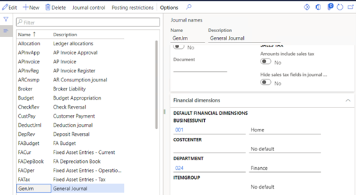
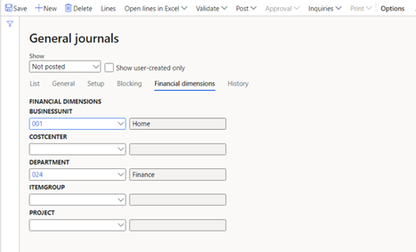
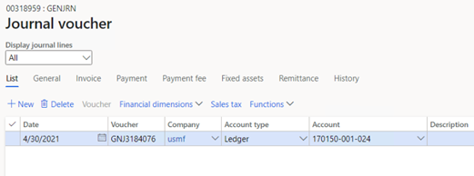

---
# required metadata

title: Default financial dimensions on financial journals 
description: This topic describes the rules that define how financial dimension values are set on transactions that are entered through financial journals. It also includes details for scenarios where fixed dimensions are used.
author: kweekley
ms.date: 09/04/2021
ms.topic: index-page
ms.prod: 
ms.technology: 

# optional metadata

ms.search.form: LedgerJournalTransDaily, LedgerJournalTransVendInvoice, LedgerJournalTransVendPaym, LedgerJournalTransCustPaym
audience: Application User
# ms.devlang: 
ms.reviewer: roschlom
# ms.tgt_pltfrm: 
# ms.custom: 
ms.search.region: Global 
# ms.search.industry: 
ms.author: kweekley
ms.search.validFrom: 2020-12-14
ms.dyn365.ops.version: 10.0.17

---

# Default financial dimensions on financial journals

[!include [banner](../includes/banner.md)]

This topic describes the rules that define how financial dimension values are set on transactions that are entered through financial journals (but not through inventory journals or project journals). It also includes details for scenarios where fixed dimensions are used.

## Symptom

The financial dimension values are not set as expected on the Account or Offset account within a financial journal. The following scenarios are two examples:

A voucher is entered in a journal a general journal. The Account is a vendor Account, and the Offset account is a bank Account. The vendor's financial dimensions are entered by default on the Account, but the bank's financial dimensions aren't entered by default on the Offset account. Instead, the dimension values from the Account are entered by default on the Offset account.

A customer has default financial dimension values assigned, and a revenue main account has a fixed dimension value assigned for the Department financial dimension. A voucher is entered in a general journal.  The Account is the customer and the Offset account is a ledger account, specifically the revenue account with the fixed dimension value. The fixed dimension isn’t set on the Offset account for the revenue main account. Instead, it is set to the Department dimension value from the Account, which came from the customer.  After posting the voucher, the fixed dimension value is used on the posted accounting entry, but the voucher still shows the customer’s department value on the revenue account. 

What rules are followed for financial dimension values set on vouchers within a journal?

## Resolution

The following rules are followed to enter financial dimension values by default on the lines of a voucher in financial journals, such as the general journal or vendor invoice journal. 

1. **Journal header**

   - Journal header dimensions are entered by default from journal name dimensions.

2. **Journal line account**

   - Journal line account dimensions are entered by default from journal header dimensions.
   - If any financial dimensions are blank, their values are entered by default from customer, vendor, bank, fixed asset, project, or ledger dimensions.

     - If the account type is **Ledger**, a fixed dimension on a ledger account is treated like a default dimension during transaction entry.
     - If the account type is **Customer**, **Vendor**, **Bank**, **Fixed assets**, or **Project**, the main account can't yet be determined. Therefore, a fixed dimension will never be entered by default for the account.

3. **Journal line offset account**

 - First, journal line Offset account dimensions default from journal line Account dimensions.

 - If any financial dimensions are blank, the next default entry will come from the default dimensions from the Customer, Vendor, Bank, Fixed assets, Project, or Ledger.
   1. If the Offset account type is **Ledger**, a fixed dimension on a Ledger account is treated like a default dimension during transaction entry. If a dimension value was already entered by default from the Account, the main account’s default or fixed dimension value will not override the existing value.
   2. If the Offset account type is **Customer**, **Vendor**, **Bank**, **Fixed assets**, or **Project**, the main account isn't known yet so a fixed dimension will never default for the Offset account.

4. **Posting**

    1. During posting, the main account for each line of the accounting entry (for both the Account and the Offset account) is evaluated to determine whether there is a fixed dimension value. If a fixed dimension is defined, any existing or blank values are replaced with that fixed dimension value.

        The fixed dimension value is **not** shown on the journal lines after posting. Instead, it's shown on the accounting entry when you view the voucher after it's posted.

    2. No other dimension values are entered by default during posting, including additional ledger accounts that might be added during posting, such as penny rounding accounts and intercompany due to or due from accounts. The default dimension entries for additional ledger accounts are taken from the Account or Offset accounts.

For the purpose of entering dimension values by default, the journal default process can't determine whether a blank dimension value was intentionally left blank, or whether the default entry wasn't made. If a dimension value is intentionally left blank, a value might still be entered by default by using the defaulting order that is described earlier. If you require that a dimension has a blank value, you might have to create a dimension that has a value of **0** (zero) or **Blank**, so that it can be used in place of a blank dimension.

Review the following scenarios for examples of the financial dimension defaulting order.

### Scenario 1

Go to **General ledger \> Journal setup \> Journal names**, and select the **GenJrn** journal name. Then, on the **Financial dimensions** FastTab, define the following values for the default financial dimensions:

- **BUSINESSUNIT:** 001
- **DEPARTMENT:** 024

Go to **General ledger \> Journal entries \> General journal**, and create a new general journal that uses the **GenJrn** journal name. The dimensions are entered by default from the journal name (LedgerJournalName table) to the journal header (LedgerJournalTable table), as shown on the **Financial dimensions** tab.

Go to the **Lines**. In the **Account type** field, select **Ledger**, and then, in the **Account** field, enter **170150**. Then select the **Tab** key to move out of the field. The dimensions are entered by default from the journal header. Therefore, the **Account** value is shown as **170150-001-024**.

Change the **Account** value to **170150-001-023**. Enter either a debit amount or a credit amount. In the **Offset account type** field, select **Ledger**, and then, in the **Offset account** field, enter **600150**. The dimension values are entered by default from the account. Therefore, the **Offset account** value is shown as **600150-001-023**.

### Scenario 2

Use the same financial dimensions that you defined for the journal name in scenario 1. Next, go to **Accounts receivable \> Customers \> All customers**, and define default financial dimension values for customer US-001. Select the customer to open the customer details. On the **Financial dimensions** tab, keep the default value for the **BUSINESSUNIT** dimension (**001**). Add the **COSTCENTER** dimension, and enter **007** as the value.

Create a new general journal that uses the **GenJrn** journal name. On the **Financial dimensions** tab, change the default **BUSINESSUNIT** value from **001** to **002**.

Go to the **Lines**. In the **Account type** field, select **Customer**, and then, in the **Account** field enter **US-001**. To view the financial dimensions for non-ledger account types, select **Financial dimensions \> Account**. The following default entries for the financial dimension values are entered:

- **BUSINESSUNIT:** 002 – The default entry is taken from the journal header. The value **001** isn't entered by default from customer US-001, because a default value was already entered.
- **COSTCENTER:** 007 – The default entry is taken from the setup of customer US-001.
- **DEPARTMENT:** 024 – The default entry is taken from the journal header.

Back on the line, in the **Offset account type**, select **Ledger**, and then, in the **Offset account** field, enter **600150**. The following default financial dimension values are entered on the line:

- **BUSINESSUNIT:** 002 – The default entry is taken from account's financial dimensions. (It was originally entered by default from the journal header.)
- **DEPARTMENT:** 024 – The default entry is taken from account's financial dimensions. (It was originally entered by default from the journal header.)
- **COSTCENTER:** 007 – The default entry is taken from account's financial dimensions. (It was originally entered by default from the the customer.)

### Scenario 3

In the same journal that you used for scenario 2, add a new line. In the **Account type** field, select **Ledger**, and then, in the **Account** field, enter **170150**. Clear the default dimension values so that only main account 170150 remains. In the **Offset account type** field, select **Customer**, and then, in the **Offset account** field, enter **US-001**. The following default entries for the financial dimension values are entered:

- **BUSINESSUNIT:** 002 – The default entry is taken from the journal header, because the Account dimension value is blank. The value **001** isn't entered by default from customer US-001, because a default value was already taken from the journal header. If the **BUSINESSUNIT** value was intentionally left blank, you must also remove the financial dimension on the Offset account.
- **COSTCENTER:** 007 – The default entry is taken from customer US-001, because the Account dimension value and journal header dimension value are blank. If the **COSTCENTER** value was intentionally left blank, you must also remove the financial dimension on the Offset account.
- **DEPARTMENT:** 024 – The default entry is taken from the journal header, because the Account dimension value is blank. If the **DEPARTMENT** value was intentionally left blank, you must also remove the financial dimension on the Offset account.

### Scenario 4

Use the same default financial dimension values that you defined for the journal name and customer in scenarios 1 and 2. Next, define a fixed dimension value for the **BUSINESSUNIT** dimension on main account 170150. Go to **General ledger \> Chart of accounts \> Accounts \> Main accounts**. In the **Main account** field, select **170150**, and then, on the **Legal entity overrides** tab, select **Add**. Select **USMF** as the legal entity, and then select **Add**. Select that record, and then select **Default dimensions**. Change the **BUSINESSUNIT** dimension to **Fixed value**, and enter **003** as the value.

Create a new general journal that uses the **GenJrn** journal name. On the **Financial dimensions** tab, remove all the default dimension values.

Go to the **Lines**. In the **Account type** field, select **Ledger**, and then, in the **Account** field, enter **170150**. Then select the **Tab** key to move out of the field. The dimension values are entered by default from the main account setup for account 170150. Therefore, the **Account** value is shown as **170150-003-**.

Change the **Account** value to **170150-004-**. **The journal functionality doesn't prevent a fixed dimension value from being changed.** Enter either a debit amount or a credit amount. In the **Offset account type** field, select **Ledger**, and then, in the **Offset account** field, enter **170250**. The financial dimension value 004 is entered as a default from the Account. Then post the document. In the journal, select **Voucher**. Notice that the **BUSINESSUNIT** value reverted to the fixed dimension value, **003**, during posting.

When you return to the voucher on the journal, the **BUSINESSUNIT** dimension does **not** reflect the fixed dimension value. It always has the value that was shown on the screen before posting. The posting process doesn't change anything that is entered on the voucher. Only the accounting entry is changed during posting.

## Developer notes

If you're a developer and want to look at code for the defaulting process, review the following methods:

- **LedgerJournalEngine.accountModified()** – This method is the main entry point for the primary account dimension defaulting process that is standard to all journals (and overridden by some journal types).
- **LedgerJournalEngine.offsetAccountModified()** – This method is the main entry point for the offset account dimension defaulting process.
