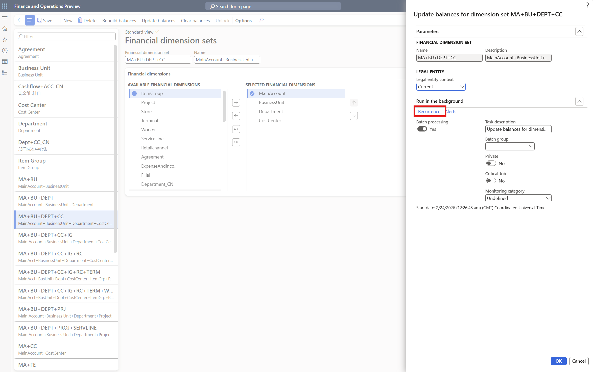

# Best practices for managing financial dimension sets

[!include [banner](../includes/banner.md)]

This article suggests practices for managing dimension set balances which help keep trial balance reports, balance initialization, and financial reports running efficiently. Following these recommendations is important because misuse of dimension sets can degrade system performance for all users.

## Update vs. rebuild

Two options are available for refreshing dimension set balances.

- **Update balances** – This option processes only the transactions that were posted since the last update. It is a fast, incremental operation that adds new records to the existing balance.
- **Rebuild balances** – This option clears all existing balance data and recalculates from the very beginning. It is a much more resource-intensive operation.

In most situations, use **Update balances**. It is significantly faster and places less load on the system. Reserve **Rebuild balances** for cases where you suspect a balance is incorrect or a transaction appears to be missing — and only after other troubleshooting steps have been exhausted.

>[!IMPORTANT]
>Once initiated, do not cancel an update, even if it is taking a long time.

## Only create dimension sets you need

Every active dimension set must be processed during each update and rebuild cycle. Creating dimension sets that you don't actively use wastes system resources without providing any benefit. For example, if you never analyze the combination of main account and cost center together, don't create it as a financial dimension set.

For dimension sets that are no longer in use, consider clearing their balances rather than deleting them:

- Clearing balances effectively deactivates a dimension set without removing it, so it remains available if you need it again in the future.
- To clear balances, go to **General ledger** \> **Chart of accounts** \> **Dimensions** \> **Financial dimension sets**, and then select **Clear balances**.

## Schedule automated balance updates

>[!NOTE]
>The [**Performance enhancement for general ledger dimension set balance calculation**](https://learn.microsoft.com/en-us/dynamics365/finance/general-ledger/financial-dimension-set-new) feature automatically schedules dimension set balance updates. Users with this feature enabled should disregard this workaround.

For environments where large transaction volumes are regularly posted or imported, scheduling periodic balance updates helps keep the number of unprocessed transactions low and thus prevents slowdowns when reports are run. Schedule these jobs during off-peak hours to minimize the impact on other users.

To set up a recurring update job, select the dimension set, and then select **Update**. In the pane that appears on the right hand side, select **Recurrence** under **Run in the background** to define the job schedule.

Keep the following points in mind:

- Running updates too frequently can itself slow performance. Choose a cadence that keeps data reasonably current without placing unnecessary load on the system.
- Some reports and inquiries trigger a balance update automatically. For example, selecting **Update** on the **Trial balance** list page runs an **Update balances** operation for that financial dimension set.
- Scheduling a **Rebuild balances** job is not recommended unless you have a specific, recurring need for it. If a rebuild must be scheduled, run it infrequently — for example, monthly — and only during periods of minimal system activity.

## Factors influencing update performance

The time it takes to process balance updates depends on several factors:

- Number of journals to process
- Number of dimensions in your chart of accounts
- Complexity of dimension configurations
- Number of active dimension sets
- Complexity of advanced rules
- Number of distinct values used within each dimension

To maximize performance, focus on optimizing these factors wherever possible.

## Enable relevant features

The [**Performance enhancement for general ledger dimension set balance calculation**](https://learn.microsoft.com/en-us/dynamics365/finance/general-ledger/financial-dimension-set-new) feature replaces the previous balance data model with a more scalable architecture. It significantly improves balance calculation performance, automatically schedules balance updates, and eliminates many of the manual management requirements for maintaining dimension set balances.

> [!IMPORTANT]
> This feature may introduce breaking changes in some environments. Test it in a UAT or sandbox environment before you enable it in production.
>
> Once feature is enabled, it is important to not disable this feature.

We also recommend disabling **change tracking** on dimension set tables where it isn't required. Change tracking adds overhead to tables that are updated frequently, and it should be reserved for authoritative transactional tables where historical change visibility is a business or compliance requirement. In particular, consider disabling change tracking for **DimensionFocus** tables such as **DimensionFocusBalance**.

## Limit the scope of balance calculations

Where possible, narrow the scope of balance calculations to avoid unnecessary processing

- **Run calculations per legal entity** – Unless cross-entity reporting requires it, run calculations per legal entity rather than across all legal entities at once.
- **Use date-range specific rebuilds** – If you need to recover missing transactions, use a date-range specific rebuild that targets only the affected period. Always try this approach before resorting to a full clear and rebuild of all balances.

## Time balance calculations carefully

When and how you run balance calculations has a significant impact on overall system performance.

- **Run calculations sequentially** – Avoid running balance calculations for multiple dimension sets at the same time. Running them one after another produces better performance than running them in parallel.
- **Avoid updates and rebuilds during year-end close** – Don't run updates or rebuilds while the year-end close process is in progress. Before year-end close completes, it automatically performs a targeted rebuild on a date range that may contain a large number of transactions. Running rebuilds in parallel during this time can be computationally expensive and unnecessary.
- **Avoid large operations during peak hours** – Large updates or rebuilds during periods of high system activity can slow down the experience for other users. Schedule them for off-peak times whenever possible.

## Don't delete and recreate dimension sets

Deleting and recreating a dimension set is not an effective way to resolve performance issues. Deleting a dimension set orphans the existing balance data, and recreating it generates a new, duplicate set of data. Over time, this bloat can worsen the performance problems you were trying to fix.

Instead, use the techniques described in this article to address performance concerns. If issues persist after following these practices, contact customer support.

[!INCLUDE[footer-include](../../includes/footer-banner.md)]
