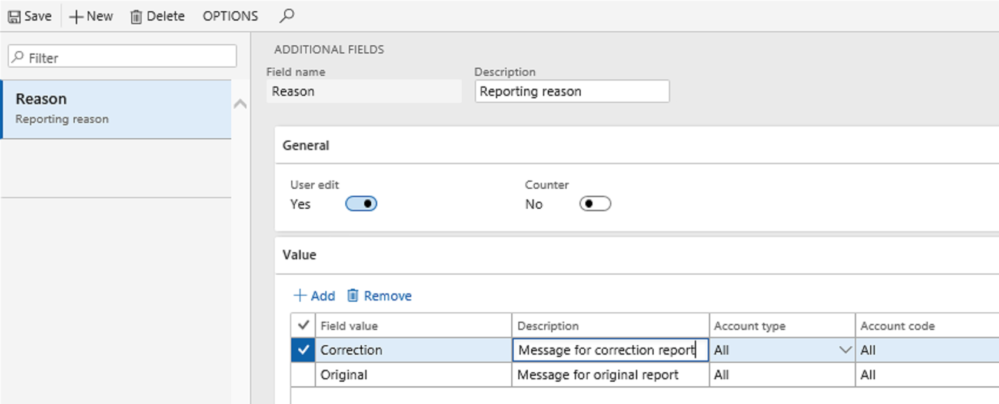

---
# required metadata

title: Set up and run processing to call a simple exporting ER format to generate an Excel report
description: This topic provides an example that shows how to set up and use electronic messages.
author: liza-golub
ms.date: 07/06/2021
ms.topic: article
ms.prod: 
ms.technology: 

# optional metadata

ms.search.form: 
# ROBOTS: 
audience: Application User
# ms.devlang: 
ms.reviewer: 
# ms.tgt_pltfrm: 
ms.custom: 
ms.search.region: Global
# ms.search.industry: 
ms.author: elgolu
ms.search.validFrom: 2021-06-24
ms.dyn365.ops.version: 10.0.21

---

# Set up and run processing to call a simple exporting ER format to generate an Excel report

[!include [banner](../includes/banner.md)]

After you've created your ER format, mapped it to data sources, and completed it, you can run it from the **Electronic reporting** workspace. After the report is generated, you can save it locally.

To control the following aspects of the reporting process, set up electronic message processing:

- Log information about who generated the report.
- Log information about when the report was generated.
- Save the reports that were generated for previous periods.

The following example shows how you can set up electronic messaging to generate a report that is based on an exporting ER format for Microsoft Excel. If you want to follow this example, the exporting ER format for Excel must already be created, mapped to data sources, and completed. Additionally, a number sequence must already be set up for electronic messages.

When you build processing, it's helpful if you first define the processing actions and statuses that will be set up. The following illustration shows the processing for this example.

## Create message statuses

1. Go to **Tax** \> **Setup** \> **Electronic messages** \> **Message statuses**.
2. Create the following message statuses:

    - New
    - Prepared
    - Generated

    

3. On the line for the **New** status, select the **Allow delete** checkbox to let users delete messages that have this status.

## Create additional fields

1. Go to **Tax** \> **Setup** \> **Electronic messages** \> **Additional fields**.
2. Add an additional field and its values.
3. Set the **User edit** option to **Yes** to let users edit the field.

## Create message processing actions

For this example, you will create the following message processing actions:

- **Create message**
- **Update to Prepared**
- **Generate report**
- **Update to initial status** (optional)

Follow these steps to create the actions.

1. Go to **Tax** \> **Setup** \> **Electronic messages** \> **Message processing actions**.
2. Create an action that is named **Create message**. On the **General** FastTab, in the **Action type** field, select **Create message**.
3. Create an action that is named **Update to Prepared**, and set the following fields:

    - On the **General** FastTab, in the **Action type** field, select **Message level user processing**.
    - On the **Initial statuses** FastTab, in the **Message status** field, select **New**.
    - On the **Result statuses** FastTab, in the **Message status** field, select **Prepared**. In the **Response type** field, enter **Successfully executed**.

4. Create an action that is named **Generate report**, and set the following fields:

    - On the **General** FastTab, in the **Action type** field, select **Electronic reporting export**. In the **Format mapping** field, select the exporting ER format. The options are **Excel**, **XML**, **JSON**, **Text**, and **Other**.
    - On the **Initial statuses** FastTab, in the **Message status** field, select **Prepared**.
    - On the **Result statuses** FastTab, in the **Message status** field, select **Generated**. In the **Response type** field, enter **Successfully executed**.

    

5. Optional: To let users regenerate a report several times, create an action that is named **Update to initial status**, and set the following fields:

    - On the **General** FastTab, in the **Action type** field, select **Message level user processing**.
    - On the **Initial statuses** FastTab, in the **Message status** field, select **Generated**.
    - On the **Result statuses** FastTab, add a separate line for each of the two message statuses (**Prepared** and **New**). For both lines, set the **Response type** field to **Successfully executed**.

## Electronic message processing

For this example, all the actions should be set up so that they run separately. The assumption is that the user will initialize every action.

1. Go to **Tax** \> **Setup** \> **Electronic messages** \> **Electronic message processing**.
2. Add a record for your processing, and add all previously defined actions and an additional field.
3. Optional: On the **Security roles** FastTab, define security roles for your processing to limit access to specific reporting.
4. Go to **Tax** \> **Inquiries and reports** \> **Electronic messages** \> **Electronic messages**.
5. Select **New** to create a message. At this point, you can add dates and a description. You can also update the value of the additional field as you require.

    

    The grid on the **Action log** FastTab is automatically filled in with a log of all actions that are performed on the message.

    You can now delete or update the message status. 

6. To update the message status, select **Update status**. In the **New status** field, select **Prepared**, and then select **OK**.

    

    The message status is updated to **Prepared**.

7. Generate the report by selecting **Generate report**.

    The report is generated, and the message status and action log are updated.

8. To view the generated report, select the **Attachment** button (paper clip symbol) in the upper-right corner of the page.

[!INCLUDE[footer-include](../../includes/footer-banner.md)]
