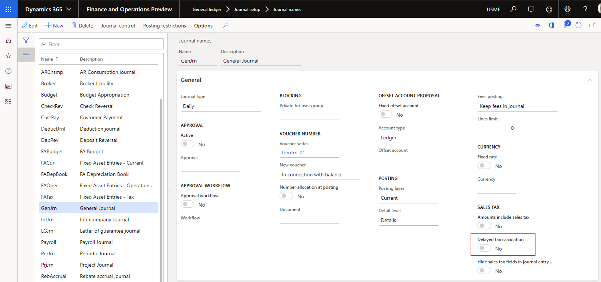
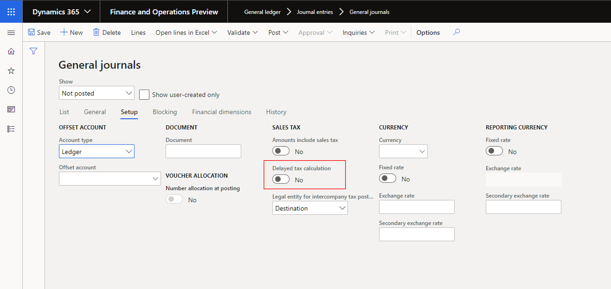

# Enable delayed tax calculation on journals
[!include [banner](../includes/banner.md)]

This article explains how you can delay sales tax calculation on journals. This capability helps improve the performance of tax calculations when there are many journal lines.

By default, sales tax amounts on journal lines are calculated whenever tax-related fields are updated. These fields include the fields for sales tax groups and item sales tax groups. Any update to a journal line causes tax amounts to be recalculated for all journal lines. Although this behavior helps user see tax amounts calculated in real time, it can also affect performance if the number of journal lines is very large.

The Delayed tax calculation feature lets you delay tax calculation on journals and therefore helps fix performance issues. When this feature is turned on, tax amounts are calculated only when a user selects **Sales Tax** or posts the journal.

You can delay the calculation of sales taxes at three levels:

- Legal entity
- Journal name
- Journal header

The system gives priority to the setting for the journal header. By default, this setting is taken from the journal name. By default, the setting for the journal name is taken from the setting on the **General ledger parameters** page when the journal name is created. The following sections explain how to turn on delayed tax calculation for legal entities, journal names, and journal headers.

## Turn on delayed tax calculation at the legal entity level

1. Go to **General ledger \> Ledger setup \> General ledger parameters**.
2. On the **Sales tax** tab, on the **General** FastTab, set the **Delayed tax calculation** option to **Yes**.

## Turn on delayed tax calculation at the journal name level

1. Go to **General ledger \> Journal setup \> Journal names**.
2. On the **General** FastTab, in the **Sales tax** section, set the **Delayed tax calculation** option to **Yes**.

## Turn on delayed tax calculation at the journal header level

1. Go to **General ledger \> Journal entries \> General journals**.
2. Select **New**.
3. Select a journal name.
4. On the **Setup** tab, set the **Delayed tax calculation** option to **Yes**.

[!INCLUDE[footer-include](../../includes/footer-banner.md)]
