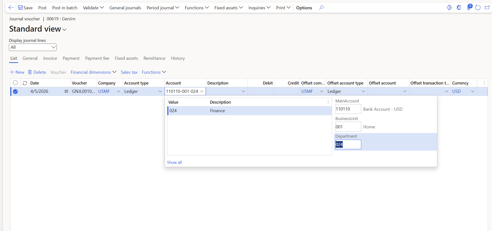

# Enter account and dimension combinations (segmented entry control)

[!include [banner](../includes/banner.md)]

This article describes how to enter account and dimension combinations or ledger accounts. The entry experience is often referred to as segmented entry control.

A segmented entry control is an input field that you use to enter a full ledger account by typing or selecting values for each segment, such as the main account and financial dimensions, separated by the chart of accounts delimiter.

Users enter account and dimension combinations on various pages, such as pages for general journals, budgeting, and posting definitions. The valid account and dimension combinations depend on the account structures that you assign to the ledger and the advanced rules that you assign to the account structures. When users enter a combination, they can either manually type the values or take advantage of a rich, lookup experience. When you enter the field, you can start to type and it searches the value and the description. For example, if you type 180 it searches any value that begins with that number combination. Or you can type Cash and it searches any value that has a description that begins with Cash. You can also use a wildcard, such as \*Cash or \*180 to search if the value or description contain the search criteria.

## When dimensions are validated

The segmented entry control allows you to freely type account and dimension values while you're entering them in the field. The control doesn't block your input as you type, even if the values don't match your account structures or derived dimensions.

Validation happens when you leave the field. When you move to another field, press Tab, or take an action on the page, the system checks what you entered against your account structures and derived dimensions list. If the values aren't valid, you receive an error at that point.

The following example shows the segmented entry control on a general journal line. The **Account** field displays the full account and dimension combination, and the lookup lets you select values for each segment.

## Keyboard shortcuts

The following table describes the keyboard shortcuts that you can use when the lookup is closed.

| Keyboard shortcut | Action |
|---|---|
| Alt+Down Arrow | Open the lookup. If you press Alt+Down Arrow a second time, the focus moves to the segments in the flyout. |
| Enter and Shift+Enter Chart of accounts delimiter Right Arrow and Left Arrow | Move to the next or previous segment. |
| Tab | Move to the next field in the grid. |

The following table describes the keyboard shortcuts that you can use when the lookup is open.

| Keyboard shortcut | Action |
|---|---|
| Esc | Close the lookup. |
| Up Arrow and Down Arrow Page Up and Page Down Home and End | Move to the previous or next value in the lists, to the previous or next group of values, or to the first or last element in the lookup. |
| Chart of accounts delimiter Right Arrow and Left Arrow | Move to the next or previous segment. |
| Tab | Move to the next field in the grid. |
| Alt+W | Switch between **Show all** and **Show valid**. |

## Copy and paste limitations

You can paste a full account and dimension combination into an individual segmented entry control, as well as paste values into individual segments. However, you can't bulk paste from Excel into the Account and Offset Account columns across multiple General Journal lines, because these columns validate each dimension segment separately.

If you need to enter account and dimension values in bulk, use one of the following alternatives:

- **Data Management Framework (DMF)** — Export the General Journal lines from the **Data Management** workspace, make your changes in Excel or another tool, and then import the updated data back. This approach is recommended for large data entry tasks.
- **Excel add-in** — Open the General Journal, select **Open in Excel**, edit the journal lines directly in the spreadsheet, and publish the changes back to Dynamics 365. For more information, see [Exporting and editing dimensions data in Excel via OData plug-in](/dynamics365/finance/general-ledger/financial-dimension-values-export-excel-odata).

[!INCLUDE[footer-include](../../includes/footer-banner.md)]
