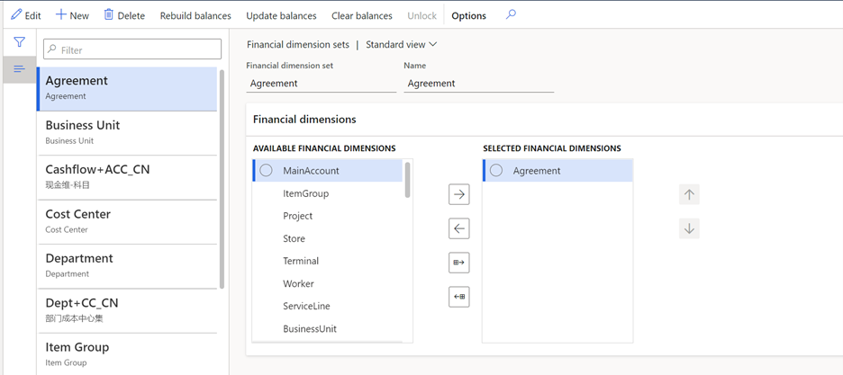
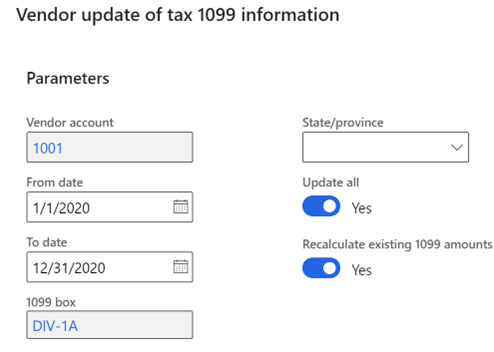
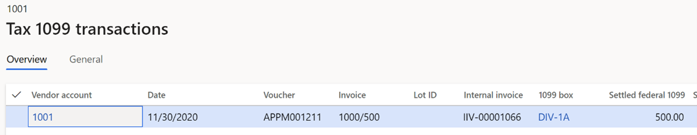

# Year-end activities FAQ 

[!include [banner](../includes/banner.md)]

This article lists questions that can arise when closing a year, and the answers that can assist with year-end closing activities. The information in this article primarily focuses on questions concerning year-end closing activities for General ledger and Accounts payable.

## General ledger year-end enhancements

Microsoft Dynamics 365 Finance version 10.0.20 introduced a year-end close enhancement. This enhancement is enabled by default as of version 10.0.25 and mandatory as of version 10.0.29. If your organization uses a version earlier than 10.0.25, we recommend that you enable this feature before you begin the year-end close process. Before you can use this feature, it must be turned on in your system. Admins can use the **Feature management** workspace to check the status of the feature and turn it on if it's required. There, the feature is listed in the following way:

- **Module:** General ledger
- **Feature name:** General ledger year-end enhancements

The setup of the year-end closing templates has moved to a new setup page, **Year-end close template setup**. The existing year-end close page will become like the **General ledger foreign currency revaluation** page, where a list shows each time that the year-end close is run or reversed. The page won't show historical information about year-end closes that were done before the feature is enabled. An accounting manager can initiate the year-end close from the new page.

To reverse the year-end close, select the most recent fiscal year for the appropriate legal entity, and then select **Reverse year-end close**. The reversal will delete the accounting entries for the previous year-end close and won't automatically rerun the year-end close. If you enable the **General ledger year-end enhancements** feature after you've completed a year-end close, and you want to reverse the historical year-end results, run the historical year-end close again after you enable the **Delete existing year-end close entries when re-closing the year** General ledger parameter.

You can rerun the year-end close by restarting the process for the fiscal year and legal entity. The process will continue to use the General ledger parameter setting to determine whether the year-end close rerun will account for only the new or changed transactions, or whether it will the process will be rerun for all transactions and completely reverse the previous close.

## General ledger: The General ledger year-end enhancements feature is enabled. Why can’t I view my previous year closings in the History section of the Year-end close page?

Prior to enabling the **General ledger year-end enhancements** feature, the date and time that the last year-end close process was run is tracked. It didn’t track history for each time the year-end close was performed. As such, the details of each year-end close run are not available to display. After enabling the feature, subsequent year-end close process information is maintained. Vouchers from all year-end close processes, even those run before the feature enablement, can be viewed on the **Voucher transactions** page. 

## General ledger: The year-end close process is failing because of the following error: "The year-end close can't be run because one or more ledger transactions posted into the fiscal year that you are closing were settled to a ledger transaction in a different fiscal year." What does this error mean?

Because the **Awareness between ledger settlement and year-end close** feature is enabled, only settled ledger transaction from the fiscal year that's being closed are excluded from the opening balance. This behavior causes debits and credit to be out of balance. For more information, see [Awareness between ledger settlement and year-end close](awareness-between-ledger-settlement-year-end-close.md).

## General ledger: Reversal of the year-end close process is failing because of the following error: "The year-end close for 1/1/2022 can't be reversed because beginning balance transaction have been ledger settled in fiscal year 1/1/2023." What does this error mean?

Because the **Awareness between ledger settlement and year-end close** feature is enabled, reversals of the year-end processing aren't allowed if the opening transactions have been settled in the new fiscal year. Reverse the ledger settlement in the new 2023 fiscal year before you reverse the year-end close for January 1, 2022. Alternatively, reclose the year for January 1, 2022, but only for new adjusting entries. To reclose the year for adjustments only, disable the **Delete existing year-end entries when re-closing the year** General ledger parameter.

## General ledger: Why isn't the ledger settlement automation processing December's ledger settlement transactions?

The **Automate ledger settlements** feature will run the automation for transactions that are dated from the first day of the fiscal year to the current date when the occurrence runs. For fiscal years that end on December 31, you might have to adjust the execution date of your occurrence to ensure that it's run in December. For example, automation is set up to run on the first day of every month. This automation will be run on December 1, 2022, and is scheduled to run on January 1, 2023. We recommend that you change the occurrence for January 1, 2023, so that it runs instead on December 31, 2022. This change will ensure that the transactions that are dated December 2 through 31 will be considered for automatic settlement.

## General ledger: What's the difference between the Reverse year-end close action and the Delete existing year-end entries when reclosing parameter for year-end close?

Confusion might exist about the difference between the **Reverse year-end close** action, and the **Delete existing year-end entries when reclosing** parameter in General ledger (**General ledger \> Ledger setup \> General ledger parameters**).

Select the **Reverse year-end close** action when you're running the year-end close process to delete all closing balance and opening balance entries, as if the year-end close had never been run. In this case, the vouchers will be deleted. The year-end close won't run again automatically. To run the year-end close, select the **Run year-end close** action.

The **Delete existing year-end entries when re-closing the year** parameter in General ledger is used only when you're running (not reversing) the year-end close. If the parameter is set to **Yes**, all closing balance and opening balance entries will be deleted, and the year-end close will run again. This option is used when an organization wants all transactions, including adjustments since the last year-end close, to be posted in a single accounting entry for the closing balance and opening balance entries. If the parameter is set to **No**, all closing balance and opening balance entries remain. They aren't deleted. Instead, a new closing balance and opening balance entry will be created only for the delta or new transactions that have been posted since the last year-end close for that fiscal year.

> [!NOTE]
> The closing balance entry is created in the year being closed. This only occurs if the **Create closing transactions during transfer** parameter in General ledger is set to **Yes**. The opening balance entry is always created, because this is the beginning balance for the next year.

## General ledger: What is the difference between “Close all” and “Close single” options on the Transfer profit and loss dimension section of the Year-end close process?

**Close all** maintains the original financial dimension values from posted transactions and uses them to create the opening balances for the retained earnings account. Separate retained earnings beginning balances will be created for each unique combination of financial dimension values. If **Close single** is selected, all posted transactions that have that financial dimension will be summarized into a retained earnings beginning balance for the dimension value that is entered in the field that appears after **Close single**. 

For example, all transactions for the fiscal year were posted with the account structure Main account - Department. For the Department financial dimension on the template, **Close single** is selected, and 100 is entered as the dimension value. If the total income of all transactions that are posted to departments 200, 300, and 400 is $100,000, one opening balance will be created for Retained earnings - 100. If you select **Close single** but leave the financial dimension value blank, all transactions will be posted to retained earnings, and the dimension value will be blank.

## General ledger: When I select “Close single” option on the Transfer profit and loss dimension section of the Year-end close process, will my detailed transactional information be lost?

The **Close all** and **Close single** options are used to specify which financial dimensions on transactions that are posted to profit and loss accounts will be transferred to the retained earnings main account. The historical, detailed posting to the profit and loss accounts is not impacted and will remain detail. The option impacts the level of detail that is transferred to the retained earnings accounts as an opening balance in the new year. 

## General ledger: The year-end close process is failing because the reporting currency for the year does not balance. What does this mean?

This error can be experienced after enabling the **Awareness between ledger settlement and year end close** feature (the Awareness feature). When the feature is enabled, ledger transactions that have been settled will no longer be included in the opening balance of the next fiscal year when running the general ledger year end close. Excluding ledger transactions that are settled may present a challenge for customers at year-end close if the Ledger is defined with a reporting currency.   
Ledger settlement is performed for only the accounting currency.  When the ledger transactions are settled, validation only ensures the accounting currency debits equal the accounting currency credits. The reporting currency amounts for those ledger transactions aren’t validated and may not have debits = credits.  In addition, ledger settlement doesn’t automatically calculate and post a gain/loss in the reporting currency.  Due to these limitations, a gain/loss transaction must exist in the reporting currency when performing ledger settlement.  If the gain/loss isn’t included in the ledger settlement, the year-end close will result in an out of balance message.  For more information, see [Awareness between ledger settlement feature and reporting currency is out of balance](reporting-currency-yec.md).

## General ledger: What can be changed to help enhance the performance of year-end processing?

You can make several changes to help improve the performance of the year-end close. We recommend that you evaluate these suggested changes to determine whether they're appropriate for your organization.

### Optimize year-end close service

The **Optimize year-end close** service empowers Microsoft Dynamics 365 Finance customers to accelerate their year-end close by moving the heavy year-end processing to a microservice. The time that's saved through an efficient year-end close enables each Finance team to react in a timely manner to required adjustments, ending in the generation of the financial reports. By processing the year-end close on a microservice, valuable resources are freed up. The processing elevation minimizes the load on the SQL server and gives customers an opportunity to accelerate the year-end close processing.

The **Optimize year-end close** service is available in version 10.0.31, so that more customers can use the new service for the 2022 year-end season. Additionally, the service has been backported to versions 10.0.30 and 10.0.29. For more information, see [Optimize year-end close](optimize-year-end-close.md).

### Dimension sets

When you run the year-end close, each dimension set balance is rebuilt. This behavior has a direct impact on performance. Some organizations create dimension sets unnecessarily, because they were used at one point or might be used at some point. Because these unnecessary dimension sets are rebuilt during the year-end close, time is added to the process. Take the time to evaluate your dimension sets and delete any that are unnecessary.

The unnecessary dimension sets also impact the batch job **BudgetDimensionFocusInitializeBalance** (**General ledger \> Chart of accounts \> Dimensions \> Financial dimension sets**).

### Year-end close template configuration

The year-end close template lets organizations select the financial dimension level to maintain when transferring profit and loss balances to retained earnings. The settings allow an organization to maintain the detailed financial dimensions (**Close all**) when moving the balances to retained earnings or choose to summarize the amounts to a single dimension value (**Close single**). This can be defined for each financial dimension. For more information on these settings, see the [Year-end close](year-end-close.md) article.

We recommend that you evaluate your organization's requirements and if possible, close as many dimensions as possible using the **Close single** year-end option to improve performance. By closing to a single dimension value (which can also be a blank value), the system calculates less detail when determining the balances for retained earnings account entries.

### Highly volatile dimensions

A highly volatile dimension provides little to no reuse by itself and in combination with other dimensions. There are two types of highly volatile dimensions. The first type is a dimension that is individually highly volatile. Typically, this type of highly volatile dimension will appear on only a single transaction, or on small sets of transactions. The second type is a dimension that becomes highly volatile in combination with one or more additional dimensions that exhibit the same potential based on the possible permutations that can be generated. A highly volatile dimension can have a significant impact on the performance of the year-end close process. To minimize performance issues, define all highly volatile dimensions as **Close single** in the year-end close setup as described in the preceding section.

## Accounts payable: What changes have been made to support 1099 year-end reporting for 2022?

#### Update to all 1099 forms

The following changes have been made to all 1099 forms for the 2022 tax year:

- In 2021, the year was fixed on 1099 forms. Starting in 2022, the year is filled in by the report.

#### 1099-MISC

The following updates have been made on Form 1099-MISC for the 2022 tax year:

- Box 13: Now indicates the Foreign Account Tax Compliance Act (FATCA) filing requirement.
- Box 14: Now used to report the excess golden parachute payments.
- Box 15: Now used to report the payment under nonqualified deferred compensation (NQDC) plans.
- Box 16: Now used to report state withheld taxes.
- Box 17: Now used to report the payer's state number.
- Box 18: Now used to report the state income.

## Accounts payable: 1099 – How do I change the 1099 box and values for a vendor that wasn't tracking 1099 information throughout the year?

Use the **Update 1099** functionality to go through previously paid invoice transactions and reassign the 1099 data in an appropriate manner, according to the settings on the **Tax 1099** tab of the **Vendor** page. To use the **Update 1099** functionality, go to **Accounts payable \> Vendors \> All vendors**, select a vendor, and then, on the Action Pane, on the **Vendor** tab, select **Update 1099**.

## Can I run the Update 1099 functionality for all my vendors at once?

You can use the **Update 1099 information for multiple vendors** page to update the 1099 box on a vendor record, and to update transactions with the information from the 1099 box. To open this page, go to **Accounts payable \> Periodic task \> Tax 1099**. To access the page, you must be assigned to the **Update 1099 box and transactions for multiple vendors** security privilege.

## Accounts payable: 1099 – Recalculate existing 1099 amounts versus Update all in the Update 1099 utility

The **Recalculate existing 1099 amounts** checkbox will reset the 1099 amount to the total paid values when it's used together with the **Update all** checkbox.

The **Recalculate existing 1099 amounts** checkbox comes into play only if there are partial 1099 values on the invoice, or if the invoice was modified on the Tax 1099 form. For example, you have an invoice that's valued at $1,000.00, but the user manually enters a 1099 amount of $500.00 on the invoice.

When this invoice is paid, $500.00 will be the 1099 amount that's paid. If you perform the recalculation routine, the 1099 amount will be changed to $1,000.00, which is the total that was paid.

## Accounts payable: 1099 – Manually create 1099 transactions

An organization might need to manually create 1099 transactions that aren't associated with an invoice. You can add manual 1099 transactions by going to **Accounts payable \> Periodic tasks \> Tax 1099 \> Vendor settlement for 1099s**. Select the **Manual 1099 transactions** button.

Manually created 1099 transactions aren't updated with the **Update all** process or the **Recalculate existing 1099 amounts** process in the **Update 1099** utility.

## Accounts payable: 1099 – Does Dynamics 365 Finance support the 1096 form?

Dynamics 365 Finance doesn't print the 1096 Annual Summary and Transmittal of US Information Returns form.

## Accounts payable: 1099 – Are there any new features that support 1099 reporting for Public sector?

A new Public sector feature, **Update 1099 information by main account**, has been added, which you can enable in the **Feature management** workspace. This feature lets you associate the 1099 values for a vendor by the main account in the accounting distribution, rather than the default account on the vendor record.

For more information, see [Set up vendors for 1099 reporting](../localizations/noam-usa-set-up-vndrs-1099-rprtg.md).

[!INCLUDE[footer-include](../../includes/footer-banner.md)]
