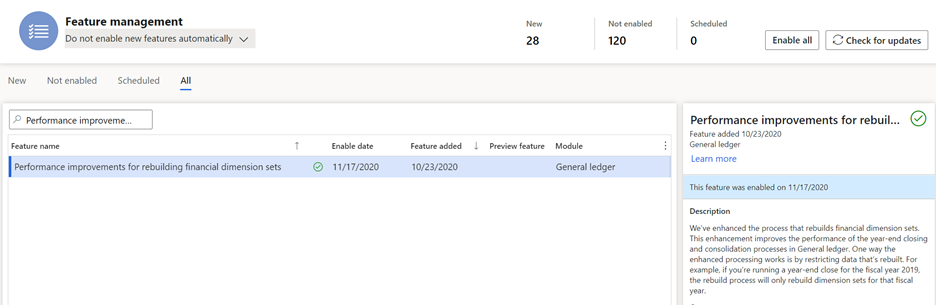

---
# required metadata

title: Year-end activities FAQ 
description: This topic has been compiled to assist with year-end closing activities.
author: kweekley
manager: aolson
ms.date: 12/14/2020
ms.topic: index-page
ms.prod: 
ms.service: dynamics-ax-applications
ms.technology: 

# optional metadata

ms.search.form: 
audience: Application User
# ms.devlang: 
ms.reviewer: roschlom
ms.search.scope: Core, Operations
# ms.tgt_pltfrm: 
# ms.custom: 
ms.search.region: Global 
# ms.search.industry: 
ms.author: kweekley
ms.search.validFrom: 2020-12-14
ms.dyn365.ops.version: 10.0.14

---

# Year-end activities FAQ 

This topic has been compiled to assist with year-end closing activities. The information in this topic primarily focuses on questions concerning year-end closing activities  for General ledger and Accounts payable.

## General ledger:  Running year-end close vs. undoing year-end close
We have seen organizations run the year-end close but were actually performing an undo of the year-end close. If the year-end close is finishing really quickly or the year end close does not produce opening balances, validate the **Undo previous close** setting in the **Year-end close** (**General ledger > Period close > Year end close > Run fiscal close**). 

If the **Undo previous close** selection is set to **Yes**, the previous year-end close is being reversed. When running an undo, all closing balance and opening balance entries will be deleted, as if the year-end close had never been run. The vouchers are deleted. The year-end close will not run again automatically. You must start the process again, this time changing **Undo previous close** to **No**. 

> [!NOTE]
> The closing balance entry is optionally created in the year being closed. This only occurs if the General ledger parameter **Create closing transactions during transfer** is set to **Yes**. The opening balance entry is always created, because this is the beginning balance for the next year.  
 
## General ledger: What is the difference between Undo and Delete GL parameter for year-end close?
Confusion might exist over the difference between the **Undo previous close** parameter, which is in the **Year-end close** dialog box, and the **Delete close-of-year transactions during transfer** parameter in General ledger (**General ledger > Period close > Year-end close > Run fiscal close**).  

Select **Undo previous close** in the drop-down dialog menu when running the year-end close process to delete all closing balance and opening balance entries, as if the year-end close had never been run. The vouchers will be deleted. The year-end close will not run again automatically. To run the year-end close, you must initiate this process again, this time changing **Undo previous close** to **No** (**General ledger > Ledger setup > General ledger parameters**). 

The **Delete close-of-year transactions during transfer** parameter in General ledger is used only when running (not undoing) the year-end close (the **Undo previous close** selection is set to **No**). If that parameter is set to **Yes**, all closing balance and opening balance entries will be deleted and the year-end close will run again. This process is used when the organization wants all transactions, including adjustments since the last year-end close, to be posted in a single accounting entry for the closing balance and opening balance entries. 

If this option is set to **No**, all closing balance and opening balance entries remain. They are not deleted. Instead, a new closing balance and opening balance entry will be created for only the delta or new transactions posted since the last year-end close for that fiscal year.  

> [!NOTE]
> The closing balance entry is created in the year being closed. This only occurs if the **Create closing transactions during transfer** parameter in General ledger is set to **Yes**. The opening balance entry is always created, because this is the beginning balance for the next year. 

## General ledger: What can be changed to enhance performance of year-end processing? 
You can make a number of changes to improve performance of the year-end close. We recommend that you evaluate these suggested changes to consider whether the change is appropriate for your organization.  

### Dimension sets
When running the year end close, each dimension set balance is rebuilt, having a direct impact on the performance. Some organizations create dimension sets unnecessarily because they were used at one point or might be used at some point.  These unnecessary dimension sets are still rebuilt during the year end close, which adds time to the process. Take time to evaluate your dimension sets and delete any unnecessary dimension sets.

The unnecessary dimension sets also impact the batch job **BudgetDimensionFocusInitializeBalance** (**General ledger > Chart of accounts > Dimensions > Financial dimension sets**).

### Year-end close template configuration
The year-end close template lets organizations select the financial dimension level to maintain when transferring profit and loss balances to retained earnings. The settings allow an organization to maintain the detailed financial dimensions (**Close all**) when moving the balances to retained earnings or choose to summarize the amounts to a single dimension value (**Close single**). This can be defined for each financial dimension. For more information on these settings, see the year end close documentation.

We recommend that you evaluate your organization's requirements and if possible, close as many dimensions as possible using the **Close single** year-end option to improve performance. By closing to a single dimension value (which can also be a blank value), the system calculates less detail when determining the balances for retained earnings account entries.
 
## General ledger – Period close – Year end close
 

### Performance improvements for rebuilding financial dimension sets (new feature)
A new feature added in version 10.0.16 improves the performance of the year-end close and consolidation processes. The feature is named, Performance improvements for rebuilding financial dimension sets. This feature changes the way dimension sets are rebuilt so that they are rebuilt only for a relevant time frame. In the previous versions, dimension sets were rebuilt for all dates. For example, if you're closing the year 2020, the system will only rebuild the balances for transactions within the fiscal year 2020. If you're running consolidation for a date range of November 1, 2020 to November 30, 2020, the system will only rebuild the balances for that date range.

Because this feature is considered a breaking change, you'll need to enable it using the **Feature management** workspace.
 

## Accounts payable: What changes have been made to support 1099 year-end reporting for 2020?

Two new regulatory features have been added for 1099 year-end changes in 2020. The first feature, **Apply changes to 1099-NEC and 1099-MISC forms for 2020**, was released mid-year as a mandatory feature. Its purpose is to ensure that 1099 transactional data for the year 2020 can be tracked for the new 1099-NEC form. This feature added the 1099 fields that are needed to support the new 1099-NEC and updated the 1099-MISC fields. This update also upgraded vendor record data for the 1099 box information. 

The second regulatory feature, **1099 statements updated for 2020 tax law**, contains the following changes.

- 1099-OID - The IRS has converted the form to continuous use.
   - The reporting year’s 3rd and 4th digit must be filled in when printed. Use the **Reporting year** field’s 3rd and 4th digits from **Tax 1099 print options**. 

- 1099-NEC – A new form for 2020. This records nonemployee compensation. 

- 	1099-MISC – Due to the creation of Form 1099-NEC, the IRS has revised Form 1099-MISC and rearranged box numbers for reporting certain income.
Changes in the reporting of income and the form’s box numbers are listed below.
   - Payer made direct sales of $5,000 or more (check box) in box 7.
   - Crop insurance proceeds are reported in box 9.
   - Gross proceeds to an attorney are reported in box 10.
   - Section 409A deferrals are reported in box 12.
   - Nonqualified deferred compensation income is reported in box 14.
   - Boxes 15, 16, and 17 report state taxes withheld, state identification number, and amount of income earned in the state, respectively.

- No changes to 1099-DIV or 1099-INT in 2020.

- Electronic filing – The format has changed to accommodate the new NEC form, and the MISC box changes described above. For specific information on electronic filing requirements, see [IRS Publication 1220](https://www.irs.gov/pub/irs-pdf/p1220.pdf).

## Accounts payable: 1099 – How do I change the 1099 box and values for a vendor that wasn’t tracking 1099 information throughout the year?
Use the Update 1099 functionality (**Accounts payable > Vendors>All vendors > Select a vendor > Vendor tab in ribbon > Update 1099**) to go through previously paid invoice transactions to reassign the 1099 data appropriately according to the settings on the **Tax 1099** tab on the **Vendor** page.

## Can I run the Update 1099 for all my vendors at once?
No. The Update 1099 routine is performed against a single vendor at a time. If this requirement is needed by your organization, please vote for the Idea titled [Batch Process for Update of Vendor's 1099 Data](https://experience.dynamics.com/ideas/idea/?ideaid=5493d608-350e-eb11-b5d9-0003ff68ded8).

## Accounts payable: 1099 – “Recalculate existing 1099 amounts” vs. “Update all” in the Update 1099 utility.
The **Recalculate existing 1099 amounts** check box will reset the 1099 amount to the total paid values, when used in conjunction with the **Update all** check box. The **Recalculate existing 1099 amounts** check box only comes into play when there are partial 1099 values on the invoice or if it was modified on the Tax 1099 form. For example, assume you have an invoice valued at $1000.00, but the user manually types in a 1099 amount on the invoice of $500.00. When this is paid, $500.00 will be the 1099 amount paid. If you perform the recalculation routine, the system will change the 1099 amount to be $1000.00, which is the total that was paid.

## Accounts payable: 1099 – Manually create 1099 transactions
An organization might need to manually create 1099 transactions that aren't associated with an invoice. You can add manual 1099 transactions by going to **Accounts payable > Periodic tasks > Tax 1099 > Vendor settlement for 1099s**. Select the **Manual 1099 transactions** button. 

Manually created 1099 transactions are not updated with the **Update all** process or the **Recalculate existing 1099 amounts** process in the **Update 1099** utility.

## Accounts payable: 1099 – Does Dynamics 365 Finance support the 1096 form? 

Dynamics 365 Finance doesn’t print the 1096 Annual Summary and Transmittal of US Information Returns form.

## Accounts payable: 1099 – Are there any new features that support 1099 reporting for Public sector? 
A new Public sector feature, **Update 1099 information by main account**, has been added, which you can enable in the **Feature management** workspace. This feature lets you associate the 1099 values for a vendor by the main account in the accounting distribution, rather than the default account on the vendor record.

For more information, see [Set up vendors for 1099 reporting](../localizations/noam-usa-set-up-vndrs-1099-rprtg.md).
