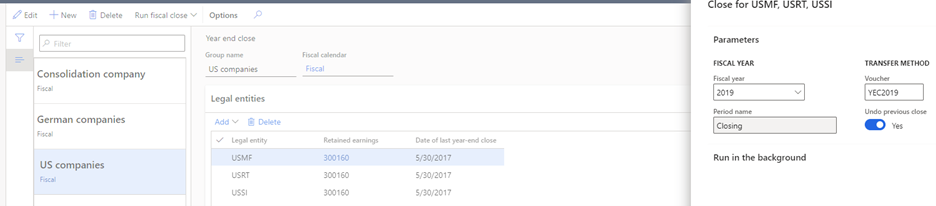

---
# required metadata

title: Year-end activities FAQ 
description: This topic lists questions that can arise when closing a year, and the answers that can assist with year-end closing activities.
author: moaamer
ms.date: 12/21/2021
ms.topic: index-page
ms.prod: 
ms.technology: 

# optional metadata

ms.search.form: 
audience: Application User
# ms.devlang: 
ms.reviewer: roschlom
# ms.tgt_pltfrm: 
# ms.custom: 
ms.search.region: Global 
# ms.search.industry: 
ms.author: kweekley
ms.search.validFrom: 2020-12-14
ms.dyn365.ops.version: 10.0.14

---

# Year-end activities FAQ 

[!include [banner](../includes/banner.md)]

This topic lists questions that can arise when closing a year, and the answers that can assist with year-end closing activities. The information in this topic primarily focuses on questions concerning year-end closing activities for General ledger and Accounts payable.

## General ledger year-end enhancements 
Version 10.0.20 introduced a year-end close enhancement, which is enabled by default starting with version 10.0.25. If your organization uses a version earlier than 10.0.25, we recommend enabling this feature before beginning the year-end close process. Before you can use this feature, it must be turned on in your system. Admins can use the Feature management workspace to check the status of the feature and turn it on if it's required. There, the feature is listed in the following way:

 - Module: General ledger
 - Feature name: General ledger year-end enhancements

The setup of the year-end closing templates has moved to a new setup page, **Year-end close template setup**. The existing year-end close page will change in a manner similar to the General ledger foreign currency revaluation, where a list displays each time the year-end close is run or reversed. An accounting manager can initiate the year-end close from the new page. 

To reverse the year-end close, select the most recent fiscal year for the appropriate legal entity and choose the **Reverse year-end close** button. The reversal will delete the accounting entries for the previous year-end close and will not rerun the year-end close automatically. 

You can rerun the year-end close by restarting the process for the fiscal year and legal entity. The process will continue to use the General ledger parameter setting to determine whether the year-end close rerun will account for only the new or changed transactions, or completely reverse the previous close, rerunning the process for all transactions.  

## General ledger: How do I know that we're running year-end close and not undoing year-end close?
We have seen organizations try to run the year-end close but instead were performing an undo of the year-end close. If the year-end close is finishing really quickly or the year end close does not produce opening balances, validate the **Undo previous close** setting in **Year-end close** (**General ledger > Period close > Year end close > Run fiscal close**). 

If the **Undo previous close** selection is set to **Yes**, the previous year-end close is being reversed. When running an undo, all closing balance and opening balance entries will be deleted, as if the year-end close had never been run. The vouchers are deleted. The year-end close will not run again automatically. You must start the process again, this time changing **Undo previous close** to **No**. 

> [!NOTE]
> The closing balance entry is optionally created in the year being closed. This only occurs if the General ledger parameter **Create closing transactions during transfer** is set to **Yes**. The opening balance entry is always created, because this is the beginning balance for the next year.  
 
## General ledger: What is the difference between Undo and Delete GL parameter for year-end close?
Confusion might exist over the difference between the **Undo previous close** parameter, which is in the **Year-end close** dialog box, and the **Delete close-of-year transactions during transfer** parameter in General ledger (**General ledger > Period close > Year-end close > Run fiscal close**).  

Select **Undo previous close** in the drop-down dialog menu when running the year-end close process to delete all closing balance and opening balance entries, as if the year-end close had never been run. The vouchers will be deleted. The year-end close will not run again automatically. To run the year-end close, you must initiate this process again, this time changing **Undo previous close** to **No** (**General ledger > Ledger setup > General ledger parameters**). 

The **Delete close-of-year transactions during transfer** parameter in General ledger is used only when running (not undoing) the year-end close (the **Undo previous close** selection is set to **No**). If that parameter is set to **Yes**, all closing balance and opening balance entries will be deleted and the year-end close will run again. This process is used when the organization wants all transactions, including adjustments since the last year-end close, to be posted in a single accounting entry for the closing balance and opening balance entries. 

If this option is set to **No**, all closing balance and opening balance entries remain. They are not deleted. Instead, a new closing balance and opening balance entry will be created for only the delta or new transactions posted since the last year-end close for that fiscal year.  

> [!NOTE]
> The closing balance entry is created in the year being closed. This only occurs if the **Create closing transactions during transfer** parameter in General ledger is set to **Yes**. The opening balance entry is always created, because this is the beginning balance for the next year. 

## General ledger: What can be changed to enhance performance of year-end processing? 
You can make a number of changes to improve performance of the year-end close. We recommend that you evaluate these suggested changes to consider whether the change is appropriate for your organization.  

### Dimension sets
When running the year end close, each dimension set balance is rebuilt, having a direct impact on the performance. Some organizations create dimension sets unnecessarily because they were used at one point or might be used at some point.  These unnecessary dimension sets are still rebuilt during the year end close, which adds time to the process. Take time to evaluate your dimension sets and delete any unnecessary dimension sets.

The unnecessary dimension sets also impact the batch job **BudgetDimensionFocusInitializeBalance** (**General ledger > Chart of accounts > Dimensions > Financial dimension sets**).

### Year-end close template configuration
The year-end close template lets organizations select the financial dimension level to maintain when transferring profit and loss balances to retained earnings. The settings allow an organization to maintain the detailed financial dimensions (**Close all**) when moving the balances to retained earnings or choose to summarize the amounts to a single dimension value (**Close single**). This can be defined for each financial dimension. For more information on these settings, see the [Year-end close](year-end-close.md) topic.

We recommend that you evaluate your organization's requirements and if possible, close as many dimensions as possible using the **Close single** year-end option to improve performance. By closing to a single dimension value (which can also be a blank value), the system calculates less detail when determining the balances for retained earnings account entries.

## Degenerate dimensions

A degenerate dimension provides little to no reuse by itself and in combination with other dimensions. There are two types of degenerate dimensions. The first type is a dimension that is individually degenerate. Typically this type of degenerate dimension will appear on only a single transaction, or on small sets of transactions. The second type is a dimension that becomes degenerate in combination with one or more additional dimensions that exhibit the same potential based on the possible permutations that can be generated. A degenerate dimension can have a significant impact on the performance of the year-end close process. To minimize performance issues, define all degenerate dimensions as **Close single** in the year-end close setup as described in the preceding section.

## General ledger: What does the period close, year-end close do?
 

### Performance improvements for rebuilding financial dimension sets
A new feature that was added in version 10.0.16 improves the performance of the year-end close and consolidation processes. The feature is named, Performance improvements for rebuilding financial dimension sets. This feature changes the way dimension sets are rebuilt so that they are rebuilt only for a relevant time frame. In the previous versions, dimension sets were rebuilt for all dates. For example, if you're closing the year 2020, the system will only rebuild the balances for transactions within the fiscal year 2020. If you're running consolidation for a date range of November 1, 2020 to November 30, 2020, the system will only rebuild the balances for that date range.

Before you can use this feature, it must be turned on in your system. Admins can use the Feature management workspace to check the status of the feature and turn it on if it's required. There, the feature is listed in the following way:
 
- Module: General ledger
- Feature name: Performance improvements for rebuilding financial dimension sets

## Accounts payable: What changes have been made to support 1099 year-end reporting for 2021?

In 2021, the DIV, NEC, and MISC forms have been changed slightly, and some additional boxes have been added.

#### DIV: new box 2e, 2f
 
- Box 2e. Shows the portion of the amount in box 1a that is section 897 gain attributable to disposition of U.S. real property interests (USRPI).  
- Box 2f. Shows the portion of the amount in box 2a that is section 897 gain attributable to disposition of USRPI. Note that boxes 2e and 2f apply only to foreign persons and entities whose income maintains its character when passed through, or distributed to, its direct or indirect foreign owners or beneficiaries. It is generally treated as effectively connected to a trade or business within the United States. See the instructions for your tax return. 
 
#### NEC: new box 2 
 
If box 2 is checked, report consumer products totaling $5,000 or more that were sold to you for resale, on a buy-sell, a deposit-commission, or other basis. Generally, report any income from your sale of these products on Schedule C (Form 1040). 
 
Meanwhile, the form size of NEC is changed. During printing, there are three forms per page. 
 
#### MISC: new box 11 
 
Box 11 shows the amount paid for the purchase of fish for resale from any person engaged in the trade or business of catching fish. See the instructions for your tax return for reporting this income. 
 
#### Electronic filing 
For information about electronic filing, see [Publication for electronic filing requirements](https://www.irs.gov/pub/irs-pdf/p1220.pdf).

Update Format Specifications and Record Layouts for 2021 e-report 
- Sec. 2 Issuer “A” Record. 
- Amount Codes - Increased Field Position 28-45, Length to 18. 
 
#### Sec. 2 Issuer “A” Record, For Reporting Payments on Form 1099-DIV: 
- Amount Type – Added Section 897 Ordinary Dividends and added Amount Code H. 
- Amount Type – Added Section 897 Capital Gains and added Amount Code J. 
 
#### Sec. 3 Payee “B” Record 
- General Information Records – Updated third bullet from 16 to 18 Payment Amount Fields. 
- Field Title Payment H – Updated Field Position 247-258, Field Title, Length and General Field Description. 
- Field Title Payment J – Updated Field Position 259-270, Field Title, Length and General Field 
Description. 
- Updated Blank field to Field Position 271-286. 
- Updated Foreign Country Indicator to Field Position 287. 
- Updated First Payee Name Line field to Field Position 288-327. 
- Updated Second Payee Name Line field to Field Position 328-367. 
- Record Layout Positions, Form 1099-MISC – Deleted Field Position 548 and Field Title FATCA Filing 
Requirement Indicator. 
- Record Layout Positions, Form 1099-NEC – Updated 545-546 to Blank, Updated 547 field to Direct Sales Indicator, Length and Description and Remarks Updated 548-722 field to Blank. 
 
#### Sec. 4 End of Issuer “C” Record 
- Field Title Payment H – Updated Field Position 304-321, Field Title, Length and General Field Description. 
- Field Title Payment J – Updated Field Position 322-339, Field Title, Length and General Field Description. 
- Field Title 340-499 – Updated Length to 160. 
 
#### Sec. 5 State Totals “K” Record 
- Field Title Payment H – Updated Field Position 304-321, Field Title, Length and General Field Description. 
- Field Title Payment J – Updated Field Position 322-339, Field Title, Length and General Field Description. 
- Field Title 340-499 – Updated Length to 160.  

## Accounts payable: 1099 – How do I change the 1099 box and values for a vendor that wasn’t tracking 1099 information throughout the year?
Use the Update 1099 functionality (**Accounts payable > Vendors>All vendors > Select a vendor > Vendor tab in ribbon > Update 1099**) to go through previously paid invoice transactions to reassign the 1099 data appropriately according to the settings on the **Tax 1099** tab on the **Vendor** page.

## Can I run the Update 1099 for all my vendors at once?
No. The Update 1099 routine is performed against a single vendor at a time. If this requirement is needed by your organization, please vote for the Idea titled [Batch Process for Update of Vendor's 1099 Data](https://experience.dynamics.com/ideas/idea/?ideaid=5493d608-350e-eb11-b5d9-0003ff68ded8).

## Accounts payable: 1099 – Recalculate existing 1099 amounts versus Update all in the Update 1099 utility
The **Recalculate existing 1099 amounts** check box will reset the 1099 amount to the total paid values, when used in conjunction with the **Update all** check box. 

The **Recalculate existing 1099 amounts** check box only comes into play when there are partial 1099 values on the invoice or if it was modified on the Tax 1099 form. For example, assume you have an invoice valued at $1000.00, but the user manually types in a 1099 amount on the invoice of $500.00.

When this is paid, $500.00 will be the 1099 amount paid. If you perform the recalculation routine, the system will change the 1099 amount to be $1000.00, which is the total that was paid.

## Accounts payable: 1099 – Manually create 1099 transactions
An organization might need to manually create 1099 transactions that aren't associated with an invoice. You can add manual 1099 transactions by going to **Accounts payable > Periodic tasks > Tax 1099 > Vendor settlement for 1099s**. Select the **Manual 1099 transactions** button. 

Manually created 1099 transactions are not updated with the **Update all** process or the **Recalculate existing 1099 amounts** process in the **Update 1099** utility.

## Accounts payable: 1099 – Does Dynamics 365 Finance support the 1096 form? 

Dynamics 365 Finance doesn’t print the 1096 Annual Summary and Transmittal of US Information Returns form.

## Accounts payable: 1099 – Are there any new features that support 1099 reporting for Public sector? 
A new Public sector feature, **Update 1099 information by main account**, has been added, which you can enable in the **Feature management** workspace. This feature lets you associate the 1099 values for a vendor by the main account in the accounting distribution, rather than the default account on the vendor record.

For more information, see [Set up vendors for 1099 reporting](../localizations/noam-usa-set-up-vndrs-1099-rprtg.md).

[!INCLUDE[footer-include](../../includes/footer-banner.md)]
