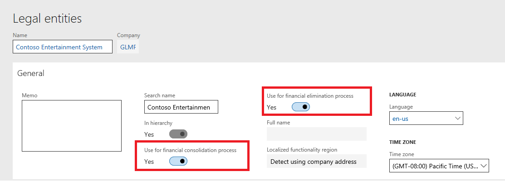
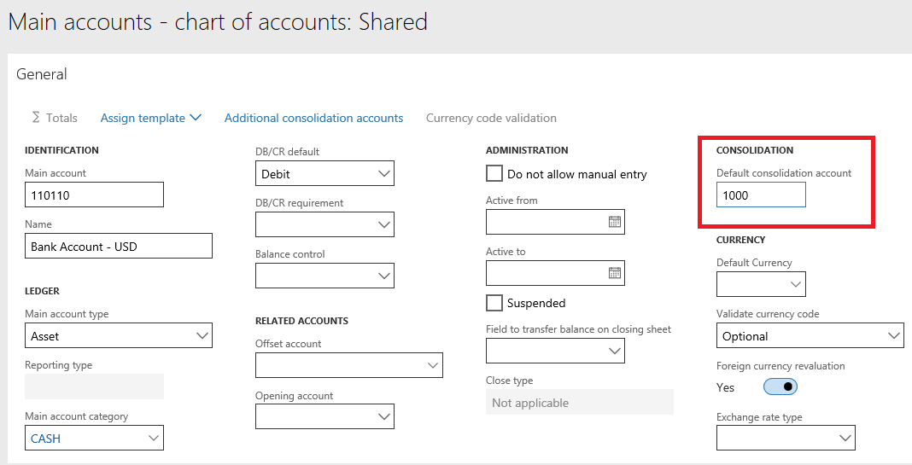
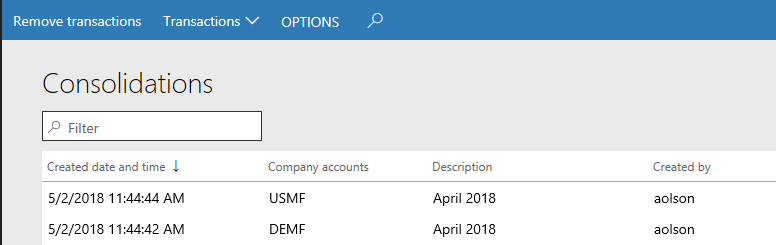
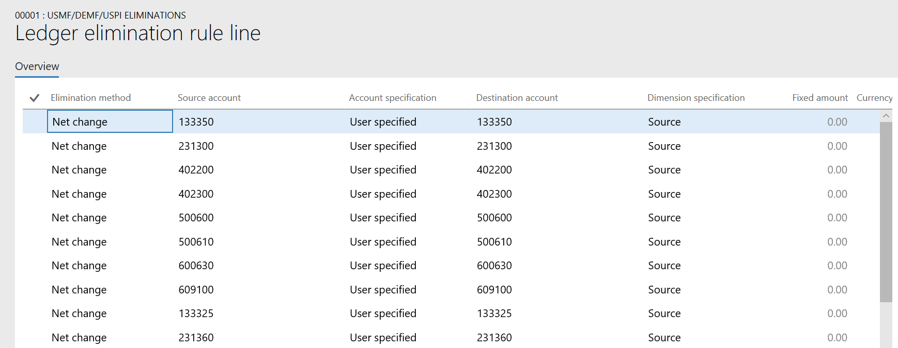

---
# required metadata

title: Financial consolidations and currency translation overview
description: This topic describes financial consolidations and currency translation in General ledger.
author: jiwo
ms.date: 10/07/2021
ms.topic: overview
ms.prod: 
ms.technology: 

# optional metadata

ms.search.form: 
audience: Application User
# ms.devlang: 
ms.reviewer: roschlom
# ms.tgt_pltfrm: 

# ms.assetid: 
ms.search.region: Global
# ms.search.industry: 
ms.author: aolson
ms.search.validFrom: 2018-5-31
ms.dyn365.ops.version: 8.0.1

---

# Financial consolidations and currency translation overview

[!include [banner](../includes/banner.md)]

This topic takes you through the approach that both Microsoft Dynamics 365 Finance and Financial reporting use for consolidations. It describes scenarios that involve multi-company reporting, aggregation, elimination, and minority interest. It also explains how to handle special situations, such as scenarios where legal entities have different fiscal periods or different charts of accounts.

This topic was written for users and functional consultants, and it assumes that readers have a general understanding of Finance and Financial reporting. Basic setup isn't covered.

> [!NOTE]
> The term *legal entity* is used in Finance, and the term *company* is used in Financial reporting. Both these terms are used in this topic. However, for the purposes of this topic, their meanings are the same.

## Audience
This topic is intended for finance and accounting users and application consultants who want to use Finance and Reporting and Financial reporting to consolidate multi-company and multi-currency data.

## Approach
Finance uses a separate legal entity to process a consolidation. It enables single-instance consolidation but provides an option to bring in data from other sources. The consolidation process must be run every time that changes are made in the source legal entities.

Financial reporting can consolidate multiple companies during report generation. Although the data is stored in a data mart, is versioned, and can be exported, every source company is the owner and container of the data. The report can be run at any time, even every minute (for example). It provides many additional benefits, such as the ability to drill down to all companies and dimensions.

Users can use Consolidate Online, Financial reporting, or a combination. Their choice depends on the needs of their company and the preferences of their auditors.

## Consolidations
The **Consolidations** module includes options for consolidating multiple legal entities during the consolidation process, and for importing or exporting a company's balance. You can also set up eliminations and post elimination journals.

## Benefits of using Consolidate online
Customers who use the **Consolidations** module will gain various benefits:

- **Depth of data** – You can create consolidated reports that bring together actual and budget data at both the account level and the dimension level.
- **Dynamic consolidations** – Consolidations can be processed multiple times.
- **Audit capabilities** – Dimensions and accounts are maintained for analysis and audit, and balances are created by date.
- **Currency translation** – You can set up the account ranges and rates to translate from the accounting currency of the source company to the accounting currency of the consolidation company.
- **Process eliminations in a consolidated or elimination company** – You can process and post eliminations as a single process during consolidation. Alternatively, you can run a proposal separately.

## Supported consolidation scenarios
Here are some of the consolidation scenarios that Consolidate online supports:

- Single-level consolidations across legal entities
- Consolidations that involve eliminations
- Minority interest (For this scenario, manual calculation and entry in the company must be used.)
- Multiple charts of accounts across legal entities
- Different fiscal calendars across multiple legal entities
- Consolidations that involve multiple reporting currencies

## Legal entity setup
Before you process a consolidation, you must set up the legal entity. You can run consolidation as many times as you require, and all data will be translated from the source company's accounting currency to the currency that is defined for the consolidation company. Therefore, for the following organizational structure, if you must translate all North American companies first to US dollars (USD) and then to euros (EUR), the currency of the parent company, you must have at least two consolidation companies.

In the preceding organizational structure, you must have a legal entity for the North American consolidation, because consolidations always consolidate from the accounting currency of the source company to the currency of the consolidation company. In the example, if all companies are included in a single consolidation, the Mexican subsidiary will be translated from Mexican pesos (MXN) to EUR, not from MXN to USD to EUR.

When you create the legal entity, you can specify whether the company is used for both the consolidation process and the elimination process, or for just one of those processes. In the following illustration, the company is used for both processes. Note that you can't post daily journals in a consolidation company, but you can post them in an elimination company. Therefore, you might want to have a separate elimination company.

## Main accounts and consolidation account groups
One choice that you must make is how you want to consolidate your chart of accounts. During the consolidation process, you have three options for consolidating main accounts.

The first option is to use the main accounts from the source companies. In this case, every account from all companies will be consolidated. For example, if Cash is account 100000 in the USMF company and account 1100 in the DEMF company, the consolidation company will include both accounts. Each account will have its respective balance.

The second option is to specify a default consolidation account on the **Main accounts** page. The account will then be mapped to the consolidation account. This option can be helpful when you have different charts of accounts or must map to a chart that is defined by the headquarters.

The third option is to use consolidation account groups. You can define as many consolidation account groups as you require. Then, on the **Additional consolidation accounts** page, you just map the main account from the chart of accounts to the account that you require for that group.

## Consolidating online
To learn how to enter details of consolidations online, see [Online financial consolidations](./consolidate-online.md).

## Managing consolidation transactions
To view the results of the consolidation, you have multiple options:

- Generate a financial report against the consolidation company.
- Review the **Trial balance** list page in the consolidation company.
- In the list of consolidation transactions on the **Consolidations** page, view the balances that are created by date for every source company for every period.

    

To run the consolidation again, you can just process the consolidation. Alternatively, you can first select **Remove the transactions** on the **Consolidations** page.
In the event, the balances on your consolidated account are not accurate, these balances can be corrected using the **Closing period adjustments** page.

## Consolidate with import
The Consolidate with import functionality works like the Consolidate online functionality. When you select the legal entities, you will browse out to the source file that contains the data.

## Export company balances
The Export company balances functionality also works like the Consolidate online functionality. When you select the legal entities, you will set a file path for the output.

## Elimination rules
To eliminate intercompany transactions, you can create an elimination rule. Alternatively, you can do a manual elimination entry in a company that is designated an elimination company. If you create an elimination rule, you have two options for the elimination method: **Net change** and **Fixed**.

### Set up elimination rules
When you set up elimination rules in Finance, you can create a financial dimension that is used specifically for elimination. Most customers name this financial dimension **Trading Partner** or something similar. If you decide not to use a financial dimension, make sure that you have main accounts that are used only for intercompany transactions.

You can find the setup for eliminations in the **Setup** area of the **Consolidations** module. After you enter a description for the rule, you must select the company that the elimination journal will be posted to. The company that you select should have **Use for financial elimination process** selected in the legal entity setup.

You can set the date when the elimination rule becomes effective and the date when it expires, as you require. If you want the elimination rule to be available in the elimination proposal process, you must set the **Active** option to **Yes**. Select a journal name of the **Elimination** type.

After you've defined the basic properties, select **Lines** to define the actual processing rules. There are two options for eliminations: you can eliminate the net change amount or define a fixed amount.

Select the source accounts. You can use an asterisk (\*) as a wildcard character. For example, **1\*** selects all accounts that start with a **1** as a source of data for the allocation.

After you've selected the source accounts, use the **Account specification** field to specify the account that is used from the destination company. Select **Source** to use the same main account that is defined in the source account. If you select **User defined**, you must specify a destination account.

The **Dimension specification** field works like the **Account specification** field. Select **Source** to use the same dimensions in the destination company and the source company. If you select **User defined**, you must specify the dimensions in the destination company by selecting **Destination dimensions**. Then select source dimensions and the financial dimensions and values that are used as a source of the elimination.

### Process elimination transactions
There are two ways to process elimination transactions. The transaction can be processed during the Consolidate online process, or you can create an elimination journal and run the elimination proposal process. This section focuses on the second option.

In a company that is defined as an elimination company, select **Elimination journal** in the **Consolidations** module. After you've selected the journal name, select **Lines**. To run the proposal, select **Proposals** \> **Elimination proposal**.

Select the company that is the source of the consolidated data, and then select the rule to process. Enter start and end dates to define the date range that is searched for elimination amounts. The **GL posting date** field specifies the date that is used to post the journal to the general ledger. After you select **OK**, you can review the amounts and post the journal.

> [!NOTE]
> The elimination journal shows the amounts for account values in the currency of their originating transactions, not in the accounting currency. When you review the amounts in the elimination journal, you might find this behavior confusing.

For more information and examples, see [Elimination rules](./elimination-rules.md).

## Currency revaluation in a consolidation company
When you consolidate data from one accounting currency to another, you must still run currency revaluation if exchange rates change, so that your account balances are correctly revalued. When you originally consolidate the data, use the **Currency translation** tab to select the initial exchange rates that should be used for translation during the consolidation process. After a new exchange rate is entered (for example, in the next month), you must revalue the account balances. The unrealized gains or losses are then updated based on the new exchange rate and date.

For more information about currency revaluation in a consolidation company see [Currency revaluation in a consolidation company](currency-revaluation-consolidation-company.md).

For more information about how currency revaluation works in the **General ledger** module, see [Foreign currency revaluation for General ledger](./foreign-currency-revaluation-general-ledger.md).

### Additional information
- All posting layers are consolidated when the consolidation is processed.
- Elimination journals can be posted only to the Current layer.
- Only operating balances are consolidated. Therefore, to see opening balances, you must still run a year-end close in the consolidation company.
- You can post a daily journal in an elimination company, but not in a consolidation company.
- Adjustments to balances in a consolidation company can only be made using the **Closing period adjustments** page. 

## Benefits of using Financial reporting for financial consolidations and currency translation, or to complement Consolidate online for consolidated reporting
Customers who use Financial reporting for financial consolidations and currency translation, or to complement Consolidate online for consolidated reporting, will gain various benefits:

- **Depth of data** – You can create consolidated reports that bring together actual and budget data at both the account level and the dimension level. For Finance, this data includes data from both budget control and budget planning.
- **Dynamic consolidations** – Consolidations can be done at any time and at any level in the organizational hierarchy.
- **Complete audit capabilities** – All dimensions, accounts, and transactional detail are maintained for analysis and audit. In addition, Financial reporting provides full drill-back to the original transaction in any of the legal entities that are consolidated.
- **Streamlined currency translation** – After minimal setup in Finance, you can translate any Financial reporting report into any reporting currency that has been set up. In addition, you can set up an unlimited number of reporting currencies.
- **Post eliminations at the source** – You can create and print an elimination report to verify elimination transactions. You can then post any new eliminations as standard intercompany transactions. You can also use an elimination legal entity for any transaction that you don't want in your legal entities.

## Supported consolidation scenarios for Financial reporting

Here are some of the consolidation scenarios that Financial reporting supports:

- Single-level and multilevel consolidations across legal entities
- Consolidations that use organization structures that are created from legal entities
- Consolidations that involve eliminations
- Minority interest
- Multiple charts of accounts across legal entities
- Different fiscal calendars across multiple legal entities
- Consolidations that involve multiple reporting currencies
- Business unit consolidations

## Generating consolidated financial statements
For information about scenarios where you might generate consolidate financial statements, see [Generate consolidated financial statements](./generating-consolidated-financial-statements.md).

## Performance enhancement for large consolidations

Environments that have many general ledger transactions might run more slowly than is optimal. To fix this issue, you can set up parallel processing of batches that uses a user-defined number of dates. To ensure that the solution works as intended, add an extension point to the consolidation to return a container of date ranges. The base implementation should contain one date range for the start state and end date of the consolidation. Date ranges in the base implementation will be validated to ensure that they don't contain gaps or overlap. The date ranges will be used to create parallel batch bundles for each company.

You can customize the number of date ranges to meet your organization's requirements. By customizing the number of date ranges, you can help simplify testing and minimize the impact on existing code, because there is no allocation logic. The only new tests that are required validate the creation of batch bundles, validate date ranges, and test a subset of date ranges to verify that the batches can be brought together for the final batch task. 

This feature enhances the consolidation process in General ledger when the process is run in a batch. The enhancement improves the performance of the general ledger consolidation process by splitting the consolidation into multiple tasks that can be processed in parallel. In the default method of running a consolidation, each task processes eight days' worth of general ledger activity. However, an extension point has been added that lets you customize the number tasks that are created.

Before you can use this feature, it must be turned on in your system. Admins can use the **Feature management** workspace to check the status of the feature and turn it on if it's required. There, the feature is listed in the following way:

- **Module:** General ledger
- **Feature name:** Performance enhancement for large consolidations

[!INCLUDE[footer-include](../../includes/footer-banner.md)]
