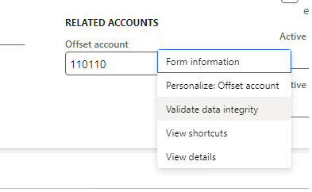
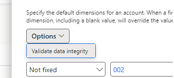

# Dimension data validation

[!include [banner](../includes/banner.md)]

Before you post a journal, you can check your entries for errors. There are two ways to validate dimension data: directly from journal lines in the user interface, or by using the **Dimension data validation** page.

## Validate journal lines

You can validate entries directly from any journal. From the journal, select **Lines** on the Action Pane to open the journal lines. Then, on the Action Pane, select the **Validate** dropdown to access the following options:

- **Validate** – Checks all journal lines for errors such as missing accounts, invalid dimension combinations, or amounts that don't balance. Any issues are displayed as messages so you can correct them before posting.
- **Validate voucher only** – Checks only the voucher-level rules, such as whether the voucher balances by currency, without running the full set of line-level checks.
- **Simulate posting** – Runs the full posting process without actually creating any accounting entries. Use this option to see exactly what would be posted, including generated distributions, so you can verify the results before committing.

## Validate from dimension fields

You can also trigger validation directly from any account or dimension field without navigating away from your current page.

On a segmented entry control, right-click the account field and select **Validate data integrity**.

On a dimension entry control, select **Options** > **Validate data integrity**.

## Validate by record ID

For advanced troubleshooting, you can validate whether a specific ledger account or default dimension combination is structurally valid by using the **Dimension data validation** page at **General ledger** > **Chart of accounts** > **Dimensions** > **Dimension data validation**.

Enter the following information and select **Run**:

- **Dimension type** – Select **Ledger dimension** to validate a ledger account combination, or **Default dimension** to validate a default dimension set.
- **Reference record ID** – The record ID of the record to validate. Ledger dimension IDs reference the **DimensionAttributeValueCombination** table; default dimension IDs reference the **DimensionAttributeValueSet** table. Record IDs can be found in dimension validation errors or by inspecting the backing data record.
- **Date** – The date to validate against, since dimension validity can vary based on active from/to dates and other setup.
- **Company** – The legal entity to use for validation, since some dimension combinations are only valid in a specific company.

The **Is valid** field shows whether the combination or set is valid. Select **Detailed results** to see the individual checks that were performed.

[!INCLUDE[footer-include](../../includes/footer-banner.md)]
