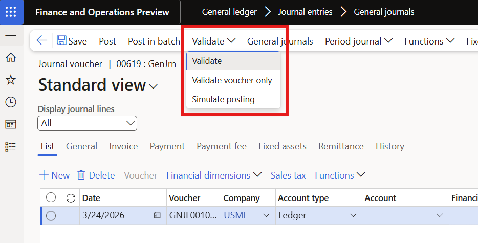
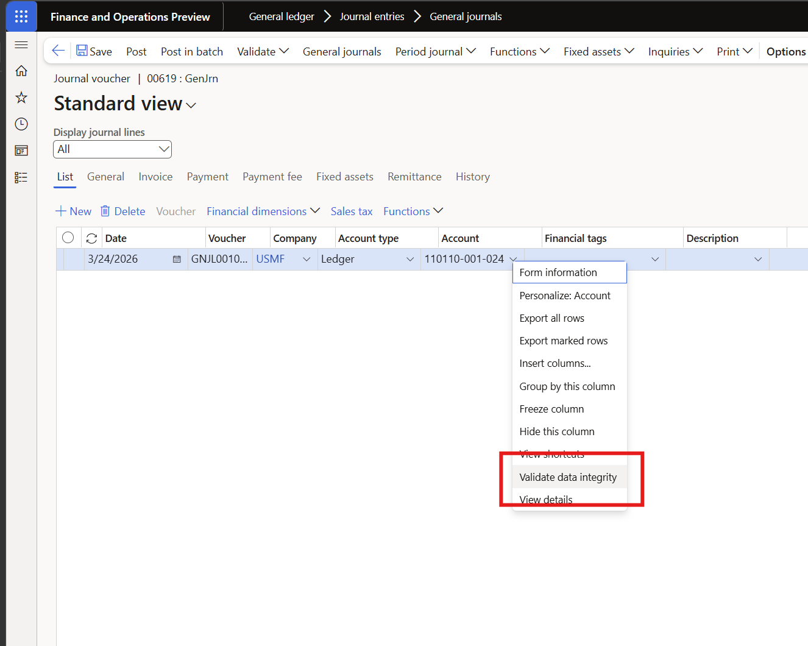
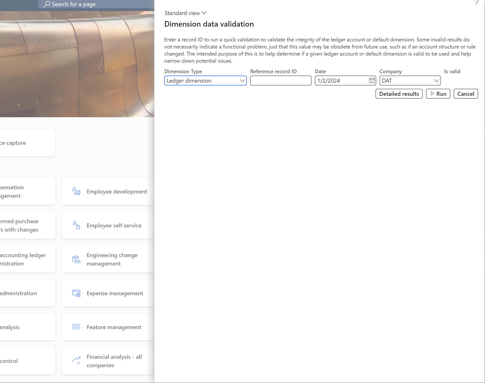
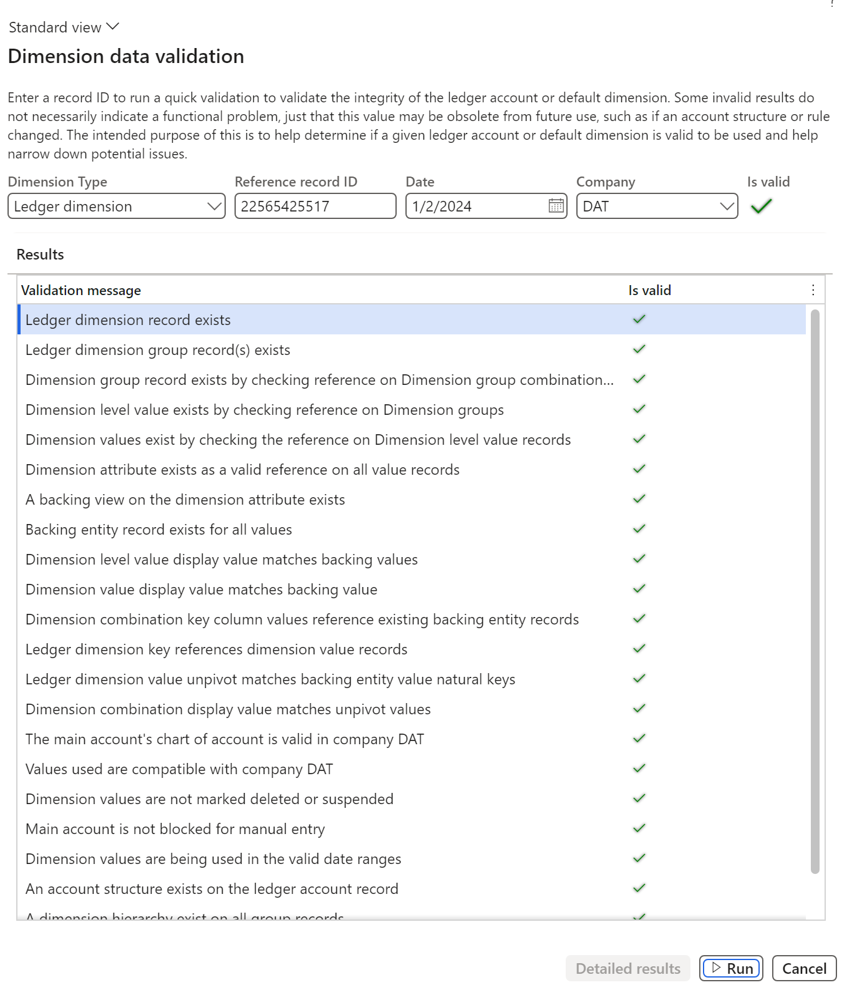

# Dimension data validation

[!include [banner](../includes/banner.md)]

Before you post a journal, check your entries for errors. You can validate journal lines from the Action Pane, or check the data integrity of a specific dimension combination by using the **Dimension data validation** page.

## Validate journal lines

You can validate entries directly from any journal. From the journal, select **Lines** on the Action Pane to open the journal lines. Then, on the Action Pane, select the **Validate** dropdown to access the following options:

- **Validate** – Checks all journal lines for errors such as missing accounts, invalid dimension combinations, or amounts that don't balance. The system displays any problems as messages so you can correct them before posting.
- **Validate voucher only** – Checks only the voucher-level rules, such as whether the voucher balances by currency, without running the full set of line-level checks.
- **Simulate posting** – Runs the full posting process without actually creating any accounting entries. Use this option to see exactly what would be posted, including generated distributions, so you can verify the results before committing.

## Validate dimension data integrity

The **Dimension data validation** page checks whether a ledger account or default dimension combination is structurally valid. The page shows an **Is valid** result, and you can select **Detailed results** to see each individual check that was performed.

You can open this page in two ways.

### Right-click on a journal line

The quickest way to validate a dimension combination is to right-click the **Account** field on a journal line and select **Validate data integrity**. This action opens the **Dimension data validation** page with the record ID automatically filled in, so you can run the check without leaving the journal.

### Navigate to the Dimension data validation page

You can also open the page directly at **General ledger** > **Chart of accounts** > **Dimensions** > **Dimension data validation**. This approach is useful when you have a record ID from an error message and want to investigate it outside of a journal.

Enter the following information and select **Run**:

- **Dimension type** – Select **Ledger dimension** to validate a ledger account combination, or **Default dimension** to validate a default dimension set.
- **Reference record ID** – The record ID of the record to validate.
- **Date** – The date to validate against, since dimension validity can vary based on active date ranges and other setup.
- **Company** – The legal entity to use for validation, since some dimension combinations are only valid in a specific company.

[!INCLUDE[footer-include](../../includes/footer-banner.md)]
