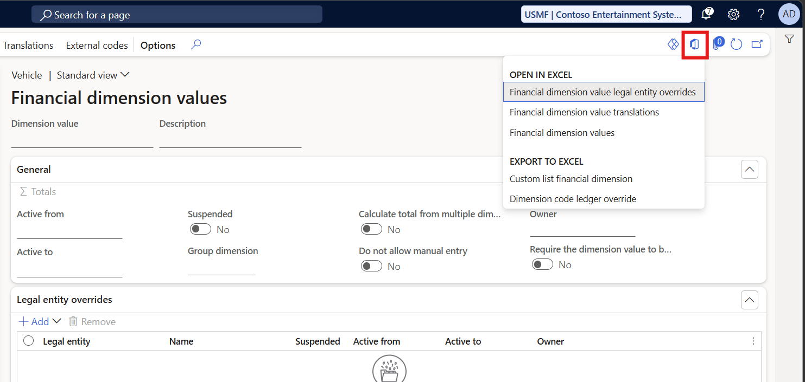

# Exporting and editing dimensions data in Excel via OData plug-in

[!include [banner](../includes/banner.md)]

The Excel button on the **Financial dimension values** page opens a dropdown with two distinct sections: **Open in Excel** and **Export to Excel**. These sections behave differently in terms of data scope and interactivity.

## Open in Excel (OData plug-in)

The workbooks listed under **Open in Excel** — **Financial dimension values**, **Financial dimension value legal entity overrides**, and **Financial dimension value translations** — connect to Finance via the OData plug-in. The workbook stays live, and any edits you make can be published back to Finance directly from Excel.

> [!IMPORTANT]
> Because these workbooks use the **Financial dimension values entity**, they are subject to the same scope as DMF exports: only values that have been used as dimensions or have had properties explicitly modified are returned. Unused values don't appear.
>
> Values that are used include those entered in transactions (such as ledger accounts, non-ledger accounts, or default dimensions) or those that have had properties modified (such as Active from/Active to dates, Suspended status, and other overrides).
>
> For dimensions sourced from other records in the system (such as customers, departments, or cost centers), not all values are exported — only those that have been used as described above.

## Export to Excel

The options listed under **Export to Excel** — such as **Custom list financial dimension** — perform a one-time static export of the data currently visible in the grid. Unlike the OData workbooks, these exports include all dimension values regardless of whether they've been used. However, the exported file is read-only; changes can't be published back to Finance.

If a value is visible on the **Financial dimension values** page but missing from an **Open in Excel** workbook or a DMF export, use **Export to Excel** > **Custom list financial dimension** to retrieve the full list.

## Making values available through the OData add-in or DMF framework

If a dimension value doesn't appear in OData add-in workbooks or DMF exports, it's because no property has been set for it. To make the value available, set any property on it — for example, an *Active from* date or a *Suspended* status. You can do this directly on the **Financial dimension values** page by selecting the value and updating its properties, or in bulk by importing overrides through the **Financial dimension values entity** via DMF. Once a property is set, the value appears in subsequent OData add-in workbooks and DMF exports.

[!INCLUDE[footer-include](../../includes/footer-banner.md)]
