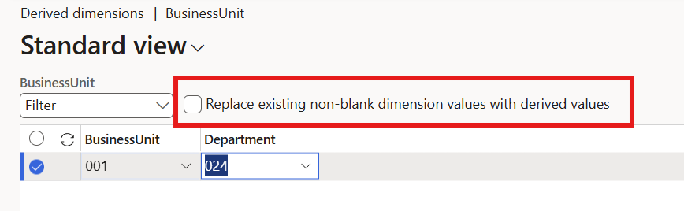

# Financial dimensions

[!include [banner](../includes/banner.md)]
[!INCLUDE [lcs-freeze-banner](../../includes/lcs-freeze-banner.md)]

Use financial dimensions to further categorize financial transactions. Financial dimension values become segments within the ledger account and you can use them for further analysis, such as generating a profit and loss financial statement by a dimension or a trial balance by dimension.  

Financial tags (tags) are an alternative to financial dimensions. An organization can create up to 20 user-defined financial tags and enter values for them on transactions. For more information, see [Financial tags](financial-tag.md). Also, explore the differences between the two in the document Differences between financial tags and financial dimensions.  

This article explains the various types of financial dimensions and how to set them up.

## Create financial dimensions

Use the **Financial dimensions** page to create financial dimensions that you can use as account segments for charts of accounts. There are two types of financial dimensions: custom dimensions and entity-backed dimensions.

Financial dimension names, dimension values, and main account numbers must follow specific rules. For the full list of requirements, see [Naming requirements](/dynamics365/finance/general-ledger/tasks/define-financial-dimensions#naming-requirements).

### Custom dimensions

To create a user-defined financial dimension, in the **Use values from** field, select **Custom dimension**. Custom dimensions are shared across legal entities, and the values are entered and maintained by users.

You can specify a dimension value mask to limit the amount and type of information that can be entered for dimension values. You can enter characters that remain the same for each dimension value, such as letters or a symbol. You can also enter number signs (\#) and ampersands (&) as placeholders for characters that change every time that a dimension value is created. The field for the format mask is available only when you select **Custom dimension** in the **Use values from** field. For details on format masks and characters to avoid, see [Naming requirements](/dynamics365/finance/general-ledger/tasks/define-financial-dimensions#naming-requirements).

### Entity-backed dimensions

To create an entity-backed financial dimension, in the **Use values from** field, select a system-defined entity to base the financial dimension on. For entity-backed dimensions, the values are defined somewhere else in the system, such as in Customers or Stores entities. Some entity-backed dimensions are shared across legal entities, whereas other entity-backed dimensions are company-specific. Dimensions that are company-specific (also known as company-striped dimensions) are only visible when accessed as a user from the associated company.

For example, to create dimension values for projects, select **Projects**. This allows any value from the project table to be used as a dimension value directly.
A dimension value is then created for each project name. The **Financial dimension values** page shows the values for the entity. If those values are company-specific, the page also shows the company.

> [!IMPORTANT]
> Important: When exporting financial dimension values, only the following values are exported:
>
> - Custom dimension values
> - Only entity-backed dimension values that have been used or entered as a dimension value. For example, the value was entered as a default dimension value or entered on a transaction.
> - Only entity-backed dimension values that have a property defined for the value, such as the value is suspended or active from/to dates are defined.

If you want to rename or delete dimension values from entity-backed dimensions, do this from the source entity rather than from the **Financial dimension values** page. 

## Financial dimension values

After you create a financial dimension, use the **Financial dimension values** page to create, view, or assign additional properties to each financial dimension value.  

For a custom financial dimension, use this page to create and edit dimension values. You can only enter or edit the **Dimension value** and **Description** fields for custom dimensions. Dimension values have a maximum length of 30 characters.

For an entity-backed financial dimension, you can't create dimension values from this page. You also can't edit the dimension value and descriptions from within the page. For example, let's say you created the Project financial dimension previously described. On the **Financial dimension values** page, you can't edit the project **Dimension value** or **Description**. This information is taken directly from the project setup. If a new project value is necessary, you must create it from the **Project** page.

To validate whether a ledger account or default dimension combination is structurally valid, use the **Dimension data validation** page. For more information, see [Dimension data validation](financial-dimension-data-validation.md).

## Activating dimensions

When you activate a financial dimension, the table updates to include the name of the financial dimension. Deleted dimensions are removed. You can create and edit dimension values before you activate a financial dimension. However, you can't consume a financial dimension anywhere until you activate it. For example, you can't add a financial dimension to an account structure until you activate the financial dimension.

When you select **Activate all**, the system updates all inactive or renamed dimensions to active, which the **Status changes** field shows. As **Activate all** processes every pending addition, rename, or deletion across all dimensions at once, there is no need to rerun the operation for each dimension. The system must be in maintenance mode when activating financial dimensions.

> [!WARNING]
> If you have customizations that depend on the schema column names of dimension tables, those customizations must be removed **before** you rename or delete dimensions. Failing to do so can cause database synchronization errors after activation. After making the desired edits, you can recreate and redeploy the removed customizations.

### Translations

Use the **Text translation** page to translate the following text into various languages:

- **Dimension name** from **General ledger** > **Chart of accounts** > **Dimensions** > **Financial dimensions** > **Translations**.
- **Financial dimension value description** from **General ledger** > **Chart of accounts** > **Dimensions** > **Financial dimensions**. Select custom financial dimension > **Dimension values** > **Translations**.
- **Main account name** from **General ledger** > **Chart of accounts** > **Accounts** > **Main accounts** > **Name translations**.

When you enter your financial dimension name and financial dimension value description, the system assumes you enter those values in the system language. You can see the system language in the Default language code shown on the **Text translation** page.  

> [!IMPORTANT]
> Translated text is only used when the user language is different from the system language. The system is designed this way to increase performance.  

If you don't enter the values in the system language, you might not get the expected results. To fix the problem, change the financial dimension name and financial dimension value description to the system language. The translated text isn't necessary for the system language.  

### Example

The system language is set to "es" (Spanish).  
A new financial dimension is created. You enter the dimension name in English, not Spanish: "Ownership."

- You can define the name in a non-system language, but it's not recommended.
You create two translations for the "Ownership" dimension name:
- "es" (Spanish) = Propiedad
- "de" (German) = Besitz

User 1 has a user language of "de." When they see the dimension name, it displays as "Besitz."  

User 2 has a user language of "es." When they see the dimension name, it displays as "Ownership." The dimension name of "Ownership" is shown because the user language is the same as the system language. As a result, the system doesn't look for any translations.  

## Legal entity overrides

All custom dimensions and some entity-backed dimensions, such as dimensions created from an operating unit, are global. When you use global values, all dimension values for that dimension are active for all legal entities that include that dimension in their account structure.

But, not all dimensions or main accounts are valid for all legal entities. Additionally, some might be relevant only for a specific period. In these cases, use the **Legal entity overrides** section to specify the companies that the dimension or main account should be suspended for, the owner, and the period when the dimension is active. The overrides at the shared level can't be more restrictive than the overrides at the legal entity level.

### Example

Department has dimension values of 100, 200, and 300. USMF, USSI, and DEMF all use the Department dimension. DEMF is only permitted to use department 100 and 200. To restrict DEMF from using Department 300, create a legal entity override where you mark the dimension value as Suspended. USMF and USSI still have full access to departments 100, 200, and 300.  

## Renaming financial dimensions

When working with financial dimensions, you might need to rename dimension values or the dimensions themselves. However, several requirements and considerations affect your ability to rename financial dimensions and their values.

- Change entity-backed dimensions through their source entity - You can't rename entity-backed dimension values through the **Financial dimension values** page. Rename them on the corresponding entity page. For example, rename Department dimension values in the **Operating units** page where the department is defined.
- Ensure dimension value names are unique - Dimension value names must be unique across the system. To check for duplicates, go to **General ledger > Chart of accounts > Dimensions > Financial dimensions**, select the dimension, then select **Dimension values**. If a duplicate exists, choose a different name.
- Verify you have sufficient privileges - Your user account must have the necessary roles and privileges to modify dimension values. If you're unable to make changes, contact your system administrator to verify permissions.

In some cases, if a dimension value was renamed outside the standard user interface, the financial dimension value may display inconsistent naming or casing across the application. This can happen if an incorrectly cased value was imported through an Excel-based data import or if a customization changed the value name without using the supported dimension update methods, such as through a direct database modification. To address the issue, rename the dimension value using the above guidance.

### Rename by primary key

Some entities—such as customers and vendors—don't support direct renaming of their identifier and instead require the **Rename primary key** option. This is because they use their account number as their primary key rather than their name. 

1. Find the record to change.
2. Select **Options** > **Record info**.
3. Select **Rename Primary Key**.
4. Enter the new name and select **OK**. Acknowledge any dialogs indicating the value will be renamed.

## Deleting financial dimensions and dimension values

To protect data integrity, the system restricts deletion of both financial dimensions and their values. In most cases, neither can be deleted once they've been referenced. Instead of deleting, consider renaming or suspending:

- **Rename** the dimension or value to indicate it shouldn't be used (for example, **\_\_\_DONOTUSE\_DimensionName**). Later, when a new value is needed, you can rename and reuse the old one rather than creating a new one. Reusing existing dimension values can improve application performance.
- **Suspend** a dimension value to prevent it from being used on new transactions. Go to **General ledger** > **Chart of accounts** > **Dimensions** > **Financial dimensions**. Select the dimension, select **Dimension values**, select the value, select **Edit**, and mark it as suspended. Suspended values are hidden from lookups but can be renamed and reused later.

### When a financial dimension can't be deleted

A financial dimension can't be deleted if any of the following are true:

- It's used in any active account structure, advanced rule structure, or financial dimension set.
- It's part of a default financial dimension integration format, or is set up as a default dimension.
- It's still selected in the Financial Reporting setup.
- Any dimension value has been created for the dimension — even if the value was never used on a transaction.

> [!NOTE]
> Starting in Finance version 10.0.27, the system doesn't automatically select financial dimensions for financial reporting setup as they're created.

### When a dimension value can't be deleted

A dimension value can't be deleted if it has been used on any posted or unposted transaction, or in any dimension value combination such as a ledger account or default dimension. If deletion is still required, a thorough assessment of all data references to the value is needed before any data can be removed.

## Financial dimensions as legal entities

You can use financial dimensions to represent legal entities. You don't need to create the legal entities in Dynamics 365 Finance. However, financial dimensions aren't designed to address the operational or business requirements of legal entities. The intercompany accounting functionality in Finance is designed to address only the accounting entries that each transaction creates.

Before you set up financial dimensions as legal entities, evaluate your business processes in the following areas to determine if this setup works for your organization:

- Inventory
- Sales and purchases between financial dimensions and legal entities
- Sales tax calculation and reporting
- Operational reporting

Here are some of the limitations:

- You can use sales tax functionality only with legal entities, not with financial dimensions.
- Some reports don't include financial dimensions. Therefore, to report by financial dimension, you might have to modify the reports.

## Default dimension values

You can use values from master records, such as customer and vendor, as default values in new dimensions. When you create the new dimensions, you enter the master record ID in the dimension values for those master records. For example, when you create a new customer, you enter the customer ID in the customer dimension. When you create sales orders, invoices, or other documents that require a customer ID, the existing defaulting rules add the customer ID to the document.

A setting in the dimension controls this feature. This setting is named **Copy values to this dimension on each new DimensionName created**, where **DimensionName** is the name of the dimension. By default, the feature is turned off. However, you can turn it on at any time.

If records already exist for the dimension, turning on the feature updates the master records. However, existing documents and transactions aren't updated.

If you're using a template to create a master record, make sure that the template value for the master dimension is blank. For example, if you're creating customers from a template, make sure that the customer dimension in the template is blank. The customer dimension value defaults from the new customer number when you create the new customer.  

> [!NOTE]
> You can intentionally default a dimension value to blank by assigning a fixed dimension value of blank on a main account (via *Legal entity overrides*).  
> 
> If you don't intend for a blank dimension value to be defaulted, ensure that the dimension’s fixed value is set to **Not fixed**, or provide a valid fixed value that complies with the account structure.

## Derived dimensions

You can configure a dimension so that information for other dimensions is automatically entered when you enter that dimension in a document. For example, if you enter cost center 10, a value of **20** can be automatically entered in the department dimension.

Set up derived values on the dimensions page.

1. Select a dimension and then select **Derived dimensions**.

    The **Derived dimensions** page includes a grid. The selected dimension segment is the first column in this grid.

1. Add the segments that you want to derive. Each segment appears as a column.

Enter the dimension combinations that you want to derive from the dimension in the first column. For example, to use the cost center as the dimension that the department and location derive from, enter cost center 10, department 20, and location 30. Then, when you enter cost center 10 in a master record or on a transaction page, department 20 and location 30 are entered by default.

### Shared dimensions only

You can only configure derived dimensions for shared dimensions, not company-specific dimensions.

**Examples of shared dimensions (allowed):** Departments, Cost Center

**Examples of company-specific dimensions (not allowed):** Project, Bank Accounts, Customers, Vendors

To check if a dimension is shared or company-specific, go to **General ledger > Chart of accounts > Dimensions > Financial dimensions** and select **Dimension values** from the action pane. Company-specific dimensions show the company name at the bottom of the tile.

If you need to use a company-specific dimension, you can create a shared custom table that includes the company-specific values. For more information, see [Make backing tables consumable as financial dimensions](../../fin-ops-core/dev-itpro/financial/dimensionable-entities.md).

> [!IMPORTANT]
> When you rename an entity that is used as the basis for a driving dimension in derived dimensions, the dimension values in the derived dimension configurations are automatically updated to reflect the new entity name.

### Overriding existing values with derived dimensions

By default, derived dimensions don't override existing values. This means you can establish default dimensions on master records, and those dimensions aren't changed by derived dimensions.

To change this behavior, select the **Replace existing dimension values with derived values** checkbox on the **Derived dimensions** page. Using the previous example, if department was already set to 50 and location to 60, entering cost center 10 would change them to department 20 and location 30.

Derived dimensions with this setting don't automatically replace the existing default dimensions values when dimension values are defaulted. Dimension values are only overridden when you enter a new dimension value on a page and there are existing derived values for that dimension on the page.

When **Replace existing dimension values with derived values** is disabled, the derived dimensions will still automatically overwrite blank fields.

### Preventing changes with derived dimensions

When you use **Add segment** on the **Derived dimensions** page to add a segment as a derived dimension, an option at the bottom of the **Add segment** page lets you prevent changes to that dimension when it's derived. The default setting is off. Change it to **Yes** to prevent the dimension from being changed after it is derived.

This setting doesn't prevent changes if the entered driving dimension value isn't in the derived dimensions list. Using the previous example, entering cost center 10 would lock department to 20. But entering cost center 20, if it has no derived rules, would leave department editable.

In all cases, the account value and all dimensions values are still validated against the account structures after the derived dimensions values are applied. If you use derived dimensions and they fail validation when used on a page, you must change the derived dimensions values on the **Derived dimensions** page before you can use them in transactions.

### Derived dimensions and entities

You can set up the derived dimensions segments and values by using entities.

- The **Derived dimensions** entity sets up the driving dimensions and the segments that are used for those dimensions.
- The **Derived dimensions value** entity lets you import the values that should be derived for each driving dimension.

When you use an entity to import data, if that entity imports dimensions, the derived dimension rules are applied during the import unless the entity specifically overrides those dimensions.

## Financial dimension service

You can access the Financial dimension service add-in in your Microsoft Dynamics Lifecycle Services environment. It provides improved performance when you use the Data management framework to import a journal that has a large number of lines. To use the service, you must enable it on the **Financial dimension service parameters** page. Currently, the service works only on imported journals. In addition, it can currently process only general journals where the **Ledger** account type is set on the journal lines. Other account types on journal lines, such as **Customer**, **Vendor**, and **Bank**, aren't currently supported. This service isn't invoked when derived dimensions are set up in the system.

The Financial dimension service provides improved performance when you import journals by using a new service that runs in parallel to the data import. It runs only on the main account and financial dimension data in the journal, and it generates the dimension combinations that are specified in the ledger account string field on the journal lines. The processing converts this string into the structured data storage that the Financial dimension framework uses throughout the rest of the product for validation, summary reporting, and inquiries. For more information about summary reporting of financial dimension data, see [Financial dimension sets](financial-dimension-sets.md).

For more information, see the following topics:

- [Define financial dimensions](tasks/define-financial-dimensions.md)
- [Maintain financial dimension default templates](tasks/maintain-financial-dimension-default-templates.md)

[!INCLUDE[footer-include](../../includes/footer-banner.md)]
