---
# required metadata

title: Financial reporting FAQ 
description: This topic lists questions related to financial reporting that other users have had. 
author: jiwo
manager: tfehr
ms.date: 01/13/2021
ms.topic: index-page
ms.prod: 
ms.technology: 

# optional metadata

ms.search.form: 
audience: Application User
# ms.devlang: 
ms.reviewer: roschlom
ms.search.scope: Core, Operations
# ms.tgt_pltfrm: 
# ms.custom: 
ms.search.region: Global 
# ms.search.industry: 
ms.author: jiwo
ms.search.validFrom: 2021-01-13
ms.dyn365.ops.version: 10.0.14

---

# Financial reporting FAQ 

This topic lists questions related to financial reporting that other users have had. 

## How do I restrict access to a report using Tree security?

Scenario: The USMF demo company has a Balance sheet report that it doesn’t want all Financial reporting users to be able to view in D365. 
Solution: You can utilize Tree security to restrict access to a single report so that only certain users can access the report. 

1.	Log into Financial Reporter Report Designer

2.	Create a new Tree Definition (File | New | Tree Definition)
  a.	Double-click the **Summary** line in the **Unit Security** column.
      i.	Click Users and Groups.  
          1.	Select the User(s) or Group that would like to access this report. 
          
[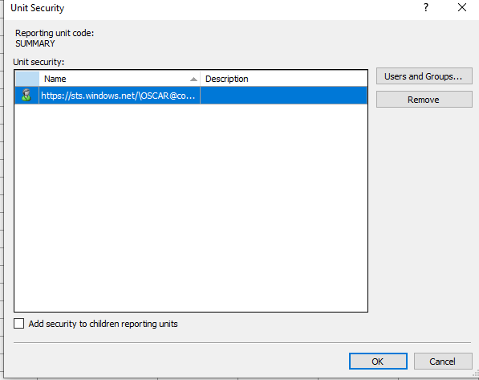](./media/FR-FAQ_users.png)

[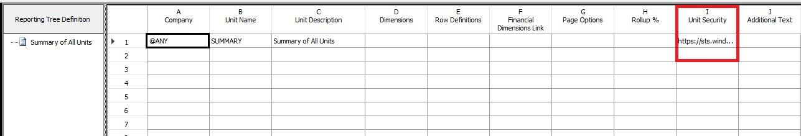](./media/FR-FAQ_security.jpg)

  b.	Click **Save**.
  
[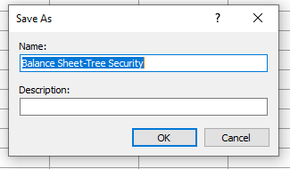](./media/FR-FAQ_save.png)

3.	In your Report Definition add your new Tree Definition

[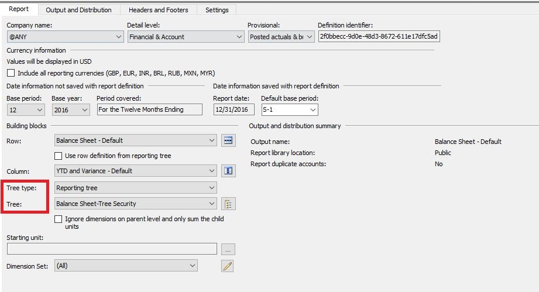](./media/FR-FAQ_tree-definition.jpg)

A.	While in the Tree Definition click on Setting and under “Reporting unit selection” check “Include all units”

[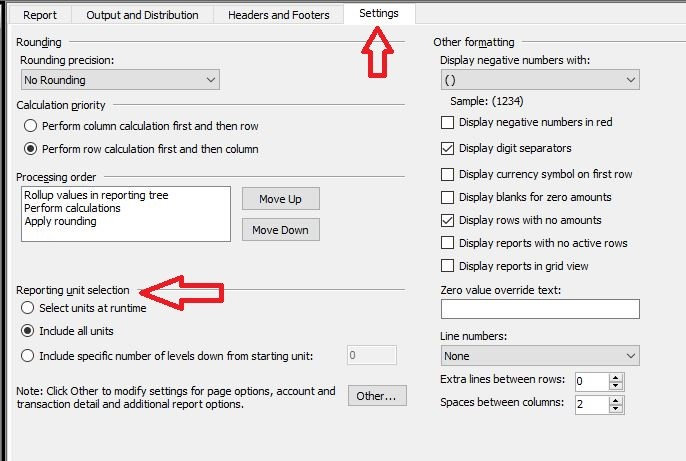](./media/FR-FAQ_reporting-unit-selection.jpg)

**Before:**
          [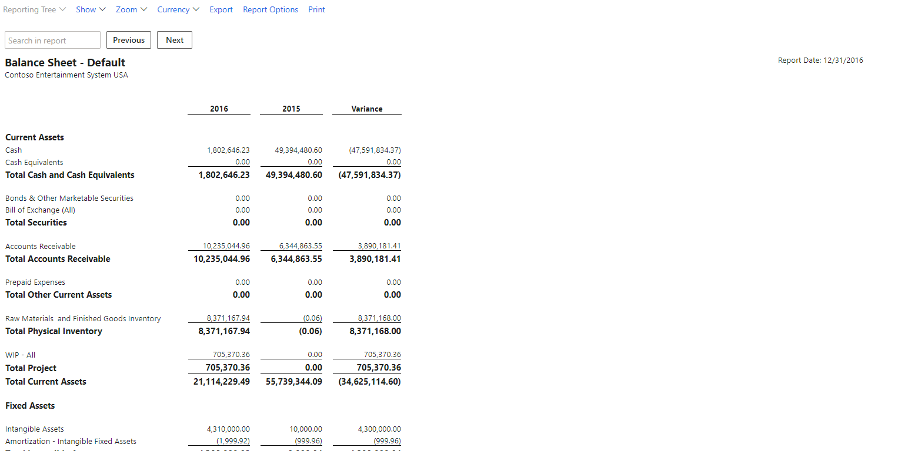](./media/FR-FAQ_before.png)

**After:**
          [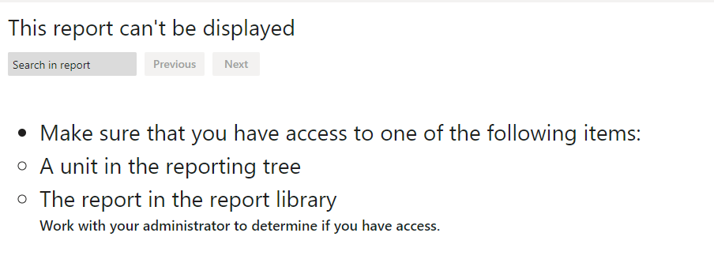](./media/FR-FAQ_after.png)

Note: Reason for the above message is my user does not have access to that report after applying Unit Security

## How do I determine which account(s) do not matching my balances in D365?

When you have a report that doesn't match what you would expect in D365, here are some steps you could take to identify those accounts and the variances. 

### In Financial Reporter Report Designer

1.	Create a new Row Definition 
  a.	Click Edit | Insert Rows from Dimensions 
    i.	Select MainAccount
        [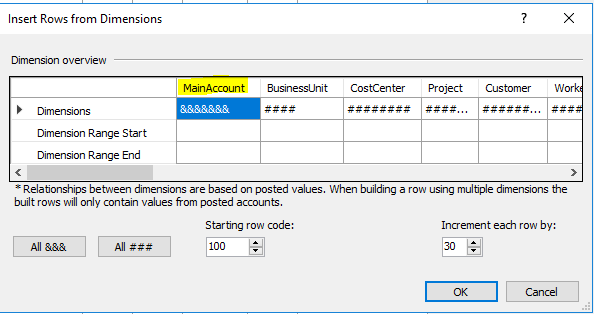](./media/FR-FAQ_selectmain_.png)
    
    ii.	Click Ok
  b.	Save the Row Definition

2.	Create a new Column Definition
        [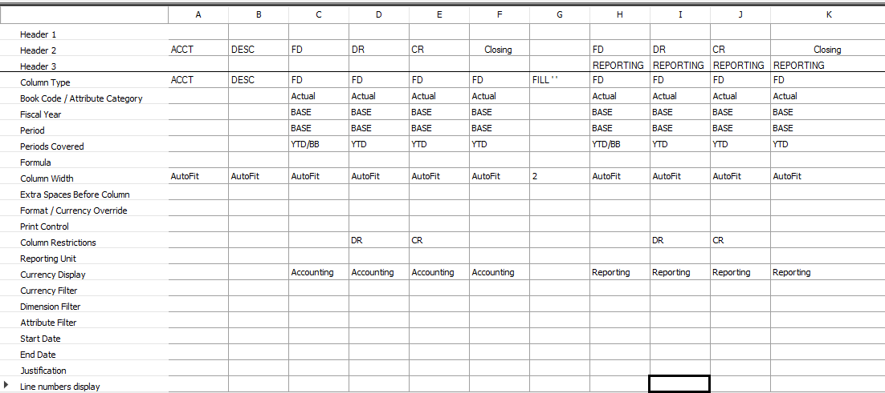](./media/FR-FAQ_column.png)

3.	Create a new Report Definition
  a.	Click Settings and uncheck 
      [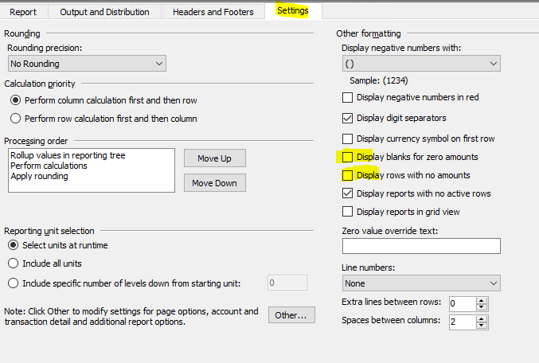](./media/FR-FAQ_settings.png)
   
4.	Generate the Report. 

5.	Export the Report to Excel.

### In D365: 
1.	Click General Ledger | Inquiries and Reports | Trial Balance
  a.	Parameters
    i.	From Date: Start of Fiscal Year
    ii.	To Date: Date you generated the report for
    iii.	Financial Dimension Set “Main Account set”
       [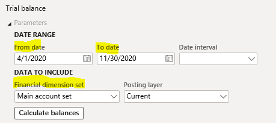](./media/FR-FAQ_mainacct.png)
      
  b.	Click Calculate

2.	Export the report to Excel

You should now be able to copy the data from the FR Excel Report and to the D365 Trial Balance report and compare the “Closing Balance” columns.

[!INCLUDE[footer-include](../../includes/footer-banner.md)]