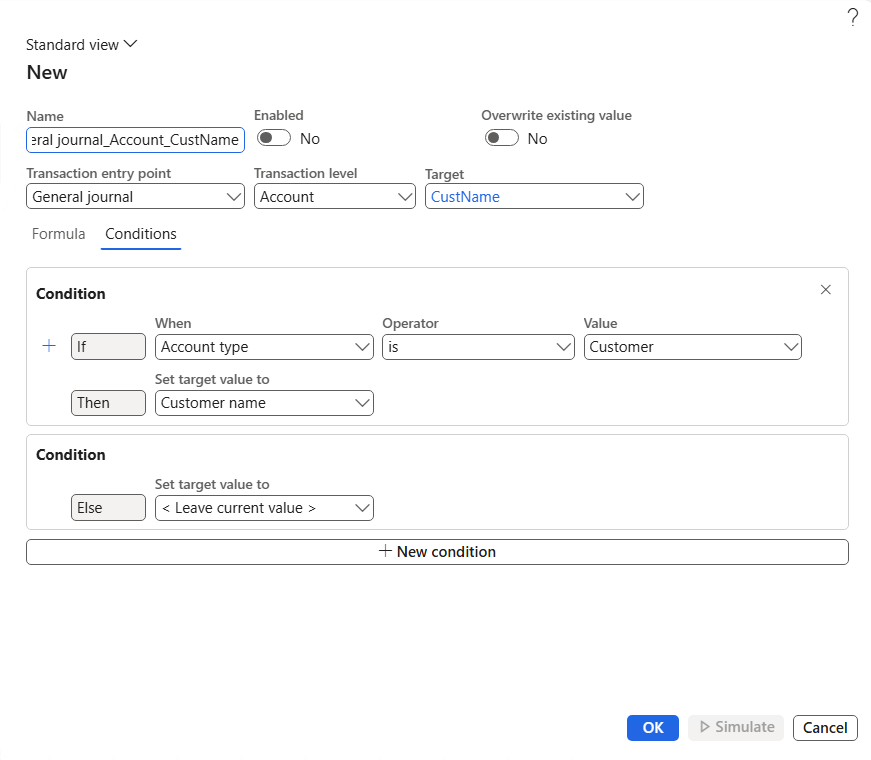

# Financial tag rules (preview)

[!INCLUDE [preview-banner](~/../shared-content/shared/preview-includes/preview-banner.md)]

Financial tag rules provide a powerful way to enter default value or automatically populate values in your [financial tags](financial-tag.md). They streamline the process and ensure consistency and efficiency in transaction tagging. Such consistency and efficiency are essential for accurate financial tracking and reporting.

This feature is available as of Microsoft Dynamics 365 Finance version 10.0.42. It's available in Feature management. In each new release, more document entry points are implemented.

[!INCLUDE [preview-note](~/../shared-content/shared/preview-includes/preview-note-d365.md)]

Currently, the following journals are supported for financial tag rules:

- General journal
- Global general journal

    > [!NOTE]
    > The General journal and Global general journal use a shared setup of financial tag rules.

- Allocation journal
- Reporting currency adjustment journal
- Invoice journal (vendor)

## Setup

To use the functionality, enable the **Financial tag defaulting rules** feature in Feature management. The feature can be disabled at any time. If the feature is enabled but later disabled, any rules that were defined for financial tags are maintained in the database. However, they are no longer used on any transactions in Dynamics 365 Finance.

Before you can use the **Financial tag rules** page, at least one [financial tag](financial-tag.md) must be set up in the company where you're creating a rule.

## Creating financial tag rules

Before you create financial tags rules, note the following points:

- System rules exist to mimic the behavior that is already used in the system today. In a journal entry, system rules copy tag header values to the **Account tag** field and account tag values to the offset **Account tag** field. You can enable or disable system rules as you require, but you can't remove them from the system or modify them in any way.
- [Microsoft Power Fx](/power-platform/power-fx/overview) is the language that is used to define and run the financial tag rules. Learn about Power Fx formulas in [Formula reference overview](/power-platform/power-fx/formula-reference-overview). Not all formulas are supported in Dynamics 365 Finance. Additional features have been added to the language to enable awareness of Dynamics 365 Finance and the tables and fields that can be used with the rule definition.
- Knowledge of Power Fx isn't required to create a rule. The feature has a rule builder that lets you select appropriate fields to generate the correct condition so that your rule can be applied.

### Create a financial tag rule

To create a financial tag rule, follow these steps.

1. Go to **General ledger** \> **Chart of accounts** \> **Financial tags** \> **Financial tags**.
1. Select **New** to create a financial tag.

   The dialog box that appears has several fields that you can set, including the following three required fields:

    - **Transaction entry point** – Specify the document where the data is entered.
    - **Transaction level** – Specify the location or level where financial tags are located. For example, **Header** refers to the top-level table that has one set of financial tags for all lines that belong to that header. **Account** is a special value for journals, because the general journal has financial tags for both the account entry and the offset account.
    - **Target** – Specify the exact tag field that you want to set.

1. On the **Formula** tab, enter a Power Fx formula to set the value by using any conditional logic that you want to use. The return from the function is the value that is set on the target financial tag (that is, the financial tag that you specified in the **Target** field).

    Learn more about the supported fields that are enabled for each document or transaction entry point in [Financial tag rule reference](financial-tag-rule-reference.md). 

1. On the **Conditions** tab, build a set of conditions and outcomes that populate the target financial tag.
1. Review the **Name**, **Enabled**, and **Overwrite existing value** values.
1. Select **OK** to save the new rule.

### Copy a financial tag rule

In the *copy a financial tag* rule, there are two options for copying a financial tag rule. Both require that you select a valid rule in the current legal entity as the source rule to copy.

- **Copy within legal entity** – This option copies a rule that is defined for one transaction entry point to another entry point in the same legal entity. On the first page of the copy wizard, you select the additional transaction type destinations to copy the rule to. On the second page of the wizard, you review your selections and then select **Finish** to complete the copy process.
- **Copy to other legal entity** – This option copies rules to any legal entity where financial tags are defined and active. Select one or more rules to copy to another legal entity. The first page of the copy wizard shows the legal entities where one or more tags are defined and active. The second page of the wizard maps the rule to a tag that has a different name on the **Mapping options** page if there is a discrepancy in the tag name between legal entities. On the last page of the  wizard, you review your selections and then select **Finish** to complete the copy process.

## How financial tag rules apply to transactions

- When a record is created, the rules that are defined for the transaction entry point and transaction level run the first defaulting of values into the corresponding financial tag fields, as defined for each target.
- For journals, when the account field or the offset account field is set for all the user-defined rules for the transaction level, the financial tags are populated for each target. It's important that you know which rules have the **Overwrite existing value** option set to **Yes**. For those rules, any values that the user or a system rule previously set are overwritten.
- When the final record is saved, the user rules run again to provide the final overwrite of financial tags. This overwrite is based on the overwrite that a user might have changed before they saved the record, or before they moved to a new row (and therefore caused the record to be saved).
