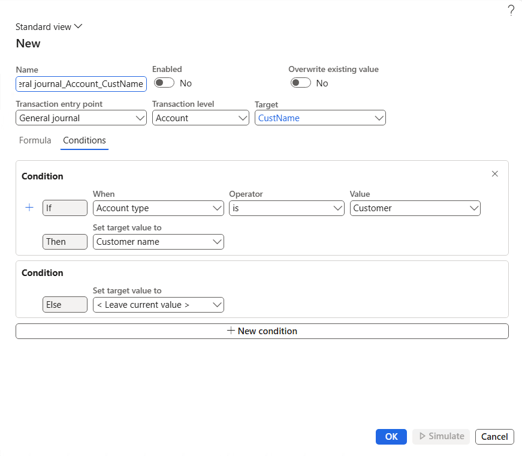
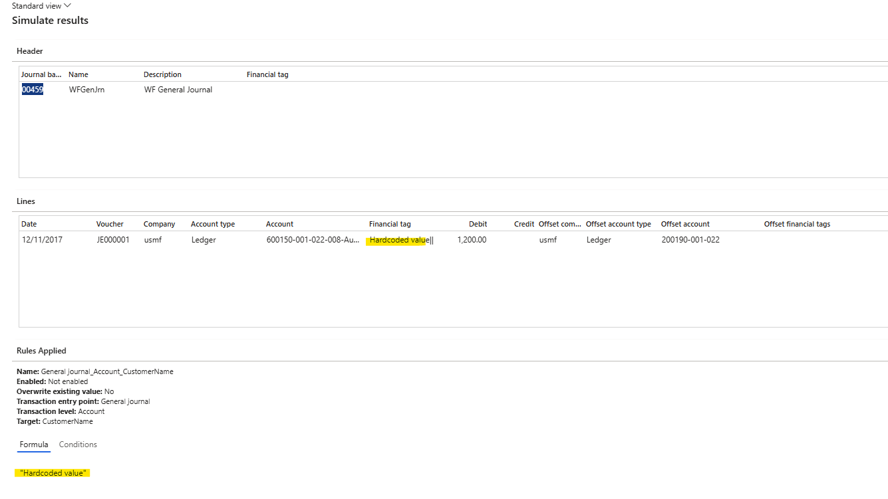
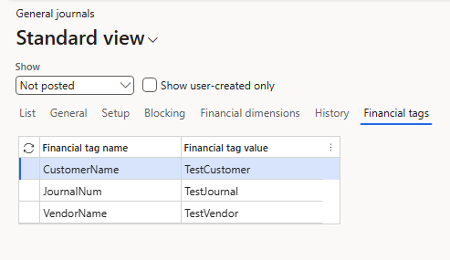
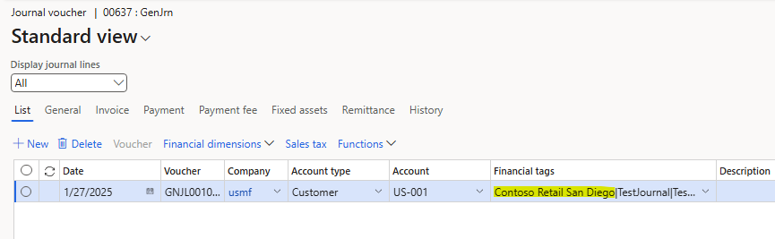

# Financial tag rules

Financial tag rules provide a way to enter default values or automatically populate values in your [financial tags](financial-tag.md). They streamline the process and ensure consistency and efficiency in transaction tagging. Such consistency and efficiency are essential for accurate financial tracking and reporting.

This feature is available as of Microsoft Dynamics 365 Finance version 10.0.42. It's available in Feature management. In each new release, more document entry points are implemented.

Currently, the following journals support financial tag rules:

- General journal
- Global general journal

    > [!NOTE]
    > The General journal and global general journal use a shared setup of financial tag rules.

- Allocation journal
- Reporting currency adjustment journal
- Invoice journal (vendor)
- Vendor payment journal
- Customer payment journal
- Fixed asset journal
- Free text invoice
- Sales order

## Setup

To use the functionality, enable the **Financial tag defaulting rules** feature in Feature management. You can disable the feature at any time. If you enable but later disable the feature, the database maintains any rules that you defined for financial tags. However, the rules no longer apply to any transactions in Dynamics 365 Finance.

Before you can use the **Financial tag rules** page, set up at least one [financial tag](financial-tag.md) in the company where you're creating a rule.

## Creating financial tag rules

Before you create financial tag rules, consider the following points:

- System rules mimic the behavior that's already used in the system today. In a journal entry, system rules copy tag header values to the **Account tag** field and account tag values to the offset **Account tag** field. You can enable or disable system rules as you require, but you can't remove them from the system or modify them in any way.
- [Microsoft Power Fx](/power-platform/power-fx/overview) is the language that's used to define and run the financial tag rules. Learn about Power Fx formulas in [Formula reference overview](/power-platform/power-fx/formula-reference-overview). Dynamics 365 Finance doesn't support all formulas. The language includes additional features that enable awareness of Dynamics 365 Finance and the tables and fields that you can use with the rule definition.
- You don't need knowledge of Power Fx to create a rule. The feature has a rule builder that you can use to select appropriate fields to generate the correct condition so that your rule can be applied.

### Create a financial tag rule

To create a financial tag rule, follow these steps:

1. Go to **General ledger** > **Chart of accounts** > **Financial tags** > **Financial tag rules**.
1. Select **New** to create a financial tag rule.

   The dialog box that appears has several fields that you can set, including the following three required fields:

    - **Transaction entry point** – Specify the document where you enter the data.
    - **Transaction level** – Specify the location or level where financial tags are located. For example, **Header** refers to the top-level table that has one set of financial tags for all lines that belong to that header. **Account** is a special value for journals, because the general journal has financial tags for both the account entry and the offset account.
    - **Target** – Specify the exact tag field that you want to set.

1. On the **Formula** tab, enter a Power Fx formula to set the value by using any conditional logic that you want to use. The return value from the function is the value that is set on the target financial tag (that is, the financial tag that you specified in the **Target** field).

    To learn more about the supported fields that are enabled for each document or transaction entry point, see [Financial tag rule reference](financial-tag-rule-reference.md).

1. On the **Conditions** tab, build a set of conditions and outcomes that populate the target financial tag.
1. Review the **Name**, **Enabled**, and **Overwrite existing value** values.
1. Select **OK** to save the new rule.

### Simulate a financial tag rule

You can test a rule before it affects live transactions. Select **Simulate** while creating a new rule, or select the **Simulate** button at the top of the **Financial tag rules** page to simulate an existing rule. Choose an existing journal to run the rule against, and the simulation shows what the financial tag value would evaluate to for each line.

### Copy a financial tag rule

In the *copy a financial tag* rule, you can copy a financial tag rule in two ways. Both options require that you select a valid rule in the current legal entity as the source rule to copy.

- **Copy within legal entity** – This option copies a rule that you defined for one transaction entry point to another entry point in the same legal entity. On the first page of the copy wizard, select the additional transaction type destinations to copy the rule to. On the second page of the wizard, review your selections and then select **Finish** to complete the copy process.
- **Copy to other legal entity** – This option copies rules to any legal entity where financial tags are defined and active. Select one or more rules to copy to another legal entity. The first page of the copy wizard shows the legal entities where one or more tags are defined and active. The second page of the wizard maps the rule to a tag that has a different name on the **Mapping options** page if there's a discrepancy in the tag name between legal entities. On the last page of the  wizard, review your selections and then select **Finish** to complete the copy process.

## How financial tag rules apply to transactions

Two types of rules can populate a financial tag, and each fires at different points in the record lifecycle:

| Rule | Transaction Level | Scope | Where it's defined | When it fires | Overwrites existing value? |
|---|---|---|---|---|---|
| **System rule** | **Line**, **Account**, **OffsetAccount** | All Financial tags | Built in; Copies the header tag to the line tag, and the **Account tag** to the **Offset Account tag** in journals. | **Only once, when the line is created.** It does not re-evaluate when the line is later modified or saved, and a later change to the header is not propagated to existing lines. | By default, **No**. The line keeps whatever value was copied at create time. **Overwrite existing value** can be updated from the **Financial tag rules** page if overwrite is desired. |
| **User-defined rule** | **Header** | Individual Financial tags | **Financial tag rules** page. | Typically on header **create** and on **save**. For some documents, the rule also re-evaluates when the primary account on the header is modified. | Only if **Overwrite existing value** is set to **Yes** on the rule. |
| **User-defined rule** | **Line**, **Account**, **OffsetAccount** | Individual Financial tags | **Financial tag rules** page. | On line **create**, on **save**, and on **modify** (for example, when the account field changes or another field that the formula references changes). | Only if **Overwrite existing value** is set to **Yes** on the rule. |

> [!IMPORTANT]
> To re-flow a header value to existing lines, configure a user-defined line rule with **Overwrite existing value** set to **Yes**, or update the line tags manually.

For journals, when you set the account or offset account field, all user-defined rules for that transaction level run and populate each target. Rules with **Overwrite existing value** set to **Yes** replace whatever value the user or a system rule previously set.

When you save the record, user rules run again to provide a final overwrite of financial tags. This re-evaluation reflects any value the user changed before saving.

For example, if you set a rule at the **Header** level, you see the financial tags populated as soon as you create a new journal:

If you set a rule at the **Account** level, the rule runs when you create a new line, change the account field, or save the record:

> [!NOTE]
> Every journal or document is responsible for calling the defaulting engine for its own scenarios. Defaulting behavior might differ between documents based on the document's implementation. The preceding examples show the generally expected behavior, but technically, the defaulting can be slightly different between documents.
