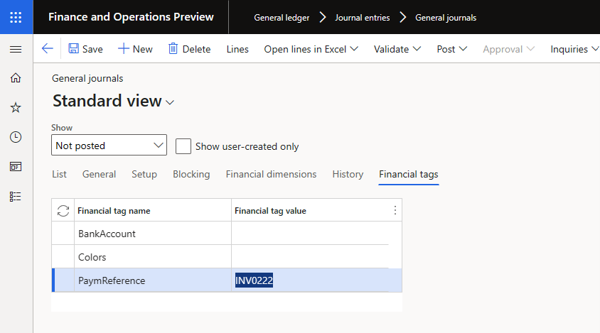
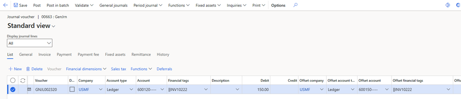
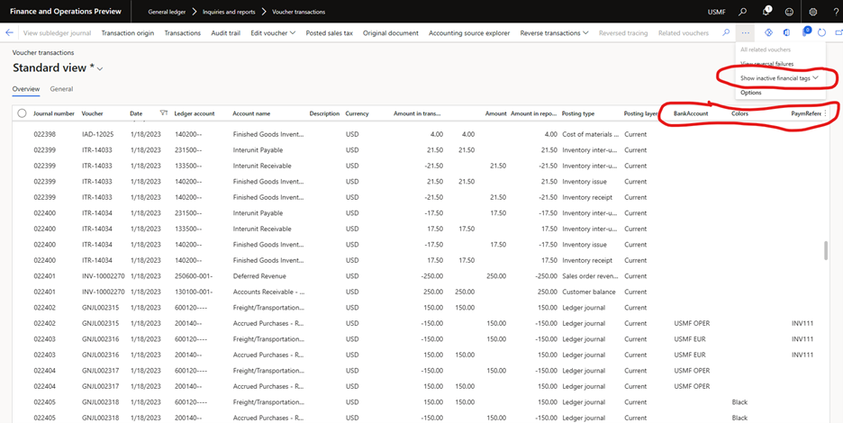

---
# required metadata

title: Financial tags 
description: This article describes financial tags.
author: kweekley
ms.date: 01/23/2023
ms.topic: article
ems.prod: 
ms.technology: 

# optional metadata

ms.search.form: DimensionFocus, LedgerTrialBalanceListPage
audience: Application User
# ms.devlang: 
ms.reviewer: twheeloc
# ms.tgt_pltfrm: 
ms.custom: 25871
ms.search.region: Global
# ms.search.industry: 
ms.author: kweekley
ms.search.validFrom: 2021-03-23
ms.dyn365.ops.version: 10.0.16

---

# Financial tags

After transactions are posted, it's common for organizations to require visibility into subledger data, so that the accounting entries that are generated from those transactions can be analyzed. Today, organizations use fields such as the document number, description, or financial dimensions to track subledger data in the general ledger, because it's difficult to navigate the data model to the subledger data. The types of subledger data that are often tracked include sales order or purchase order numbers, vendor or customer names, payment references, invoice numbers, or reference numbers from external transactions that are imported into Microsoft Dynamics 365 Finance. In addition to being used for analytics, the subledger data is used for processes such as ledger settlement.

The **Financial tags** (tags) feature eliminates the need to use document numbers, descriptions, or financial dimensions by letting an organization create and enter up to 20 user-defined fields on transactions. Those fields are then stored on the accounting entries that are created for the transactions. Tag values aren't stored in any subledger tables, the Customer transactions or Vendor transactions table.

Tags were introduced in the 10.0.32 release of Dynamics 365 Finance. This release supports the capability to define up to 20 user-defined tags and to enter tag values on the following journals (and corresponding Open Data Protocol \[OData\] and Data management entities):

- General journal
- Global general journal

In each new release, tags will be implemented in additional journals, documents, and processes.

## Setup

To use the functionality, you must enable the **Financial tags** feature in the **Feature management** workspace. The feature can be disabled at any time. If the feature is enabled but later disabled, any values that were entered for financial tags on transactions will be maintained in the database. However, they'll no longer be visible on any transactions or in inquiries in Dynamics 365 Finance.

The experience of entering tags on transactions resembles the experience of entering a ledger account by using financial dimensions. Tags don't use the same control as a ledger account, but they still require a delimiter between the tag values. You should define the tag delimiter before you define any financial tags. On the **General ledger parameters** page, select **Financial tags**, and specify the delimiter. The delimiter that you specify must not be used in any tag values that are entered on transactions. The delimiter can't be changed after it's defined.

After the feature is enabled, each legal entity can define up to 20 financial tags. Tags are legal entity–specific. You can use the **Financial tag configuration** and **Financial tags custom list value** entities to import the tags for each legal entity. Therefore, you can quickly and easily define the same initial setup in multiple legal entities.

## Creating financial tags

Before you create financial tags, note the following points:

- Evaluate whether the data should be tracked as a financial dimension or a financial tag. Financial tags are an alternative to financial dimensions, especially when you're tracking values that have little or no reusability, such as sales order numbers or purchase order numbers. For more information about the differences between financial tags and financial dimensions, see [Differences between financial tags and financial dimensions](financial-tag-financial-dimension.md).
- After a financial tag is created, it can be deactivated but not deleted. This restriction helps ensure that the tag values remain available for reporting on posted general ledger entries. Financial tags can easily be activated and deactivated at any time.
- The label of each financial tag can be changed at any time, even after transactions are posted.
- If no transactions have been posted for a specific financial tag, a change to the tag's label will have no impact. This behavior is useful when you must repurpose a tag so that you can track other data.
- If transactions have been posted for a specific financial tag, the tag values don't change. If the tag's label was originally "Purchase order number," but it's later changed to "Sales order number," the accounting entries that were posted before the label change will still contain the purchase order numbers that were entered and posted to the general ledger.

### Create a financial tag

Follow these steps to create a financial tag.

1. Go to **General ledger \> Chart of accounts \> Financial tags \> Financial tags**.
2. Select **New** to create a financial tag.
3. Enter a label for the tag. The label must start with a letter or underscore, and it can contain only letters, numbers, and underscores. No special characters, including spaces, are permitted.
4. In the **Value type** field, select **Text**, **List**, or **Custom list**.
5. If you selected **List** in the **Value type** field, select the value source in the **Use values from** field. The field contains a list of entities that the tag values can be selected from during transaction entry.
6. If you selected **Custom list** in the **Value type** field, select **Tag values** to create the custom list of tag values that will be available for selection during transaction entry.
7. Select **Activate** to activate the tag.

## Entering financial tag values on transactions

After one financial tag is activated, tags will be available for entry on each transaction that supports the feature.

### Journals and lines

When you enter journals, you can define tag values on the journal batch header. Those values will then be used as default values for the lines in the journal. As for other default values in the journal, they'll automatically be entered on new lines that are added to the journal. However, they won't be entered on lines that already exist when you define the values on the header.

### Default values

Tag values that you enter in a journal are entered as default values in the following way:

- Single-line voucher:

    - Tag values that you add to the journal batch header are entered as default values on the account.
    - Tag values that you add to the account are entered as default values on the offset account.
    - If the offset account already exists when you add tag values to the account, those tag values aren't entered as default values on the offset account.
    - If tag values exist on both the account and the offset account, changes to the tag values in one place don't cause the values in the other place to be updated. For example, if you change the tag values on the account, the tag values on the offset account aren't updated. This behavior helps prevent loss of data if a user manually overrides the default values.
    - When you add a new line, if you assign a new voucher number (which represents a new transaction), the defaulting behavior starts over. Tag values from the lines of one voucher are never entered as default values on the lines of a different voucher.

- Multiline voucher:

    - Tag values that you add to the journal batch header are entered as default values on the account of each line that's added to the voucher.
    - The tag values that you add to the account on the first line aren't entered as default values on the account of the next line of the voucher, and so on.

Tag values from master data are never used as default values. For example, there's no capability to define default tag values on customers or vendors. In addition, tag values from the transaction itself aren't automatically entered as default values. For example, a tag was created to track the customer name. If a transaction contains a customer, the tag value won't be entered as the customer name by default. The value must be manually entered or imported.

### Validation

When tag values are entered on transactions, no validation occurs during either transaction entry or posting. Even if a tag of the **List** or **Custom list** value type is defined, the tag values aren't validated to ensure that they exist in the list. For example, a tag of the **List** value type is created, and the purchase order number is selected as the source of the list. Although a list of purchase order numbers will be presented, the user can enter a purchase order number that doesn't exist in the list.

## Posting transactions that have tag values

After a transaction is posted, the financial tags are available on the lines of the general ledger account entry. They're shown on the **Voucher transactions** and **Transactions for main account** pages. The financial tags are shown in separate columns, so that they're easier to sort and filter. 

For reporting, the tags aren't part of the dimension sets. Therefore, you can't get a summarized balance of transactions for a specific tag value. For example, when you're looking at the trial balance, you can't get balances per tag value. However, when you drill down into the balances from the trial balance, the tag values will be shown on the detailed transactions. The detailed transactions, including the tag values in separate columns, can be exported to Excel, where they can be summarized if balances are required.

If a tag is deactivated, the tag values remain on the posted transactions. By default, deactivated tags aren't shown on inquiry pages. However, you can add the columns by selecting **Show inactive financial tags**.

### Correct tag values after posting

Although financial tags are available for reporting, they aren't part of the ledger account and have no impact on financial statements. Because tags are used only for internal analysis, edits to the tag values are permitted after transactions are posted.

1. In the **Feature management** workspace, enable the feature that's named **Allow edits to internal data on general ledger vouchers**. This feature enables some roles to modify the **Description** field of posted accounting entries. If the **Financial tags** feature is also enabled, this feature is enhanced to enable edits to the tag values.
2. After the feature is enabled, go to **Voucher transactions**.
3. Use the query to find the transactions that you want to edit.
4. Select the lines in **Voucher transactions**, and then select **Edit internal voucher data**. You can edit only lines that are selected.
 

The page shows the lines that you selected in **Voucher transactions**, including the current financial tags and new financial tags. The current tag values are entered as default values for the new tags. Therefore, you don't have to manually enter everything again but can instead change only what's incorrect. You can use the **Bulk update selected records** button to do mass updates. Mass updates are useful if you want to assign tag values to large groups of posted transactions that were incorrect or that no tag values were defined for (for example, because they were posted before the feature was enabled).
