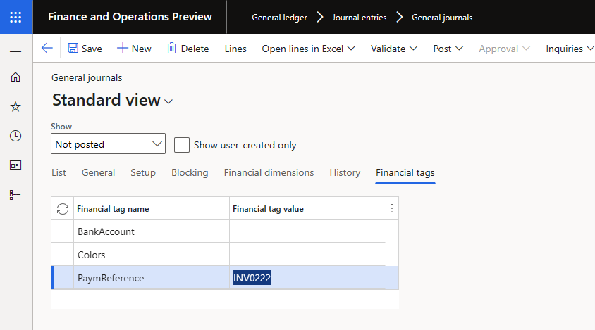
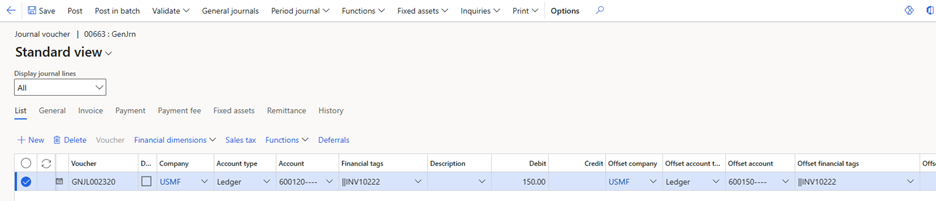
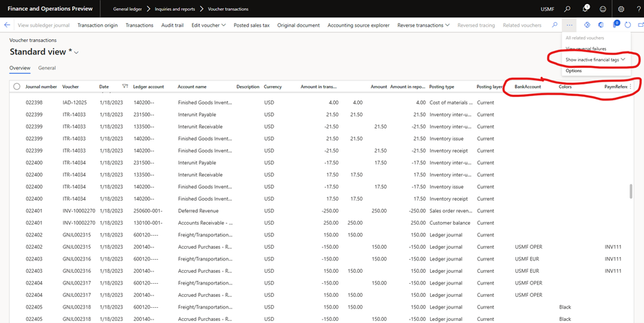
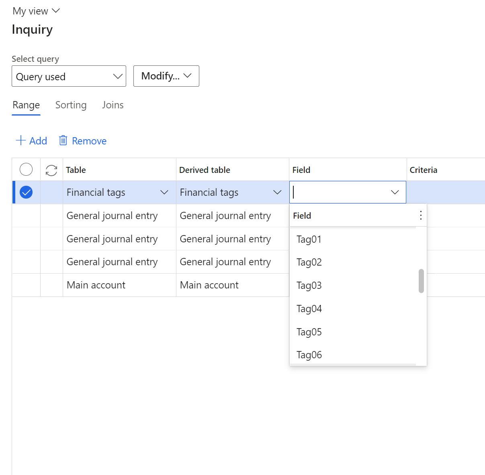
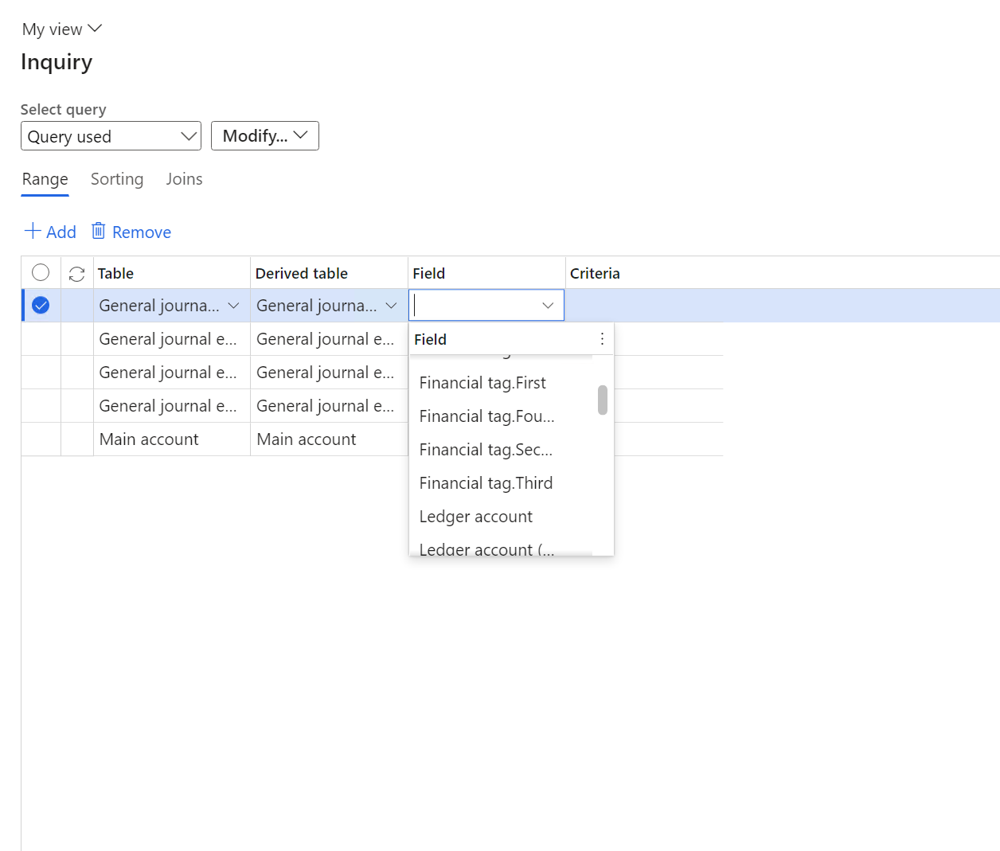
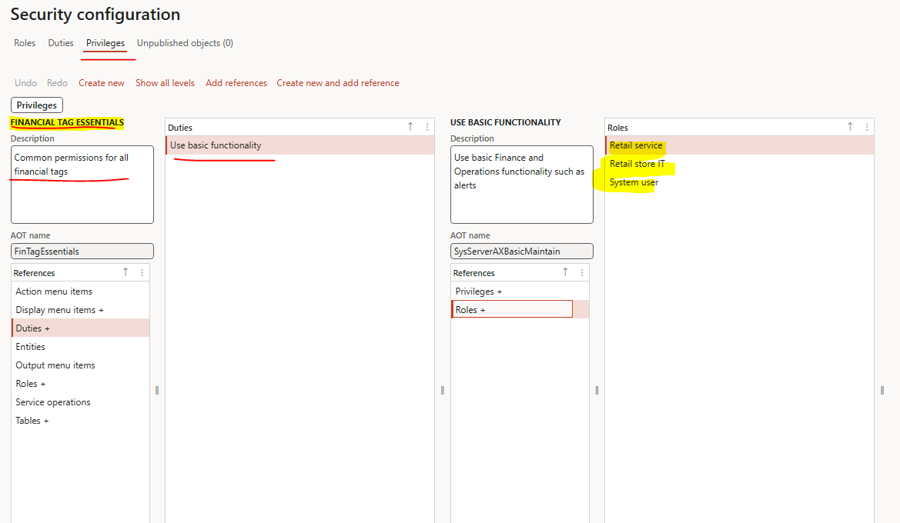

# Financial tags

After you post transactions, organizations often need visibility into subledger data so they can analyze the accounting entries that come from those transactions. Today, organizations use fields such as the document number, description, or financial dimensions to track subledger data in the general ledger, because it's difficult to navigate the data model to the subledger data. The types of subledger data that organizations often track include sales order or purchase order numbers, vendor or customer names, payment references, invoice numbers, or reference numbers from external transactions that are imported into Microsoft Dynamics 365 Finance. In addition to being used for analytics, the subledger data is used for processes such as ledger settlement.

The **Financial tags** (tags) feature eliminates the need to use document numbers, descriptions, or financial dimensions by letting an organization create and enter up to 20 user-defined fields on transactions. The system stores those fields on the accounting entries that it creates for the transactions. Tag values aren't stored in any subledger tables, the Customer transactions, or Vendor transactions table.

In each new release, tags are implemented in additional journals, documents, and processes. The following journals and transactions support tags:

- General journal
- Global general journal
- Allocation journal
- Fixed asset journal
- All asset leasing journals
- Periodic journal
- Reporting currency adjustment journal
- Customer payment journal
- Vendor payment journal
- Invoice journal (vendor)
- Global invoice journal (vendor)
- Invoice register
- Sales order documents (Sales order, packing slip, and customer invoice)

    > [!NOTE]
    > To make support for tags available on sales order documents, enable the **Enable financial tags for sales order invoicing** feature in Feature management.

- Purchase order documents (Purchase order, product receipt, and vendor invoice)

    > [!NOTE]
    > Starting in Dynamics 365 Finance version 10.0.41, tags are available on purchase order documents. The **Enable financial tags for purchase order invoicing** feature is available in Feature management. The feature is in private preview controlled by the **PurchaseOrderFinTagFeature** flight. To start using Financial tags on purchase order documents, create a IcM ticket to enable the flight first.

## Setup

To use this functionality, you must enable the **Financial tags** feature in the **Feature management** workspace. You can disable the feature at any time. If you enable the feature but later disable it, the database maintains any values that you entered for financial tags on transactions. However, you can't see these values on any transactions or in inquiries in Dynamics 365 Finance.

The experience of entering tags on transactions resembles the experience of entering a ledger account by using financial dimensions. Tags don't use the same control as a ledger account, but they still require a delimiter between the tag values. You should define the tag delimiter before you define any financial tags. On the **General ledger parameters** page, select **Financial tags**, and specify the delimiter. The delimiter that you specify must not be used in any tag values that you enter on transactions. For example, if you define a hyphen (\-) as the delimiter, the customer name that you enter as the tag value can't contain a hyphen. You can't change the delimiter after you define it.

After you enable the feature, each legal entity can define up to 20 financial tags. Tags are legal entity–specific. Use the **Financial tag configuration** and **Financial tags custom list value** entities to import the tags for each legal entity. You can quickly and easily define the same initial setup in multiple legal entities.

## Creating financial tags

Before you create financial tags, note the following points:

- Evaluate whether you should track the data as a financial dimension or a financial tag. Financial tags are an alternative to financial dimensions, especially when you're tracking values that have little or no reusability, such as sales order numbers or purchase order numbers. For more information about the differences between financial tags and financial dimensions, see [Differences between financial tags and financial dimensions](financial-tag-financial-dimension.md).
- After you create a financial tag, you can deactivate it but not delete it. This restriction helps ensure that the tag values remain available for reporting on posted general ledger entries. You can easily activate and deactivate financial tags at any time.
- You can change the label of each financial tag at any time, even after transactions are posted.
- If you didn't post transactions for a specific financial tag, a change to the tag's label has no impact. This behavior is useful when you must repurpose a tag so that you can track other data.
- If you posted transactions for a specific financial tag, the tag values don't change. If the tag's label was originally "Purchase order number," but you later change it to "Sales order number," the accounting entries that were posted before the label change still contain the purchase order numbers that you entered and posted to the general ledger.

### Create a financial tag

Follow these steps to create a financial tag.

1. Go to **General ledger > Chart of accounts > Financial tags > Financial tags**.
1. Select **New** to create a financial tag.
1. Enter a label for the tag. The label must start with a letter or underscore, and it can contain only letters, numbers, and underscores. No special characters, including spaces, are permitted.
1. In the **Value type** field, select **Text**, **List**, or **Custom list**.
1. If you select **List** in the **Value type** field, select the value source in the **Use values from** field. The field contains a list of entities that you can select tag values from during transaction entry.
1. If you select **Custom list** in the **Value type** field, select **Tag values** to create the custom list of tag values that are available for selection during transaction entry.

>[!NOTE]
> Beginning in Dynamics 365 Finance version 10.0.44, you can select a **Fixed list** and a **Fixed custom list** as the value type. Selecting either of these items runs extra validation at entry. Only the values found in the list are allowed for entry when you select this option.

1. Select **Activate** to activate the tag.

## Enter financial tag values on transactions

After you activate a financial tag, enter tags on each transaction that supports the feature.

### Journals and lines

When you enter journals, you can define tag values on the journal batch header. Those values then become the default values for the lines in the journal. As with other default values in the journal, the system automatically enters them on new lines that you add to the journal. However, the system doesn't enter them on lines that already exist when you define the values on the header.

### Default values for journals

Tag values that you enter in a journal are entered as default values in the following way:

- Single-line voucher:

  - When you add tag values to the journal batch header, the system uses them as default values on the account.
  - When you add tag values to the account, the system uses them as default values on the offset account.
  - If the offset account already exists when you add tag values to the account, the system doesn't use those tag values as default values on the offset account.
  - If tag values exist on both the account and the offset account, changes to the tag values in one place don't update the values in the other place. For example, if you change the tag values on the account, the tag values on the offset account aren't updated. This behavior helps prevent loss of data if a user manually overrides the default values.
  - When you add a new line, if you assign a new voucher number (which represents a new transaction), the defaulting behavior starts over. Tag values from the lines of one voucher are never used as default values on the lines of a different voucher.

- Multiline voucher:

  - When you add tag values to the journal batch header, the system uses them as default values on the account of each line that's added to the voucher.
  - The tag values that you add to the account on the first line aren't used as default values on the account of the next line of the voucher, and so on.

Default tag values don't exist on master data and aren't available as default values. For example, you can't define default tag values on customers or vendors. In addition, properties of a transaction itself aren't automatically entered as default values. For example, you create a tag to track the customer name. If a transaction contains a customer, the customer's name isn't used as the customer tag value by default. You must enter or import the value manually.

### Default values for documents

For documents, just as for journals, don't enter tag values as default values from master data, because master data doesn't contain default tag values. Most documents, such as sales orders, follow this general defaulting order:

1. Define tag values on the header of the document.
1. Use tag values from the header as default values on the lines of the document.
1. Use tag values from the lines of the document as default values in the accounting distributions, if the document is a source document and supports accounting distributions.

For the accounting entries that you create, enter the tag values as default values in the following way:

- **Non-source documents:**

  - Enter the tag values for the summary account, such as Accounts payable or Accounts receivable, by default from the header.
  - All other accounts, such as the expense, revenue, tax, and discounts, use the tag values from the lines by default.

- **Source documents:**

  - Enter the tag values for the summary account, such as Accounts payable or Accounts receivable, by default from either the header or the accounting distributions, depending on the General ledger parameters that are used for summary accounts. (Go to **General ledger** > **Ledger setup** > **General ledger parameters**.) The tag values are entered by default according to the same logic that the system uses for the financial dimension values for the summary account.
  - All other accounts, such as the expense, revenue, tax, and discounts, use the tag values from the accounting distributions by default.

If a document has downstream documents, the system uses the tags from the parent document for the child documents. For example, the system uses the tag values from the sales order header and lines for the accounting that it creates for the packing slip and customer invoice, according to the logic that is described earlier.

### Validation

When you enter tag values on transactions, the system doesn't validate them during either transaction entry or posting. Even if you define a tag of the **List** or **Custom list** value type, the system doesn't validate tag values to ensure they exist in the list. For example, if you create a tag of the **List** value type and select the purchase order number as the source of the list, the system presents a list of purchase order numbers, but you can enter a purchase order number that doesn't exist in the list.

If you require validation, change the tag's value type to **Fixed list** or **Fixed custom list** (available in version 10.0.44 and later). To switch an existing tag:

1. Go to **General ledger** > **Chart of accounts** > **Financial tags** > **Financial tags**.
1. Select the financial tag that you want to enable validation for.
1. In the **Value type** field, select **Fixed list** or **Fixed custom list**.
1. Select **Activate** to activate the tag.

After you switch to a fixed type, only values that exist in the defined list are accepted during transaction entry.

## Posting transactions that have tag values

After you post a transaction, the financial tags are available on the lines of the general ledger account entry. They appear on the **Voucher transactions** and **Transactions for main account** pages. The financial tags appear in separate columns, so that you can more easily sort and filter them.

For reporting, the tags aren't part of the dimension sets. Therefore, you can't get a summarized balance of transactions for a specific tag value. For example, when you're looking at the trial balance, you can't get balances per tag value. However, when you drill down into the balances from the trial balance, the tag values appear on the detailed transactions. You can export the detailed transactions, including the tag values in separate columns, to Excel, where you can summarize them if balances are required.

If you deactivate a tag, the tag values remain on the posted transactions. By default, deactivated tags aren't shown on inquiry pages. However, you can add the columns by selecting **Show inactive financial tags**.

### Correct tag values after posting

Although financial tags are available for reporting, they aren't part of the ledger account and don't affect financial statements. Because tags are used only for internal analysis, you can edit the tag values after posting transactions.

1. In the **Feature management** workspace, enable the **Allow edits to internal data on general ledger vouchers** feature. This feature enables some roles to modify the **Description** field of posted accounting entries. If you also enable the **Financial tags** feature, this feature is enhanced to enable edits to the tag values.
1. After you enable the feature, go to **Voucher transactions**.
1. Use the query to find the transactions that you want to edit.
1. Select the lines in **Voucher transactions**, and then select **Edit internal voucher data**. You can edit only lines that you select.

The page shows the lines that you selected in **Voucher transactions**, including the current financial tags and new financial tags. The current tag values are entered as default values for the new tags. Therefore, you don't have to manually enter everything again but can instead change only what's incorrect. Use the **Bulk update selected records** button to do mass updates. Mass updates are useful if you want to assign tag values to large groups of posted transactions that were incorrect or that no tag values were defined for (for example, because they were posted before the feature was enabled).

## Filter voucher transactions by financial tag

When filtering voucher transactions by using the query form, select **General journal account entry** as the table - not **Financial tags**. The **Financial tags** table displays generic column names (Tag01, Tag02, and so on) instead of your configured tag names, which leads to ambiguous and potentially incorrect results.

Instead, select **General journal account entry** as the table. The financial tag fields appear with their configured names, so you can identify and filter on the correct tag.

## Troubleshoot the "Part Reference's menu item must point to a Form" error

If users receive the error **"Part Reference's menu item must point to a Form"** when opening a form that includes financial tags, the cause is typically a missing security configuration.

Financial tag controls require the **Financial tag essentials** privilege, which grants access to the display menu items used by the financial tag preview. By default, this privilege is included in the **Use basic functionality** duty, which is assigned to the **System user**, **Retail service**, and **Retail store IT** roles.

To resolve the error, either assign one of these roles to the affected user, or add the **Financial tag essentials** privilege to a role the user already has. If the error persists after updating security, a service restart might be needed to clear cached security state.
