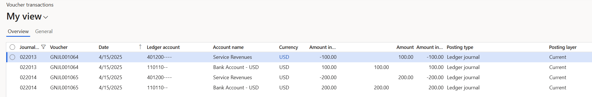
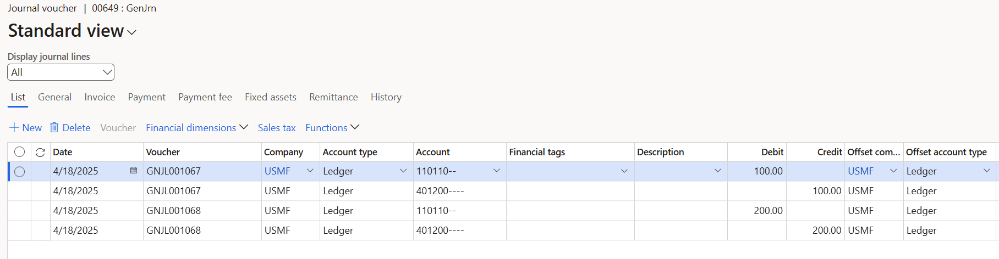
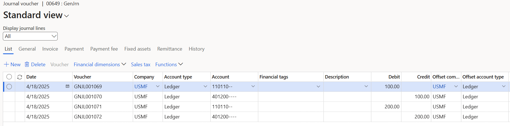

# General journal processing

[!include [banner](../includes/banner.md)]

This article describes capabilities that can help make general journal processing easier. They can also help ensure that correct data is captured and internal control isn't compromised.

## Journal names

One of the most important areas to set up is journal names. It's a good idea to define specific journal names for each purpose, such as intercompany, accrual adjustment, and error correction. You can tailor each journal name to help make data entry for each purpose easy and secure.

On the **Journal names** page, you can set up the following:

- **Workflow approval** – To increase internal control, define journal workflows that establish materiality limits for review and approval steps, based on criteria such as total debit amount. You set up workflows for the general journals on the **General ledger workflows** page.
- **Default values** – Select default values for offset accounts, currency, and financial dimensions.
- **Journal control** – You can set up restrictions on the company and account type, and also the segment values.

## Examples

A journal name can be used only for adjustments. In this case, you can specify that only the **Ledger** account type is valid across all companies.

A journal name can be used only for a specific segment or for a range for main accounts.

**Automatic reversal** is available in general journals. For example, you have an accrual adjustment where the actual document hasn't yet been processed, as shown in the following illustration.

The Microsoft Excel add-in for journal entry provides an additional level of automation and makes data entry easier. The **Open lines in Excel** action is available on the **General journal** and **Journal voucher** pages.

On the **Periodic journals** page, you can set up recurring journals to automate journal processing.

You can use voucher templates at any time. On the **General journals** page, select a **Journal voucher** page. The **Save** and **Select voucher template** actions are available under **Functions** for the voucher lines.

### Related setup

The following setup isn't specific to general journals, but it helps ensure that data entry is correct and easy.

#### Main account

The main account setup provides many options for general journal processing:

- **DC/CR requirement** – Use this option if a main account is limited to debit or credit transactions. The setup is verified when a journal is validated or posted.
- **Default offset account**
- **Suspended** – Suspend a main account for data entry across all companies or for a specific company/legal entity.
- **Do not allow manual entry** – Prevent users from manually entering a value for the account in journals.
- **Default/Validate currency**
- **Legal entity override** – This setup is specific to the defined company/legal entity:

    - **Default/Validate sales tax**
    - **Default dimension** – **Not fixed** or **Fixed value**. **Fixed value** helps ensure that all postings for this main account always use any dimension value that is set up as **Fixed**.

- **Posting validation**

    - **User validation** – This option controls which users are allowed to post to a main account.
    - **Posting type validation** – This option controls which posting types are allowed for a main account.

### Accounting structures and advanced rules structures

Accounting structures and advanced rules structures are important for ensuring that the data that is required for financial reporting and performance tracking is captured during general journal processing and any documentation. Accounting structures and advanced rules structures let you tailor the data entry experience. You can allow data entry only for financial dimensions that are relevant in each situation. You can also enforce the requirement that required and accurate data is always captured.

For more information, see the following topics:

- [Plan your chart of accounts](plan-chart-of-accounts.md)
- [Create advanced rules for journals](tasks/create-advanced-rules-journals.md)
- [Create a journal entry using template](tasks/create-journal-entry-template.md)
- [Create and validate journals](tasks/create-validate-journals.md)
- [Post periodic journals](tasks/post-periodic-journals.md)
- [Process ledger allocation journal](tasks/process-ledger-allocation-journal.md)

### Global general journals

The **Global general journal** lets you enter a journal into any legal entities that are defined in your environment, without having to switch companies before you create the journal. Use the **New journal** button at the top of the **Global general journal** page to select the legal entity for the journal, and then specify the journal that you want to enter data for. Select lines for the created journal to open the same standard journal lines page that you can open from the **General journal** page.

> [!NOTE]
> In Dynamics 365 Finance release 10.0.34, a new **Enable the Global general journal page to select multiple companies for posting** feature lets you select multiple journals for posting across any legal entities. The posting process creates a single batch job per legal entity to complete the posting.

### Simulate posting

You can find **Simulate posting** on the **Validate** menu for most journals. When you validate a journal using the **Validate** function, the journal is tested for specific error conditions. If you use the **Simulate posting** function, all the same processes that are run during posting are run without actually posting the journal. You can then review the posting messages that are displayed, fix any errors that you find, and then open the **Post** menu to post the journal.

**Simulate posting** isn't available for batch processing. However, code is available to simulate posting in batch, and developers can extend the code to add that functionality.

### Journal unlock

A button that is available on the journal page unlocks a journal where the "locked by system" status is set to **Yes**. An administrator of the system can perform this unlock after they analyze any running batch jobs and confirm that the journal is no longer being actively processed by a batch job. The button is enabled by the **Journal unlock button** feature on the **Feature management** page.

### Workflow recall

The ability to recall a journal in a workflow that has a status of "unrecoverable" is enabled by using the **Workflow** button on a journal, and on the **Workflow history** page. This is enabled by the **Resetting the workflow status for journals** feature on the **Feature management** page.

### Delete journal lines

In Dynamics 365 Finance version 10.0.34, a new feature **Delete journal performance using batch** is available. This feature allows the delete process, for unposted journals, to be scheduled. This lets users continue other work instead of waiting for the delete processing to be completed.

To quickly delete all journal lines in a journal, go to **Functions** > **Delete journal lines**. This function affects extensions by using the **Delete** method on the **LedgerJournalTrans** table. The set of lines is removed without calling each line's **Delete** method.

> [!NOTE]
> Dynamics 365 finance and operations doesn't allow the deletion of posted transactions.

### Load ledger transactions

To use the **Load ledger transactions** function to transfer selected ledger transactions to the current journal, follow these steps.

1. Go to **General ledger** > **Journals** > **General journal**.
1. Enter a new journal, or select an existing journal, and then select **Lines**.
1. Select **Functions** > **Load ledger transactions**.

Use the voucher list to select how voucher numbers are assigned to the loaded transactions.

- **Original voucher number** – The new/loaded vouchers have the same voucher number as the original vouchers.
- **Same new voucher number for all vouchers** – All new/loaded vouchers have the same voucher number.
- **New voucher number per voucher** – Each new/loaded voucher has a new voucher number.
- **New voucher number per transaction** – Each line in the new/loaded vouchers has a different voucher number.

**Original voucher number** can be used only if the **Check for voucher used** field in General ledger parameter is set to **Accept duplicates** or **Warn in case of duplicates**.

#### Example

The following example uses the **Load ledger transactions** feature.

1. The original journal batch number has vouchers GNJL00164 and GNJL001065.

    

1. If the **Load ledger transactions** function was completed by using **New voucher number per voucher**, the new journal batch has vouchers GNJL001067 and GNJL001068.

    

1. If the **Load ledger transactions** function was completed by using **New voucher number per transaction**, the new journal batch has a different voucher number for each line: GNJL001069, GNJL001070, GNJL001071, and GNJL001072. Because the vouchers aren't balanced, this journal batch can't be posted. You can use this method if you want to add offset account types to the vouchers before posting.

    

1. Set the **Accrued transactions** option to **Yes** to include accrued transactions.
1. Set the **Invert sign** option to **Yes** to reverse the sign for the amount that is loaded into the journal. If the **Invert sign** option is set to **Yes**, and the **Voucher** field is set to **New voucher number per voucher** or **New voucher number per transaction**, the following description text is automatically shown for the created transactions: "Void of 'xxx'" (where 'xxx' is the original voucher number).
1. To change the posting date of the loaded transactions, set the **Unit** and **Number of units** fields. For example, if you select **Months** in the **Unit** field and enter **1** in the **Number of units** field, and the original posting date is May 1, the posting date for the loaded transactions is June 1.
1. Use the **Filter** button to limit the transactions that are loaded into the journal.

To restrict the use of voucher numbers, use the General journal entry table and the **Voucher** field.

The default query includes the **Journal number** field. However, that field refers to the **Journal entry number** field, not the **Journal batch number** field. To add the **Journal batch number** field to the query, follow these steps.

1. In the query, on the **Joins** tab, expand the **General journal account entry** table.
1. Select the **General journal entry** table.
1. Select **Add table join**.
1. Select **Ledger entry journal**, and then select **Select**. **Ledger entry journal** is added under the **Fiscal calendar period**.
1. On the **Range** tab, select **Add**. 
1. In the **Table** column, select **Ledger entry journal**. By default, the **Derived table** column is set to the same table.
1. In the **Field** column, select **Journal batch number**.
1. Enter a **Journal batch number** value to load into the journal.

[!INCLUDE[footer-include](../../includes/footer-banner.md)]
