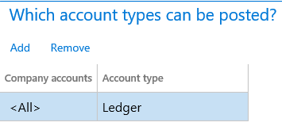
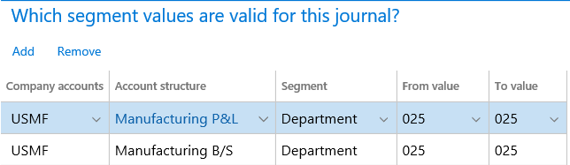

---
# required metadata

title: General journal processing
description: This article describes capabilities in Microsoft Dynamics 365 Finance that can help make general journal processing easier, and that can also help ensure that correct data is captured and internal control isn't compromised.  
author: kweekley
ms.topic: article
ms.prod: 
ms.technology: 

# optional metadata

ms.search.form: LedgerJournalSetup, LedgerJournalTable
# ROBOTS: 
audience: Application User
# ms.devlang: 
ms.reviewer: twheeloc
# ms.tgt_pltfrm: 
ms.assetid: b4b406fa-b772-44ec-8dd8-8eb818a921ef
ms.search.region: Global
# ms.search.industry: 
ms.author: kweekley
ms.search.validFrom: 2016-02-28
ms.dyn365.ops.version: AX 7.0.0

---

# General journal processing

[!include [banner](../includes/banner.md)]

This article describes capabilities that can help make general journal processing easier, and that can also help ensure that correct data is captured and internal control isn't compromised.  

## Journal names

One of the most important areas to set up is journal names. It's a good idea to define specific journal names for each purpose, such as intercompany, accrual adjustment, and error correction. You can tailor each journal name to help make data entry for each purpose easy and secure. 

On the **Journal names** page, you can set up the following elements:

-   **Workflow approval** – To increase internal control, define journal workflows that establish materiality limits for review and approval steps, based on criteria such as total debit amount. You set up workflows for the general journals on the **General ledger workflows** page.
-   **Default values** – Select default values for offset accounts, currency, and financial dimensions.
-   **Journal control** – You can set up restrictions on the company and account type, and also the segment values. 

**Examples**

A journal name can be used only for adjustments. In this case, you can specify that only the **Ledger** account type is valid across all companies. 

A journal name can be used only for a specific segment or for a range for main accounts. 

The **Automatic reversal** option is available in general journals. For example, you have an accrual adjustment where the actual document hasn't yet been processed, as shown in the following illustration.
 

The Microsoft Excel add-in for journal entry provides an additional level of automation and makes data entry easier. The **Open lines in Excel** action is available on the **General journal** and **Journal voucher** pages. 

On the **Periodic journals** page, you can set up recurring journals to automate journal processing. 

You can use voucher templates at any time. On the **General journals** page, the **Save** and **Select voucher template** actions are found on the **Journal voucher** page, under **Functions** for the voucher lines.

## Related setup
The following setup isn't specific to general journals, but will help ensure that data entry is correct data and easy.

### Main account

The main account setup provides many options for general journal processing:

-   **DC/CR requirement** – Use this option if a main account is limited to debit or credit transactions. The setup is verified when a journal is validated or posted.

-   **Default offset account**
-   **Suspended** – Suspend a main account for data entry across all companies or for a specific company/legal entity.
-   **Do not allow manual entry** – Prevent users from manually entering a value for the account in journals.
-   **Default/Validate currency**
-   **Legal entity override** – This setup is specific to the defined company/legal entity:
    -   **Default/Validate sales tax**
    -   **Default dimension** – **Not fixed** or **Fixed value**. **Fixed value** will help ensure that all postings for this main account always use any dimension value that is set up as **Fixed**.
-   **Posting validation**
    -   **User validation** – This option controls which users are allowed to post to a main account.
    -   **Posting type validation** – This option controls which posting types are allowed for a main account.

### Accounting structures and advanced rules structures

Accounting structures and advanced rules structures are extremely important for ensuring that the data that is required for financial reporting and performance tracking is captured during general journal processing and any documentation. Accounting structures and advanced rules structures let you tailor the data entry experience. You can allow data entry only for financial dimensions that are relevant in each situation, and can also enforce the requirement that required and accurate data always be captured.

For more information, see the following topics:
- [Plan your chart of accounts](plan-chart-of-accounts.md) 
- [Create advanced rules for journals](tasks/create-advanced-rules-journals.md)
- [Create a journal entry using template](tasks/create-journal-entry-template.md)
- [Create and validate journals](tasks/create-validate-journals.md)
- [Post periodic journals](tasks/post-periodic-journals.md)
- [Process ledger allocation journal](tasks/process-ledger-allocation-journal.md)

## Global general journals
The **Global general journal** allows entry of a journal into any legal entities defined in your environment without having to switch companies before creating the journal. At the top of the **Global general journal** page, the **New journal** button allows you to select the legal entity for the journal and then specify the journal you wish to enter data for. Clicking the lines for the created journal will open the standard journal lines page that is the same as opening it from the **General journal** page.  
>[!NOTE] 
>In Dynamics 365 Finance release 10.0.34, a new feature **Enable the Global general journal page to select multiple companies for posting** allows the selecting of mulitple journals for posting across any legal entities. The posting process will create a single batch job per each legal entity to complete the posting. 

## Simulate posting
You can find **Simulate posting** on the **Validate** menu for most journals. When you validate a journal using the **Validate** function, the journal is tested for specific error conditions. If you use the **Simulate posting** function, all of the same processes that are run during posting are run without actually posting the journal. You can then review the posting messages that are displayed, fix any errors that you find, and then open the **Post** menu to post the journal. 

**Simulate posting** is not available for batch processing. However, there is code available to simulate posting in batch and developers can extend the code to add that functionality.  

## Journal unlock
A button is available on the journal page to unlock a journal that has a status of "locked by system" set to **Yes**. This unlock can be performed by an administrator of the system who has analyzed any executing batch jobs and confirmed this journal is no longer actively being processed by a batch job. This button is enabled by the feature named **Journal unlock button** on the **Feature management** page. 

## Workflow recall 
The ability to recall a journal in a workflow that has a status of "unrecoverable" is enabled by using the **Workflow** button on a journal, and on the **Workflow history** page. This is enabled by the **Resetting the workflow status for journals** feature on the **Feature management** page.

## Delete journal lines
In Dynamics 365 Finance version  10.0.34, a new feature **Delete journal performance using batch** is available. This feature allows the delete process to be scheduled. This lets users to continue other work instead of waiting for the delete processing to complete. 

To quickly delete all journal lines in a journal, go to **Functions** > **Delete journal lines**. This function affects extensions on the **LedgerJournalTrans** table. It's **Delete** method. The set of lines are removed without calling each line's **Delete** method. 

[!INCLUDE[footer-include](../../includes/footer-banner.md)]
