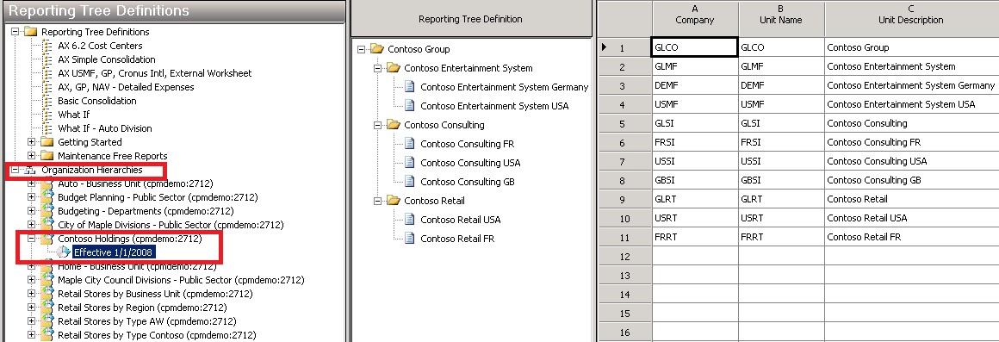
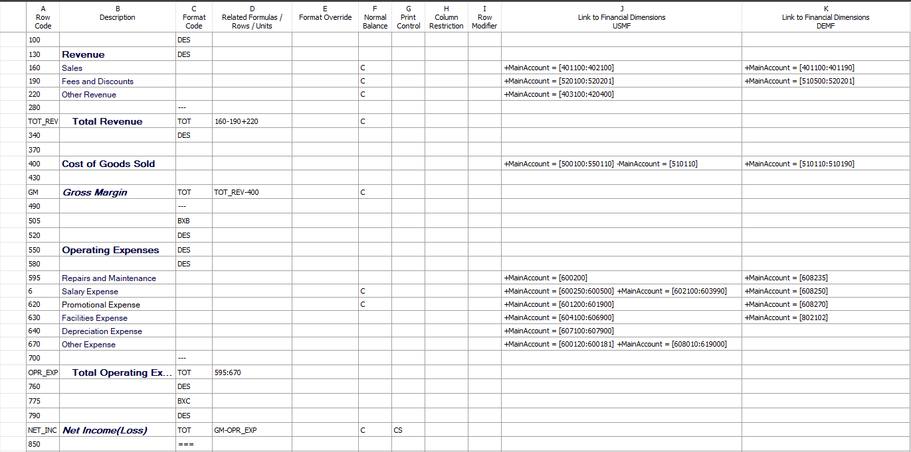
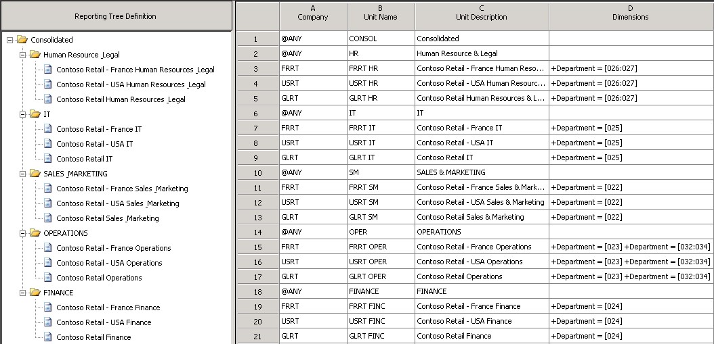

---
# required metadata

title: Generate consolidated financial statements
description: This topic describes the various scenarios where you might generate consolidated financial statements.
author: aprilolson
ms.date: 07/09/2018
ms.topic: article
ms.prod: 
ms.technology: 

# optional metadata

ms.search.form: 
audience: Application User
# ms.devlang: 
ms.reviewer: roschlom
# ms.tgt_pltfrm: 
# ms.custom: 
# ms.assetid: 
ms.search.region: Global
# ms.search.industry: 
ms.author: aolson
ms.search.validFrom: 2018-5-31
ms.dyn365.ops.version: 8.0.1

---

# Generate consolidated financial statements

[!include [banner](../includes/banner.md)]

This topic describes the various scenarios where you might generate consolidated financial statements.

## Single-level and multilevel consolidations across legal entities
The simplest method for consolidating by using Financial reporting is to use reporting trees to aggregate data across companies that have the same chart of accounts and fiscal periods. Here are the high-level steps to consolidate by using a reporting tree.

1. Create a row definition, and make sure that all appropriate accounts in all companies are included in the rows.
2. Create a column definition that includes all the columns that are required for the report that you're creating.
3. Create a reporting tree that includes a reporting node for each company that you're using on consolidated reports.

> [!TIP]
> For more information about how to create and manage row definitions, column definitions, and reporting trees, see [Financial report components](../../fin-ops-core/dev-itpro/analytics/financial-report-components.md).

The following illustration shows how you can use a reporting tree definition in Financial reporting to identify each company that you will consolidate.

As the consolidated report in the following illustration shows, when you use the reporting tree together with a report definition, you can view each company separately. The consolidated amounts are shown at the summary level.

You can also create a multilevel reporting tree that includes as many levels as you require. The following illustration shows a multilevel reporting tree definition that has roll-ups by worldwide region.

The following illustration shows a multilevel reporting tree definition that has roll-ups by function.

### Viewing companies side by side
Many customers prefer reports where the companies appear side by side, and where a column shows the consolidated total. This format is easy to achieve after you've created the reporting tree. Here are the high-level steps to view companies side by side on consolidated financial statements.

1. Create a column definition that includes a **Financial Dimension** column for each company.
2. Use the **Reporting Unit** field to select the tree and reporting unit for each column.
3. Optional: Add headers and total columns.

The following illustration shows a column definition in a side-by-side format.

## Consolidations that use organization structures that are created from legal entities
Organization hierarchies that contain dimensions or legal entities dynamically create reporting tree definitions in Financial reporting. An easy way to streamline consolidations is to add an organization hierarchy to your report in Financial reporting. Based on the report date, Financial reporting will select the organization hierarchy on or before the effective date, as shown in the following illustration.

## Consolidations that involve eliminations
Elimination transactions are a common part of the consolidation process. In this example, five accounts are eliminated during consolidation: 142600, 211400, 401420, 401180, and 510820. Companies might set up their intercompany accounts differently. For example, some companies set the last digit to 9 if the account is used in intercompany transactions. Regardless of the method, if you know the intercompany accounts, you can show eliminations on your consolidated financial statements.

The following illustration shows a column definition for a consolidated income statement. Three profit and loss intercompany accounts are defined for each company by using the dimension filter. Columns F, G, and H include the elimination accounts only for the USMF, USRT, and DEMF companies. These columns are set up so that they are **not** printed on the financial statement.

When the report is generated, the elimination amounts are calculated in columns F, G, and H, and they are totaled in column I. Column J shows the consolidated amounts. These consolidation amounts exclude eliminations for the USMF, USRT, and DEMF companies.

> [!TIP]
> Create a second report that shows only the elimination entries, and use it in a report group that includes your consolidated report. In this way, you have all the necessary information to create any journal entries that are required.

The following illustration shows the consolidated report.

Whether you use accounts, dimensions, or both, Financial reporting lets you filter out the elimination entries by using the dimension filtering capabilities.

## Minority interest
A company might own only a percentage of another company. In this situation, when you're producing a consolidated report, it's important that you account for only the percentage that the company owns. Financial reporting has multiple ways to show minority interest, depending on user preference. One way is to use a roll-up percentage in the reporting tree definition. Another way is to show minority ownership as a separate line on a report.

### Using the reporting tree definition
In the reporting tree definition, enter the percentage of ownership in the **Rollup %** column (column H), as shown in the following illustration. When the report is generated, this percentage will be used to calculate the consolidated amount. In this example, Contoso owns only 80 percent of Contoso Germany. You can enter either **80** or **.8** in the **Rollup %** column, and 80 percent will be rolled up to the consolidated level.

> [!NOTE]
> You can apply this ownership percentage to any reporting unit, not just at the company level. 

When the report is generated, the Contoso Germany report will show 100 percent of the sales amount, and 80 percent of the amount will be allocated and rolled up to the consolidated level for sales.

If you own less than 1 percent of a company, you can select the **Allow rollup less than 1%** check box on the **Additional Options** tab of the **Report Settings** page, as shown in the following illustration. In this case, values in the **Rollup %** column in the reporting tree will be treated as less than 1 percent. For example, if you enter **.8**, 0.8 percent will be rolled up to the consolidated level, not 80 percent. Alternatively, you can achieve the same result by leaving the **Allow rollup less than 1%** check box cleared and entering **.008** in the **Rollup %** column.

### Showing ownership as a separate row on the consolidated report
Another option for minority interest is to show 100 percent of the subsidiary for every line on the report but subtract the non-controlling interest from the net income.

As the following illustration shows, an **IF THEN ELSE** statement and column restriction in the row definition can be used to calculate minority interest on financial reports.

## Multiple charts of accounts across legal entities
Often, different legal entities have different charts of accounts but still want to produce consolidated financial statements. In this situation, Financial reporting can be used to consolidate the data, so that you can generate consolidated financial reports. Here are the high-level steps to consolidate when different charts of accounts exist across legal entities.

1. Create a row definition that has multiple links to financial dimensions. There should be one link for each chart of accounts.
2. Use the reporting unit restriction in the column definition to assign each company to the appropriate column.

Multiple links to financial dimensions can be added to each row in the row definition for each unique company's chart of accounts. In the following illustration, the USMF company uses the set of accounts in the first **Link to Financial Dimensions** column (column J), and the DEMF company uses the accounts in the second **Link to Financial Dimensions** column (column K).

> [!TIP]
> For more information about the **Link to Financial Dimensions** cell, see Specify Link to Financial Dimensions cell.

You can use a reporting tree to define which link to financial dimensions from the row definition is used with each company. Select the row definition in column E, and then select the appropriate row link in column F, as shown in the following illustration.

> [!TIP]
> When you create links to financial dimensions, use the description to identify the companies that each link applies to. In this way, you can more easily select the correct company when you create a reporting tree. In the column definition, the **Reporting Unit** field lets you restrict each column to a unit of the reporting tree, so that you can view the data side by side. If you don't indicate a specific company for a column, consolidated data for all companies will be shown.

## Different fiscal calendars across multiple legal entities
Different legal entities might have different fiscal calendars but still be required to produce consolidated financial statements. There are two ways to consolidate when different fiscal periods exist across legal entities:

- Create a column definition, and use the period and year to map the appropriate periods for each company.
- At **Settings** \> **Other** \> **Additional Options**, select whether to consolidate by using the period end date or the period number.

When you're designing the column definition for multiple companies that have different fiscal periods, it's important that you consider which company will be assigned to the **Company name** field in the report definition. That company's fiscal calendar will be used as the base fiscal calendar for the report definition. For example, the following table shows the fiscal period that was set up for the USMF and INMF companies. For consolidated reports, you want to use the fiscal calendar that USMF uses. The "Mapping" column shows the equivalent period and year for each company if a report is generated for June 30, 2018.

| Company   | Fiscal year                                  | Mapping                     |
|-----------|----------------------------------------------|-----------------------------|
| USMF      | Fiscal year, July 1 through June 30          | Period 12, fiscal year 2018 | 
| INMF      | Calendar year, January 1 through December 31 | Period 6, fiscal year 2018  |

In the following illustration, the USMF company is specified in the **Company name** field in the report definition. Therefore, the USMF company's fiscal calendar will be used as the base fiscal calendar. In this example, when a report is generated for June 30, 2018, the USMF company will use the BASE period, which is defined as period 12 in the report definition. The INMF company will use BASE–6, which is period 6. Both columns will include data for June 2018.

The following illustration shows the options in the report definition that let you select whether the period number or the period end date is used for the consolidation.

## Business unit consolidations
This topic has focused on using reporting tree definitions and organization hierarchies in Financial reporting for consolidation purposes. You can also use the reporting tree to create business unit consolidation reports, such as reports about worldwide sales or operations. These reports are a common requirement. To create them, select a company and a dimension for each unit that you want to consolidate on. For example, in the following illustration, the business unit roll-up is accomplished by repeating each company in the **Company** column (column A) and identifying a group of Department dimension values per company in the **Dimensions** column (column D).

## Consolidations that involve multiple reporting currencies
Financial reporting offers increased flexibility when you view actual, budget, budget control, and budget planning data in multiple currencies. By bringing across key setup data, you don't have to do any additional setup in Financial reporting to view any report, in any currency, at any time, for any user.

### Prerequisites
To correctly calculate translated balances, Financial reporting requires that the **Retained Earnings Account** category be assigned to the Retained Earnings account in the **Main account** list. Financial reporting doesn't support posting to the Retained Earnings account. If transactions are posted to the Retained Earnings account, the translated balances won't be calculated correctly. We recommend that users set up an additional Retained Earnings account to post adjustments to the Retained Earnings account.

On the main account, the **Financial reporting exchange rate type** and **Currency translation type** fields on the **Financial reporting** FastTab must be set for each account, as shown in the following illustration. You can complete this task on an account-by-account basis, or you can use the account templates to easily roll down changes.

- In the **Financial reporting exchange rate type** field, select the exchange rate type that contains the currencies and exchange rates to apply to the account. This table of currencies and exchange rates will be applied to actual data in Financial reporting.
- In the **Currency translation type** field, select the method that is used to calculate the exchange rate for the account. This currency method is used for both actual and budget data in Financial reporting.

For budget, budget control, and budget planning data, the exchange rate type is defined in the **Ledger** page. That table will be used to pull the exchange rates, and the currency translation type that is assigned to the account will be used.

### Currency translation methods
There are four options for calculating exchange rates in Financial reporting:

- **Weighted average** – This method is used most often for profit and loss accounts. It uses the following formula:

    (Exchange rate × Days in effect) ÷ Days in period

- **Average** – This method is an alternative method for profit and loss accounts. It uses the following formula:

    Total of exchange rates ÷ Number of exchange rates

- **Current** – This method is used most often for balance sheet accounts. The exchange rate that is used is the rate on or before the date of the report or column in Financial reporting.
- **Transaction date** – This method is used for fixed assets accounts. The exchange rate that is used is the rate on the day when the asset was acquired. If a rate isn't entered for that date, the previous rate that was entered closest to the asset acquisition date is used.

### Report designer options for currency translation
In Financial reporting, any report can be shown in any number of reporting currencies. The following fields in the report definition support this capability:

- The **Currency Information** section in the **Report Definition** page. This section shows the currency that the values are shown in when a report is generated.
- A new **Include all reporting currencies** check box. When this check box is selected, a report for each reporting currency will be added to the report queue up after the report that uses the company's functional currency is generated. If the check box is cleared, you can still select a reporting currency in the Web Viewer. In this case, the reporting currency will be processed only when you select it.

The options in the report definition let you easily translate a report into all your reporting currencies. Therefore, you might be able to eliminate duplicate report definitions that differ only in the currencies that are used. If you require a report that shows multiple currencies side by side, you can continue to use the **Currency display** field in the **Column Definition** page to translate just that column of the report into an alternate reporting currency.

### Currency translation adjustment
The currency translation adjustment (CTA) is the difference between the rates that are used to calculate the balance sheet accounts and the rate that is used for the income statement accounts. This difference will cause the balance sheet to be out of balance. You can use Financial reporting to calculate the CTA in two ways:

- Use the **Rounding Adjustments** page in the row definition, as shown in the following illustration.

    

    When you specify the row that should show the rounding adjustment (CTA), the total assets row, the total liabilities and equity row, and the threshold that you're comfortable with, Financial reporting will calculate the difference and put it on the desired row. A line that is named **Rounding Adjustment** will be created and shown upon drill-down, as shown in the following illustration.

    

- Put all the accounts in a range, from assets to expenses. As shown in the following illustration, the difference will be the same amount as the rounding adjustment (CTA). Therefore, you can use it as a check total to make sure that the rounding adjustment page doesn't include any account balances that were missed.

    

### Balance calculation approach
To get correctly translated amounts when currencies are used, Financial reporting uses the following calculation methods for the balances:

- **Weighted average and average** – Each period is calculated at its weighted average, and is totaled for columns such as quarterly and year to date.
- **Historical** – Any account that uses the historical translation method always goes back to the transaction date. If an acquisition date is associated with the transaction, that date is used to get the exchange rate. Each period is then totaled and stored to help improve the calculation time.
- **Current** – Calculated and total columns, such as columns for quarterly and year-to-date, are calculated at the spot rate that is determined in the column or on the report. For example, the **Quarter 1** column will use the March 31 rate if a calendar year is used.

## Additional resources

For more information about consolidation and currency translations, see the parent topic of this topic, [Financial consolidations and currency translation overview](./financial-consolidations-currency-translation.md).

For more information about how to enter details of consolidations online, see [Online financial consolidations](./consolidate-online.md).

[!INCLUDE[footer-include](../../includes/footer-banner.md)]