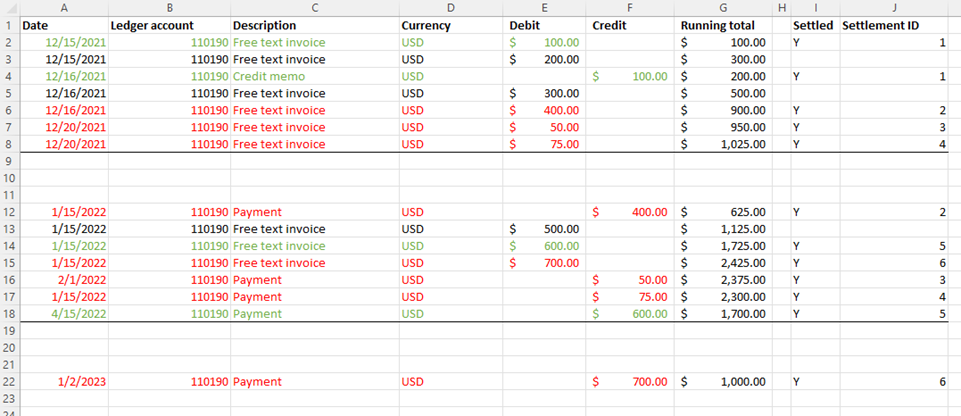
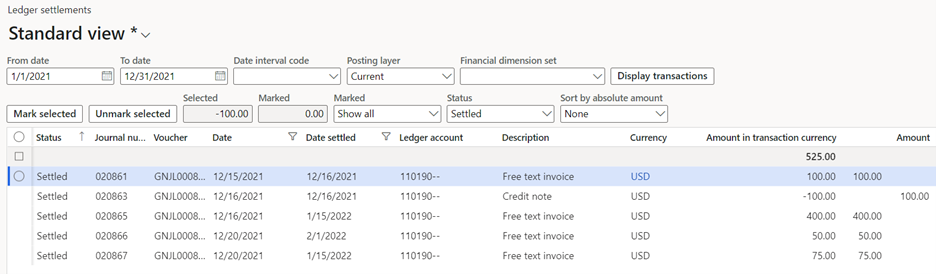
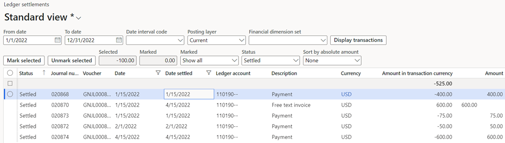
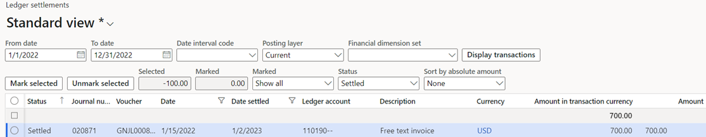
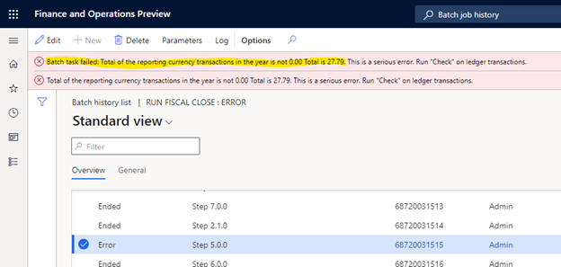
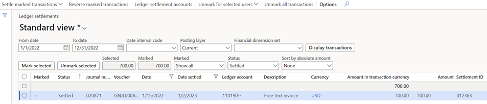
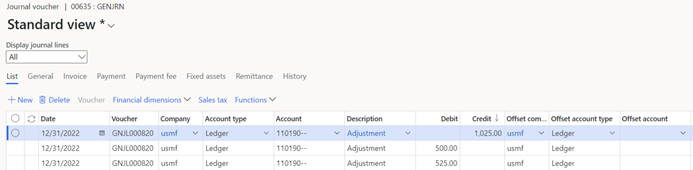
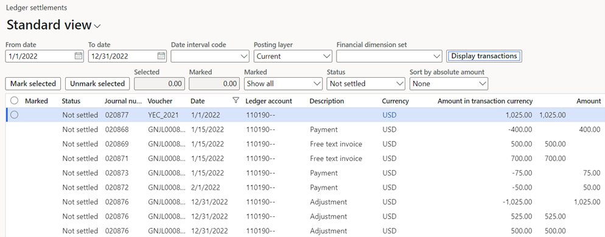
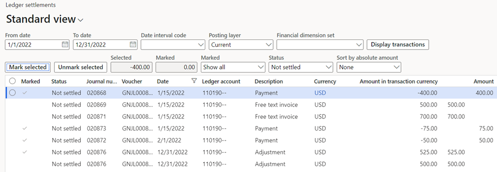

# Awareness between ledger settlement parameter before year-end close

[!include [banner](../includes/banner.md)]

## Preparing for the ledger settlement **Enable advanced awareness options** parameter before year-end close

> [Note]
> Beginning in version 10.0.40, the **Awareness between ledger settlement** feature, along with its associated features **Automate ledger settlement process** and **Post foreign currency realized gains/losses for ledger settlements**, can be found on the **General Ledger parameters,** specifically under the **Ledger settlements** tab. These features are managed through parameters titled **Enable advanced awareness options**, **Enable process automation for ledger settlement**, and **Enable post currency realized gains/losses for ledger settlements** respectively.

A major change of the **Enable advanced awareness options** parameter is that ledger settlement can't be done across fiscal years. This cross-year limitation is relevant only to ledger settlement, not to Accounts receivable or Accounts payable settlements.

Before the **Enable advanced awareness options** parameter is enabled, the fiscal year that will undergo the year-end close must not have any ledger transactions that are settled across fiscal years. Specifically, any transactions that were posted into the fiscal year that you're running the year-end close for must be unsettled from transactions that were posted into a different fiscal year. The transactions can then be resettled against transactions in the same fiscal year.

This article describes the steps that are required to identify, unsettle, and resettle the ledger transactions that are settled across fiscal years. In the example that's provided, fiscal year 2021 has been closed, and you're preparing to run the year-end close for fiscal year 2022.

## Example setup

The following illustration shows the transactions that were posted for main account 110190. The ledger transactions in green are settled in the same fiscal year and don't have to change. The transactions in red are ledger-settled, but they have transaction dates in different fiscal years. Those transactions must be identified, and the ledger settlement might have to be reversed.

## Example

Follow these steps if your organization wants to use the **Enable advanced awareness options** parameter before the year-end close for fiscal year 2022 is run.

> [!NOTE]
> The year-end close for 2021 and earlier fiscal years must be rerun only if new transactions are posted into fiscal year 2021 or earlier. When you complete the following procedure, no new transactions are posted into 2021. Therefore, the year-end close doesn't have to be rerun.
>
> Ledger transactions that are settled across fiscal years can remain ledger-settled if they aren't settled against a transaction that was posted into 2022 or later. For example, if you've settled transactions across 2019 and 2020, they can remain settled.

1. Optional: Temporarily enable the **Enable advanced awareness options** parameter.

    - If you choose to enable the **Enable advanced awareness options** parameter, you'll have to disable it in later steps, as noted. The benefit of enabling the **Enable advanced awareness options** parameter now is that you temporarily prevent users from settling ledger transactions that were posted into different fiscal years.
    - If you choose not to enable the **Enable advanced awareness options** parameter, we recommend that you ask your team not to settle transactions across fiscal years. If cross-year settlement occurs after the following steps are completed, you'll have to repeat the steps to identify and unsettle the ledger transactions.

2. On the **Ledger settlement** page, identify the total of all the transactions that are settled across fiscal years 2021 and 2022.

    1. Specify a date range for all of fiscal year 2021. For example, enter January 1, 2021, through December 31, 2021, if you're using a calendar year as the fiscal year.

        If the **Enable advanced awareness options** parameter is enabled, you receive a warning that transactions can't be settled or unsettled for a closed fiscal year. The warning isn't relevant because no settlement or unsettlement is occurring in this step.

    2. In the **Status** field, select **Settled**.
    3. Filter on one ledger account at a time.

        - You'll have to repeat these steps for each ledger account that ledger settlement occurs for.
        - If other ledger accounts are no longer set up for ledger settlement, you might have to temporarily add them back to the ledger settlement setup. Then complete these steps if those ledger accounts have transactions in 2022 that are settled against transactions in another fiscal year.

    4. Select and hold (or right-click) in the **Status** column, and then select to group by this column.
    5. Select and hold (or right-click) in the **Amount in transaction currency** column, and then select to total this column.

        - If you settled transactions only in 2021, the total will be 0 (zero).
        - If you have transactions that were settled across fiscal years, the total won't be 0 (zero).

        In the following illustration, there's a balance of $525.00. This balance is the total of the transactions that were settled against transactions in a different fiscal year. Your total might include transactions that were settled between 2021 and 2022, and transactions that were settled between 2022 and 2023.

        

    6. Identify which transactions were settled between 2020 and 2021 by further filtering on the **Settlement date** value. Specify a date range filter of January 1, 2021, through December 31, 2021. No transactions are shown because no 2020 transactions were settled against transactions that were posted into 2021.
    7. Identify which transactions were settled between 2021 and 2022 by changing the date filter on the **Settlement date** value. Specify a date range filter of January 1, 2022, through December 31, 2022. The transactions are shown again, and the total is $525.00 because all the transactions were settled between 2021 and 2022.

3. On the **Ledger settlement** page, identify the total of all the transactions that are settled across fiscal years 2021 and 2022.

    1. Specify a date range for all of fiscal year 2022. For example, specify January 1, 2022, through December 31, 2022, if you're using a calendar year as the fiscal year.
    2. In the **Status** field, select **Settled**.
    3. Filter on one ledger account at a time.
    4. Select and hold (or right-click) in the **Status** column, and then select to group by this column.
    5. Select and hold (or right-click) in the **Amount in the transaction currency** column, and then select to total this column.

        

    6. Add an additional filter on the **Settlement date** value. Specify a date range filter of January 1, 2022, through December 31, 2022. The same total of $525.00 is shown. This result validates that the total amount of transactions that are settled across 2021 and 2022 is $525.00.

        

    7. Change the additional filter on the **Settlement date** value. Specify a date range filter of January 1, 2023, through December 31, 2023. A new total of $700 is shown. This total is the total amount of the transactions that were settled across 2022 and 2023.
 
4. Repeat step 3 for fiscal year 2023. The total should match the $700 from 2022 because no 2023 transactions were settled against 2024 transactions.
5. If you enabled the **Enable advanced awareness options** parameter in step 1, disable it before you move on to step 6. In the next steps, you'll reverse the ledger settlement that crossed fiscal years. If the **Enable advanced awareness options** parameter is enabled, ledger settlement can't be reversed for fiscal year 2021. Therefore, you must disable the **Enable advanced awareness options** parameter before you continue.
6. After the **Enable advanced awareness options** parameter is disabled, use the same filters on the **Ledger settlement** page to reverse the ledger settlement of the detailed transactions.

    1. Return to the **Ledger settlement** page, and filter on transaction dates for 2021. Add an additional filter on the **Settlement date** value. Specify a date range filter from January 1, 2022, through December 31, 2022. Then find the detailed transactions that make up the $525 total. Filtering for this information might not be easy. You might have to send the data to Microsoft Excel to evaluate it.
    2. After you have the list of transactions, select the ledger transactions on the **Ledger settlement** page, and select **Mark selected**. You don't have to see both sides of the ledger transactions that were settled. If you mark either the debit or the credit, everything that has the same **Settlement ID** value will be reversed, even if the **Marked amount**  value isn't **0** (zero).
    3. Select **Reverse marked transactions** to unsettle the transactions.

    

7. Repeat step 6 to reverse the settlement for the transactions that were settled across 2022 and 2023.

    

8. Post an adjusting general journal to split the opening balance for 2022 into two amounts: the portion that's settled against the fiscal year 2021 transaction and the portion that isn't yet settled in 2022.

    - **Portion of the opening balance that's settled against the previous year:** The first amount is $525, based on the totals that were found that were settled across 2021 and 2022.
    - **Portion of the opening balance that isn't settled against the previous year:** The second amount is the difference between the opening balance and the settled amount of $525. The remaining amount is $1025 – $525 = $500.

    In this way, you can settle the 2022 transactions against the $525 that was originally settled against the 2021 transaction. This step is required because ledger settlement doesn't allow for partial settlement.

    1. Go to the general journal, and post the adjustment. Your organization will have to decide what transaction date to use, based on the periods that are open. These transactions might have been settled by using a settlement date of January or February 2022, but the adjustment might have to be posted in December if that's the only open period.
    2. You might have to temporarily turn off the **Do not allow manual entry** parameter on the **Main account** page. This adjustment won't be posted if the main account doesn't allow for manual entry.

    

9. You can now resettle the unsettled transactions. Return to the **Ledger settlement** page, and limit the date range to January 1, 2022, through December 31, 2022. The following illustration shows the unsettled transactions that now exist.

    

    - The opening balance of $1,025 can be settled against the adjustment for -$1,025.
    - The detailed transactions that were unsettled for -$400, -$50, and -$75 can be settled against the adjustment for $525.00.

    

10. Enable the **Enable advanced awareness options** parameter. You're now ready to run the year-end close.

    - Before you run the year-end close, consider selecting the **Keep details** option in the ledger settlement setup for all balance sheet accounts. For more information about the benefits of completing this step, see Awareness document.
    - When you begin the year-end close for 2022, if transactions are still found that are settled across fiscal years, the year-end close process will immediately notify you.
    - If 2021 and 2022 transactions are still settled, you'll have to disable the **Enable advanced awareness options** parameter again and repeat the previous steps to unsettle the transactions. This approach is required because 2021 is closed, and transactions can't be unsettled in a closed fiscal year.
    - If 2022 and 2023 transactions are still settled, you do **not** have to disable the **Enable advanced awareness options** parameter. Because neither 2022 nor 2023 is closed, you can use the previous steps to unsettle the transactions.

After the year-end close for 2022 is successfully run, you can leave **Enable advanced awareness options** parameter enabled.
