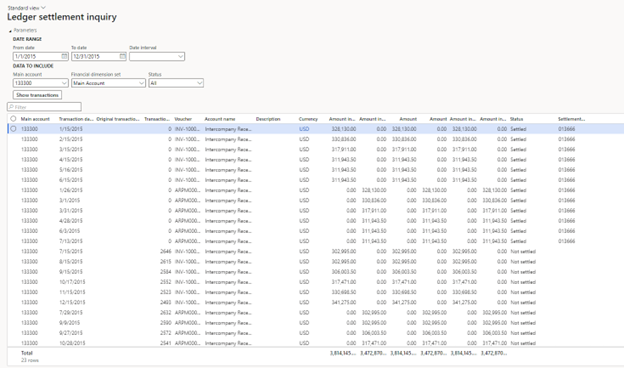

---
# required metadata

title: Ledger settlement inquiry
description: This article describes the Ledger settlement inquiry window  
author: kweekley
ms.date: 12/15/2022
ms.topic: article
ms.prod: 
ms.technology: 

# optional metadata

ms.search.form: LedgerClosingSheet
# ROBOTS: 
audience: Application User
# ms.devlang: 
ms.reviewer: twheeloc
# ms.tgt_pltfrm: 
ms.custom: 14091
ms.assetid: c64eed1d-df17-448e-8bb6-d94d63b14607
ms.search.region: Global
# ms.search.industry: 
ms.author: kweekley
ms.search.validFrom: 2016-02-28
ms.dyn365.ops.version: AX 7.0.0

---

# Ledger settlement inquiry

[!include [banner](../includes/banner.md)]

This article describes the **Ledger settlement inquiry** window that can be used to view settled, unsettled, or both settled and unsettled ledger transactions for a 
fiscal period. The **Status** column will display the settlement status as of the **To date** provided on the **Date range** section of the page.

## View ledger settlement transactions
1.	Go to **General ledger > Inquiries and reports > Ledger settlement inquiry**.
2.	Use the **From date** and **To date** fields or the **Date interval** field to specify a date range. As for the trial balance, the date range must fall within a 
single fiscal year.
3.	In the **Main accounts** field, select one or more main accounts to view the ledger transactions for. The drop-down list shows only main accounts that are set up 
for ledger settlement on the **General ledger parameters** page.
4.	Use the **Financial dimension set** field to show the financial dimensions in the grid. Because the main account is required, the **Main account** field value will
always be shown as the first column, even if you select a financial dimension set that doesn't include the main account.
5.	In the **Status** field, select:
-   **All** to view both settled and unsettled transactions
-   **Not settled** to view only unsettled transactions 
-   **Settled** to view only settled transactions
6.	Select **Show transactions**. Ledger transactions appear in the grid, based on the criteria that you entered. You can export the results of the inquiry to Microsoft
Excel for further analysis. Select and hold (or right-click) in the grid.

### Column details
The grid on the **Ledger settlement inquiry** page includes the following columns:
-   **Main account** – This field is required and is always shown.
-   **Financial dimensions** – Financial dimensions are shown based on the financial dimension set that is selected.
-   **Transaction date** – The posting date of the ledger transaction.
-   **Original transaction date** – If the year-end close has been run, and ledger settlement is set up so that it keeps details for a main account, the unsettled 
transactions are brought over in detail as an opening balance. The original posting date of the ledger transaction is maintained in the **Original transaction date** field.
-   **Transaction age** – The value is 0 (zero) for all settled transactions. For unsettled transactions, the value is calculated as the number of days from either the 
original transaction date or the transaction date to the date when the inquiry is run.
For example, a ledger transaction has a transaction date of January 1, 2022 (1/1/2022) and an original transaction date of December 30, 2021 (12/30/2021). If the 
inquiry is run on January 2, 2022 (1/2/2022) for the fiscal year 2022, the **Transaction age value** will be 4. This value is calculated as the number of days between 
the original transaction date (12/30/2021) and 1/2/2022.

If there is no original transaction date, the transaction date is used instead.
-   **(Other transactional information)** – Additional columns show information such as the voucher number, the description, and debit and credit amounts in all three 
currencies (transaction, accounting, and reporting).
-   **Status** – This value is either **Settled** or **Not settled**. The value is determined based on the state as of the **To date**. 
-   **Settlement ID** – The ID that is assigned to the settled transactions.

 
Totals can be shown under the grid.
1.	Select the ellipsis (…) on the right of the grid, and then select **Show footer**.
2.	Select and hold (or right-click) in each amount column, and then select **Group by this column** to show the totals. The totals are shown in the footer. If the 
inquiry is filtered so that it shows only unsettled transactions, you can use the totals to reconcile the amounts with the trial balance.

