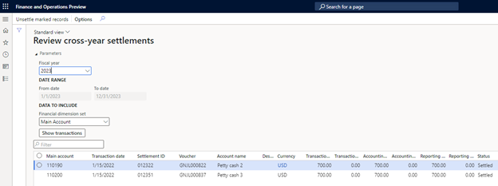
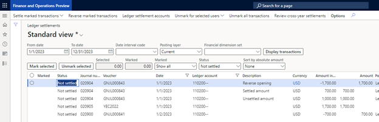

# Enable advanced awareness options parameter after year-end close using the inquiry page

> [Note]
> Beginning in version 10.0.40, the **Awareness between ledger settlement** feature, along with its associated features **Automate ledger settlement process** and **Post foreign currency realized gains/losses for ledger settlements**, can be found on the **General Ledger parameters,** specifically under the **Ledger settlements** tab. These features are managed through parameters titled **Enable advanced awareness options**, **Enable process automation for ledger settlement**, and **Enable post currency realized gains/losses for ledger settlements** respectively.

A major change of the **Enable advanced awareness options** parameter is that ledger settlement can't be done across fiscal years. This cross-year limitation is relevant only to ledger settlement, not to Accounts receivable or Accounts payable settlements.

Before you enable the **Enable advanced awareness options** parameter, the fiscal year that will undergo the year-end close must not have any ledger transactions that are settled across fiscal years. Specifically, any transactions that were posted into the fiscal year that you're running the year-end close for must be unsettled from transactions that were posted into a different fiscal year. The transactions can then be resettled against transactions in the same fiscal year.

This article describes the steps that are required to identify, unsettle, and resettle ledger transactions that are settled across years. In the example that's provided, fiscal year 2022 has been closed. The focus is on preparing the ledger settlement transactions before the 2023 year-end close is run.

As of Microsoft Dynamics 365 Finance release 10.0.29, you can identify, unsettle, and resettle ledger transactions by using a new inquiry page that's available. If you aren't currently on Microsoft Dynamics 365 Finance release 10.0.29 or later, you can find the steps for identifying, unsettling, and resettling the ledger transactions in the following articles:

- [Awareness between ledger settlement feature before year-end close](ledger-settle-yec.md)
- [Awareness between ledger settlement feature after year-end close](ledger-settle-yec-after.md)

For more information about the new inquiry window, see [Ledger settlement inquiry](ledger-settlement-inquiry.md). 

## Example setup

The following illustration shows the transactions that were posted for main account 110200. The transactions in green were ledger-settled in the same fiscal year and don't have to change. The transactions in red were ledger-settled, but they have transaction dates in different fiscal years. Those transactions must be identified, and the ledger settlement might have to be reversed.

## Example

Follow these steps if your organization wants to use the **Enable advanced awareness options** parameter after you run the year-end close for fiscal year 2022.

> [!NOTE]
> The year-end close for 2022 and earlier fiscal years must be rerun only if new transactions are posted into fiscal year 2022 or earlier. When you complete the following procedure, no new transactions are posted into 2022. Therefore, the year-end close doesn't have to be rerun.
>
> Ledger transactions that are settled across fiscal years can remain ledger-settled if they aren't settled against a transaction that was posted into 2022 or later. For example, if you've settled transactions in 2019 and 2020, they can remain settled.

1. Complete the year-end close for 2022 without the **Enable advanced awareness options** parameter enabled.
2. Identify all the transactions that were posted into other fiscal years but settled against transactions that were posted into 2023 (the next fiscal year that will be closed).

    > [!NOTE]
    > 2021 transactions that were settled against 2022 transactions aren't relevant because the year has already been closed for 2022. Those transactions can remain settled.

    1. On the **Ledger settlements** page, select **Review cross-year settlement**.
    2. Select fiscal year 2023, the next fiscal year that you want to run the year-end close process for.
    3. Select a value in the **Financial dimension set** field to show the financial dimensions that you want to view for the ledger account. The main account is always shown, even if the dimension set that's selected doesn't contain a main account.
    4. Select **Show transactions**.

    The inquiry page will show all transactions from other fiscal years that are settled against transactions that were posted in 2023.

    

3. Select and hold (or right-click) in the grid, and then select **Export all rows**. These rows are all the transactions that must be unsettled from the transactions in 2022 before the year-end close for the next year (2023) can be run. You want a record of these transactions.

    After all the detailed transactions from 2022 are exported to Excel, you're ready to unsettle the transactions by using the inquiry page.

4. Select all the records in the grid, and then select **Unsettle marked records**. All the selected transactions in the grid will be unsettled.

    Two warning messages are shown to ensure that the transaction details are exported to Excel before the transactions are unsettled. If you accidentally unsettle ledger transactions before you send the details to Excel, there's no way to reverse the unsettlement.

    

5. Use the Excel data to find the total amount of transactions in 2022 that were settled to transactions in 2023. In this example, the transactions for 2023 total $700.
6. Post an adjusting general journal to split the opening balance for 2022 into two amounts: the portion that was settled against the 2022 fiscal year transaction and the portion that hasn't yet been settled to 2023.

    - **Portion of the opening balance that was settled to the previous year:** The first amount is $700, based on the totals that were found that were settled across 2021 and 2022.
    - **Portion of the opening balance that wasn't settled to the previous year:** The second amount is the difference between the opening balance and the settled amount of $700. The remaining amount is $1,700 – $700 = $1,000.

    In this way, you can settle the 2023 transactions against the $700 that was originally settled against 2022 transaction. This step is required because ledger settlement doesn't allow for partial settlement.

    1. Go to the general journal, and post the adjustment. Your organization will have to decide what transaction date to use, based on the periods that are open in 2023.
    2. You might have to temporarily turn off the **Do not allow manual entry** parameter on the **Main account** page. This adjustment won't be posted if the main account doesn't allow for manual entry.

    

7. You can now resettle the unsettled transactions. Return to the **Ledger settlements** page, and limit the date range to January 1 through December 31, 2023. Then use the detailed transactions that you exported to Excel to find the specific transactions that must be resettled. The following illustration shows the unsettled transactions that now exist.

    

    - The opening balance of $1,700 can be settled against the adjustment for -$1,700.
    - The detailed transactions that were unsettled for -$700 can be settled against the adjustment for $700.00.

8. Enable the **Enable advanced awareness options** parameter. You're now ready to run the year-end close.

    - Before you run the year-end close for 2023, consider selecting the **Keep details** option for all balance sheet accounts in the ledger settlement setup. For more information, see [Awareness between ledger settlement and year-end close](awareness-between-ledger-settlement-year-end-close.md).
    - When you begin the year-end close for 2023, if transactions are still found that were settled across fiscal years, the year-end close process will immediately notify you. This situation might occur if users settled transactions across fiscal years before the **Enable Advanced Awareness Options** parameter was enabled.
    - If 2022 and 2023 transactions are still settled, you'll have to disable the **Enable advanced awareness options** parameter again and then repeat the previous steps to unsettle those transactions. This approach is required because 2022 is closed, and transactions can't be unsettled in a closed fiscal year.

After the year-end close for 2022 is successfully run, you can leave the **Enable advanced awareness options** parameter enabled.
