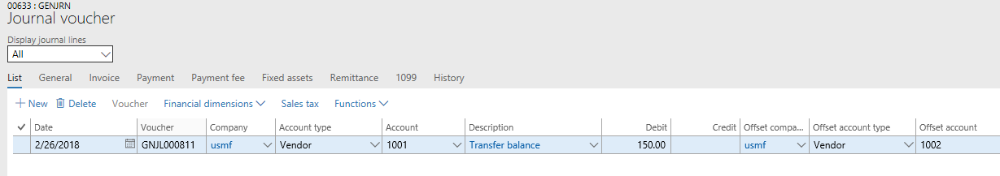

---
# required metadata

title: One voucher
description: One voucher for financial journals (general journal, fixed asset journal, vendor payment journal, and so on) lets you enter multiple subledger transactions in the context of a single voucher.
author: kweekley
manager: AnnBe
ms.date: 11/05/2018
ms.topic: article
ms.prod: 
ms.service: dynamics-ax-applications
ms.technology: 

# optional metadata

ms.search.form: LedgerJournalSetup, LedgerParameters, AssetProposalDepreciation
# ROBOTS: 
audience: Application User
# ms.devlang: 
ms.reviewer: roschlom
ms.search.scope: Core, Operations
# ms.tgt_pltfrm: 
ms.custom: 14091
ms.assetid: c64eed1d-df17-448e-8bb6-d94d63b14607
ms.search.region: Global
# ms.search.industry: 
ms.author: kweekley
ms.search.validFrom: 2018-03-16
ms.dyn365.ops.version: 8.0.2

---

# One voucher

[!include [banner](../includes/banner.md)]

## What is One voucher?

The existing functionality for financial journals (the general journal, fixed asset journal, vendor payment journal, and so on) lets you enter multiple subledger transactions (customer, vendor, fixed assets, project, and bank) in the context of a single voucher. Microsoft refers to this functionality as *One voucher*. You can create a single voucher by using one of the following methods:

- Set up the journal name (**General ledger** \> **Journal setup** \> **Journal names**) so that the **New voucher** field is set to **One voucher number only**. Every line that you add to the journal is now included in the same voucher. Therefore, the voucher can be entered as a multiline voucher, as an account/offset account on the same line, or as a combination.

    

    > [!IMPORTANT]
    > The definition of One voucher does **not** cover cases where journal names are set up as **One voucher number only**, but the user then enters a voucher that includes only ledger account types. In this topic, One voucher means that there is a single voucher that contains more than one vendor, customer, bank, fixed asset, or project.

- Enter a multiline voucher where there is no offset account.

    

- Enter a voucher where both the account and the offset account contain a subledger account type, such as **Vendor**/**Vendor**, **Customer**/**Customer**, **Vendor**/**Customer**, or **Bank**/**Bank**.

    

## Issues with One voucher

The One voucher functionality causes issues during settlement, tax calculation, transaction reversal, reconciliation of a subledger to the general ledger, financial reporting, and more. (For more information about issues that can occur during settlement, see, for example, [Single voucher with multiple customer or vendor records](https://docs.microsoft.com/dynamics365/finance/accounts-payable/single-voucher-multiple-customer-vendor-records).) To work and report correctly, these processes and reports require transaction details. Although some scenarios might still work correctly, depending on your organization's setup, there are often issues when multiple transactions are entered in one voucher.

For example, you post the following multiline voucher.

You then generate the **Expenses by vendor** report in the **Financial Insights** workspace. On this report, expense account balances are grouped by vendor group and then vendor. When the report is generated, the system can't determine which vendor groups/vendors incurred the expense of 250.00. Because transaction details are missing, the system assumes that the whole 250.00 expense was incurred by the first vendor that is found in the voucher. Therefore, the 250.00 expense, which is included in the balance for main account 600120, is shown under that vendor group/vendor. However, it's very likely that the first vendor in the voucher isn't the correct vendor. Therefore, the report is probably incorrect.

## The future of One voucher

Because of the issues that were mentioned earlier, the One voucher functionality will be made obsolete. However, because there are functional gaps that depend on this functionality, the functionality won't become obsolete all at one time. Instead, the following schedule will be used:

- **Spring 2018 release** – By default, the functionality will be turned off by default through the **Allow multiple transactions within one voucher** parameter on the **General** tab of the **General ledger parameters** page. However, you can turn the functionality on if your organization has a scenario that falls into one of the functional gaps that are listed later in this topic.

    - If customers have a business scenario that doesn't require One voucher, they shouldn't turn the functionality on. Microsoft won't fix "bugs" in the areas that are identified later in this topic if this functionality is used even though another solution exists.
    - Stop using One voucher for integrations, unless you need the functionality for one of the functional gaps.

- **Later releases** – All functional gaps will be filled. **After the functional gaps are filled and new features are delivered, it will be at least one year before the One voucher functionality is permanently turned off**, because customers and independent software vendors (ISVs) must have enough time to react to the new functionality. For example, they might have to update their business processes, entities, and integrations.

> [!IMPORTANT]
> The **One voucher number only** option has **not** been removed from the Journal name setup. This option is still supported when the voucher contains only ledger account types. Customers must be careful when they use this setting, because the voucher won't be posted if they use the **One voucher number only** option but then enter more than one customer, vendor, bank, fixed asset, or project. Additionally, customers can still enter a mix of subledger account types, such as a payment in a single voucher that contains the **Vendor**/**Bank** account types.

## Why use One voucher?

Based on conversations with customers, Microsoft has compiled the following list of scenarios where customers use the One voucher functionality or reasons why they use it. Some of these business requirements can be met only by using One voucher. However, for many scenarios, alternatives can meet the same business requirements.

### Scenarios that require One voucher

The following scenarios can be accomplished only by using the One voucher functionality. If your organization has any of these scenarios, you must enable multiple transactions to be entered in a voucher by changing the setting of the **Allow multiple transactions within one voucher** parameter on the **General ledger parameters** page. These functional gaps will be filled through other features in later releases.

> [!Note]
> [For each of the following scenarios the **Allow multiple transactions within one voucher** field must be set to Yes in the **General** FastTab on the **General ledger parameters** page.]

### Post vendor or customer payments in summary form to a bank account

**Scenario** An organization communicates a list of vendors and amounts to its bank, and the bank uses this list to pay the vendors on the organization's behalf. The bank posts the sum of the payments as a single withdrawal on the bank account.

Summarization of vendor payments is supported only through One voucher. Each vendor is entered as a separate line to maintain details in the Accounts payable subledger. However, the summarized amount for all the payments is offset to a single line for the bank account. Therefore, the withdrawal is shown as a single summarized amount in the bank subledger.

**Scenario** An organization deposits customer payments, or the bank deposits customer payments on the organization's behalf, and the deposit is shown as a lump sum on the bank account.

Summarization of customer payments is typically supported through the deposit functionality. However, if you're using "bridging" on the method of payment, this scenario is supported only through One voucher. The customer payments are entered in the same manner that is described for vendor payment summarization.

### Mechanism to group transactions from a business event

**Scenario** An organization has a single business event that triggers multiple transactions. However, the Accounting department wants to view the accounting entries together for better auditability.

If an organization must view the accounting entries from a business event together, it must use One voucher. 

### Country-specific features

**Scenario** The Single Administrative Document (SAD) feature for Poland currently requires that a single voucher be used. Until a grouping option is available for this feature, you must continue to use the One voucher functionality. There may be additional country-specific features that require the One voucher functionality.

### Customer prepayment payment journal that has taxes on multiple "lines"

In this scenario, the customers in the single voucher are the same customer, because the transaction simulates the lines of a customer order. The prepayment must be entered in a single voucher, because the tax calculation must be made on the "lines" of the single payment that the customer made.

### Customer reimbursement

**Scenario** A customer makes a prepayment for an order, and the lines of the order have different taxes that must be recorded for the prepayment. The prepayment customer payment is one transaction that simulates the lines of the order, so that the appropriate tax can be recorded for the amount on each line.

If the Reimbursement periodic task is run from the Accounts receivable module, it creates a transaction to move the balance from a customer to a vendor. For this scenario, One voucher must be used to reimburse the customer.

### Fixed asset maintenance: Catch-up depreciation, split asset, calculate depreciation on disposal
The following fixed asset transactions also create multiple transactions in a single voucher:

- An additional acquisition is made on an asset, and "catch-up" depreciation is calculated.
- An asset is split.
- A parameter to calculate depreciation on disposal is turned on, and then the asset is disposed of.
- An asset's service date is before the acquisition date. Therefore, a depreciation adjustment is posted.

> [!Note]
> When you are entering transactions, be sure that all the transactions apply to the same fixed asset. The voucher won't be posted if it includes more than one fixed asset, even if the **New Voucher** field is set to One voucher number only on the **Journal names** page in General ledger. If you include more than one fixed asset in the voucher, the message **There can only be one fixed asset transaction per voucher** will be displayed and you won't be able to post the voucher.  

### Bills of exchange and promissory notes
Bills of exchange and promissory notes require that One voucher be used, because the transactions move the customer or vendor balance from one Accounts receivable/Accounts payable ledger account to another, based on the state of the payment.

## Scenarios that don't require One voucher

The following scenarios can be accomplished through other means and should not use the One voucher functionality.

### Post customer payments in summary form to the bank account

An organization deposits customer payments, or the bank deposits customer payments on the organization's behalf, and the deposit is shown as a lump sum on the bank account.

Summarization of customer payments is supported through the deposit functionality when "bridging" isn't used on the method of payment.

### Netting

In netting, the balances for a vendor and customer are netted against each other, because the vendor and customer are the same party. This approach minimizes the exchange of money between an organization and the customer/vendor party.

Netting can be accomplished by entering the increase and decrease in separate vouchers, and then posting the offset to a clearing ledger account.

### Post in summary to the general ledger

Organizations often want to post to the general ledger in summary form to minimize the amount of data. However, those organizations typically still require that the transaction details be maintained. When posting is done in summary form through a single voucher, the transaction details aren't known and can't be maintained.

- Because the transaction details currently can't be maintained, we recommend that organization **not** use One voucher to post in summary form.
- After support for One voucher is removed, the Source document and Accounting frameworks can be implemented in the journals. These frameworks will then maintain the transaction details and support summarization into the general ledger.

### Settle multiple unposted payments to the same invoice

This scenario is typically found in organizations where customers can use multiple methods of payment to pay for purchases. In this scenario, the organization must be able to record multiple unposted payments and settle them against the customer invoice.

A new feature that was added in Microsoft Dynamics 365 for Operations version 1611 (November 2016) enables multiple unposted payments to be settled against a single invoice. Multiple customer payments no longer have to be entered in a single voucher.

### Import bank statement transactions

Banks often pay and receive payments on an organization's behalf, and those transactions are recorded in Finance through a file that is received from the bank. Organizations often want to group together those transactions by using the bank statement number in the file. Because each transaction is shown in detail on the bank statement, no summarization is required in the bank subledger.

Transactions can be grouped by using other fields on the journal, such as the journal batch number itself or the document number.

### Transfer balances

An organization might have to transfer a balance from one vendor to another vendor, either because of a mistake or because another vendor has taken over the liability. Transfers of this type also occur for account types such as **Customer** and **Bank**.

Balance transfers from one account (vendor, customer, bank, and so on) to another account can be done through separate vouchers, and the offset can be posted to a clearing ledger account.

### Enter beginning balances

Organizations often enter beginning balances for subledger accounts (vendors, customers, fixed assets, and so on) as one voucher transaction. Beginning balances for each subledger account can be entered as separate vouchers, and the offset can be posted to a clearing ledger account.

### Correct the accounting entry of a posted customer or vendor document

An organization might have to correct the Accounts receivable or Accounts payable ledger account for an accounting entry of a posted invoice, but that invoice can't be reversed or corrected through another mechanism.

If a correction must be made to the Accounts receivable or Accounts payable ledger account, an adjustment must be made directly to the ledger account. The adjustment can't be made by posting through the vendor or customer. This approach requires that the adjustment be made during a "down time," so that the ledger account can temporarily allow manual entry.

### "The system allows it"

Organizations often use the One voucher functionality merely because the system lets them use it, without understanding the implications.
