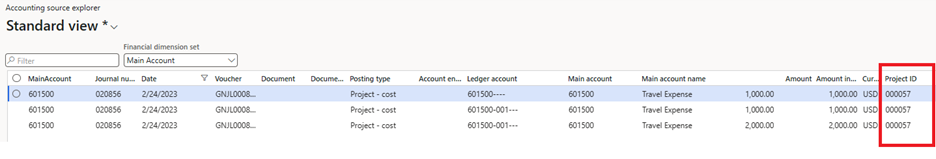
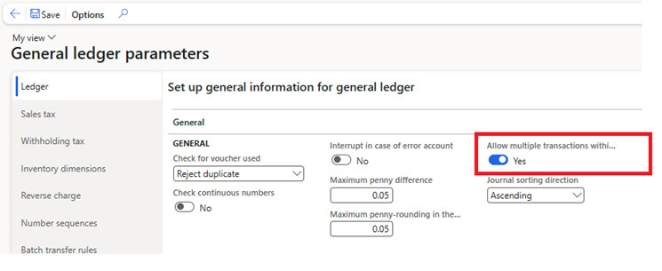

---
# required metadata

title: One voucher 
description: This article provides information about One voucher for financial journals, which lets you enter multiple subledger transactions in the context of a single voucher.
author: kweekley
ms.date: 04/05/2023
ms.topic: article
ms.prod: 
ms.technology: 

# optional metadata

ms.search.form: LedgerJournalSetup, LedgerParameters, AssetProposalDepreciation
# ROBOTS: 
audience: Application User
# ms.devlang: 
ms.reviewer: twheeloc
# ms.tgt_pltfrm: 
ms.custom: 14091
ms.assetid: c64eed1d-df17-448e-8bb6-d94d63b14607
ms.search.region: Global
# ms.search.industry: 
ms.author: kweekley
ms.search.validFrom: 2018-03-16
ms.dyn365.ops.version: 8.0.2

---

# One voucher 

[!include [banner](../includes/banner.md)]
[!include [preview banner](../includes/preview-banner.md)]

## What is One voucher?

Because of the flexibility of financial journals, you can enter a single voucher that represents one transaction, but has multiple customers, vendors, fixed assets, projects, or bank accounts. Microsoft refers to this functionality as One voucher. The One voucher scenarios do **not** include transactions that include only ledger accounts. Those transactions are posted to general ledger, not to subledgers such as Accounts receivable, Fixed assets, and Bank.

There are two categories of One voucher examples:

- The voucher contains multiple transactions that were entered as a single transaction. Here are some of the possible examples:

    - Multiple vendor payments are entered on each line (no offset account is used), and the payment sum offset to a bank account is entered on one line. Payment summarization is done to update the bank subledger as a summarized amount that matches the bank account statement. However, each vendor transaction is still recorded in detail in the Accounts payable subledger. The same scenario is also found on the customer payment side.
    - Multiple fixed assets are acquired in a single voucher. This approach is often used when beginning balances are entered for the **Fixed assets** module.

- The voucher contains one transaction that affects multiple non-ledger account types. Here are some of the possible examples:

    - Bank transfers
    - Netting vendor/customer (same-party) balances
    - Transferring balances from customer A to customer B
    - Vendor invoices that have multiple lines that contain fixed assets or projects

The preceding examples for each category represent valid business requirements. Sometimes, the business requirements can't be met in any other way: the organization must enter the transactions as One voucher. However, at other times, there are other valid ways to meet the business requirements: the transactions can be entered differently or use another feature.

## Issues with One voucher

Use of the One voucher functionality to meet business requirements might cause issues. Various processes, transaction reversals, and inquiries/reports require transaction details. Those details can't be determined from the current data model if multiple transactions are entered in summary in a single voucher. In addition, the details can't always be clearly determined if the transaction type that's being entered is unknown. This limitation is caused by the flexibility of journals, especially when they're entered through the general journal.

Some scenarios might still work correctly, depending on your organization's setup. Here are areas where you may encounter issues:

- **Settlement** – If more than one vendor or customer exists on a voucher, the accounting that's created during settlement might be incorrectly allocated to financial dimensions. For more information about issues that can occur during settlement, see [Single voucher with multiple customer or vendor records](./accounts-payable/single-voucher-multiple-customer-vendor-records.md).
- **Tax calculation** – If more than one voucher or customer exists on a voucher, the tax calculation might be incorrect.
- **Transaction reversal** – If more than one subledger account type exists on a voucher, when a single subledger transaction is reversed, an incorrect accounting entry might be posted for the reversal in the general ledger. For example, if you acquire multiple assets in a single voucher and then reverse the acquisition of one of the assets, the general ledger accounting will be incorrect for the reversal.
- **Reporting and inquiries** – If you include more than one subledger account type (for example, **Vendor** and **Customer**) on a voucher, reports/inquiries will show only the first account value that's found.

    For example, you post the following multiline vendor invoice. It contains four projects that represent the "lines" on the invoice. This approach is a common business requirement for organizations that use journals extensively.

    

    Three of the four projects are posted to the same main account (601500). If you open the Accounting source explorer to view details about posted transactions for that main account, you'll notice that the project ID for all three lines is **000057**. This behavior is a known limitation of One voucher. The details won't correctly link each line to the appropriate project on the journal. Instead, the first account value that's found will always be shown on reports and in inquiries.

    

### Enter a transaction as One voucher

To enter transactions as One voucher, go to **General ledger \> Ledger setup \> General ledger parameters**, and then, on the **Ledger** tab, set the **Allow multiple transactions within one voucher** option to **Yes**.

You can enter a One voucher transaction on the **Journal names** page by setting the **New voucher** field to one of the following values:

- **One voucher number only** – Every line that you add to the journal will be included in the same voucher, and the lines will contain more than one customer, vendor, bank, fixed asset, or project.
- **In connection with balance** – Enter a multiline voucher where there's no offset account, and the lines contain more than one customer, vendor, bank, fixed asset, or project.
- **In connection with balance** – Enter a single-line voucher where both the account and the offset account contain a subledger account type, such as **Vendor**/**Vendor**, **Customer**/**Customer**, **Vendor**/**Customer**, or **Bank**/**Bank**.

### Does my business scenario require One voucher?

The following business scenarios have been identified as scenarios that customers use the One voucher functionality for. Some business requirements can be met only by using One voucher. However, for many others, alternatives are available.

| Scenario | Description | One voucher required? | Alternative |
|----------|-------------|-----------------------|-------------|
| Vendor payment summarization | An organization communicates a list of vendors and amounts to its bank. The bank uses this list to pay the vendors on the organization's behalf. Each vendor payment must be posted in detail to Accounts payable, but the sum of the payments is posted to the bank account as a single withdrawal. | No | As of Microsoft Dynamics 365 Finance version 10.0.32, there's a feature that's named **Ability to post detailed vendor and customer payments, but summarize amounts to bank account**. For more information, see [Post detailed vendor and customer payments](summary-payment.md). |
| Customer payment summarization | Customer payments are deposited as a lump sum on the bank account. Each customer payment must be posted in detail to Accounts receivable, but the sum of the payments is posted to the bank account as a single deposit. | No | As of Dynamics 365 Finance version 10.0.32, there's a feature that's named **Ability to post detailed vendor and customer payments, but summarize amounts to bank account**. For more information, see [Post detailed vendor and customer payments](summary-payment.md). |
| Vendor/customer invoice | An invoice is entered for a single customer or vendor, but additional lines represent the lines of the invoice and have multiple fixed assets or projects. | Yes | |
| Customer prepayment payment journal that has taxes on multiple "lines" | A customer makes a prepayment for an order. The lines of the order have different taxes. The prepayment customer payment must contain the customer on multiple lines, so that taxes can be calculated for each line. | Yes | |
| Customer reimbursement | If the Reimbursement periodic task is run from Accounts receivable, it creates a transaction to move the balance from a customer to a vendor. The vendor is the same party as the customer. | Yes | |
| Fixed asset maintenance: Catch-up depreciation, splitting an asset, and calculating depreciation on disposal | Catch-up deprecation, splitting of an asset, and calculation of depreciation for asset disposal all used to create a single voucher. | No | As of Finance version 10.0.21, fixed asset transactions that are created for catch-up depreciation, splitting of an asset, and calculation of depreciation for asset disposal use different voucher numbers. |
| Bills of exchange and promissory notes | Bills of exchange and promissory notes move the customer or vendor balance from one Accounts receivable or Accounts payable ledger account to another, based on the state of the payment. Because the same customer or vendor is always used in the voucher, no reporting issues exist. | Yes | | 
| Netting | If a customer and vendor are the same party, the balances for the vendor and customer are netted against each other. This approach minimizes the exchange of money between an organization and the customer/vendor party. | Yes/No | Netting can be accomplished by entering the increase and decrease in separate vouchers, and then posting the offset to a clearing ledger account. For some organizations, this approach requires too much overhead. Therefore, they choose to use One voucher instead. |
| Transfer balances | An organization might have to transfer a balance from one vendor to another, either because of a mistake or because another vendor has taken over the liability. Transfers of this type also occur for account types such as **Customer** and **Bank**. | Yes/No | Balance transfers from one account (vendor, customer, bank, and so on) to another can be done through separate vouchers, and the offset can be posted to a clearing ledger account. For some organizations, this approach requires too much overhead. Therefore, they choose to use One voucher instead. |
| Settling multiple unposted payments to the same invoice | This scenario is typically found in organizations where customers can use multiple methods of payment to pay for purchases. In this scenario, the organization must be able to record multiple unposted payments and settle them against the customer invoice. | No | A new feature that was added in Finance enables multiple unposted payments to be settled against a single invoice. |
| Country/region-specific features | The **Single Administrative Document (SAD)** feature for Poland currently requires that transactions be grouped together, and the voucher number is used for this purpose. There might be additional country/region-specific features that require the One voucher functionality. | Yes | |
| Mechanism to group transactions from a business event | An organization has a single business event that triggers multiple transactions. The Accounting department wants to view the accounting entries together for easier auditing. A similar scenario is one where bank transactions are recorded in Finance through a file that's received from the bank. Organizations often want to group together those transactions by using the bank statement number in the file. | No | Although grouping transactions together is a valid scenario, the voucher number must never be used for this purpose. Vouchers always represent individual transactions, never a group of transactions. Transactions can be grouped by other fields instead, such as the journal batch number or the document number. |
| Entering beginning balances | Organizations often enter beginning balances for subledger accounts (vendors, customers, fixed assets, and so on) as a single voucher transaction. | No | Beginning balances for each subledger account must be entered as separate vouchers. The offset can be posted to a clearing ledger account, which is offset by the beginning balance for general ledger. |
| Correcting the accounting entry of a posted document | An organization might have to correct the Accounts receivable or Accounts payable ledger account for a posted invoice. Because the invoice is correct, it shouldn't be reversed. | Yes/No | If a correction must be made to the Accounts receivable or Accounts payable ledger account, an adjustment can be made directly to the ledger account. This approach requires that the adjustment be made during a "down time," so that the ledger account can temporarily allow for manual entry. One downside of this approach is that the vendor/customer to ledger reconciliation reports will show a difference going in and out. The net amount is 0 (zero). |
| Posting in summary to the general ledger | Organizations often want to post to the general ledger in summary, to minimize the amount of data. However, those organizations typically still require that the transaction details be maintained. When posting is done in summary through a single voucher, the transaction details aren't known and can't be maintained. | No | Because the transaction details are lost, organizations must not use One voucher to post in summary if details are required for reporting. |
| "The system allows it" | Organizations often use the One voucher functionality merely because the system lets them use it, without understanding the implications. | No | The mere fact that the system enables the functionality to be used is never a valid reason. The functionality should be used only if it's required to meet another business requirement. |

### The future of One voucher

Because of the issues that can occur when One voucher is used, the following options are being explored:

- New features will continue to be introduced if there's a better way to accomplish a business scenario. For example, a feature that was introduced in Finance version 10.0.32 enables payments to be entered as separate vouchers, but the bank account is still updated in summary. As features are added, they will be documented for each business scenario in the "Alternative" column of the preceding table.
- Some transactions might continue to be entered through the journal in a single voucher, but additional data might be tracked to correctly identify transactional details.
- A combination of new features might be used, but transactions for the business scenarios might continue to be entered in the journal by using a single voucher.

Depending on the approach for each business scenario, only parts of the One voucher functionality might be deprecated.

As new features are introduced, your organization must continuously evaluate whether the **Allow multiple transactions within one voucher** option on the **General ledger parameter** page can be turned off. We recommend that you not use One voucher for integrations unless you require the functionality for one of the documented functional gaps.

After all the functional gaps are filled, Microsoft will communicate what portions of One voucher will be deprecated. If some portions are deprecated, the deprecation won't be effective for at least one year after all features are introduced and communication is provided to all customers.
