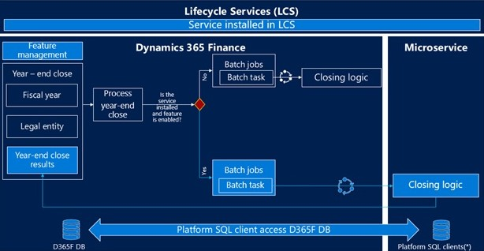

---
# required metadata

title: Optimize year-end close 
description: This article describes the Optimize year-end close add-in that is available for the general ledger year-end close process. 
author: moaamer
ms.date: 11/02/2022
ms.topic: article
ms.prod: 
ms.technology: 

# optional metadata

ms.search.form: LedgerClosingSheet
# ROBOTS: 
audience: Application User
# ms.devlang: 
ms.reviewer: twheeloc
# ms.tgt_pltfrm: 
ms.custom: 14091
ms.assetid: c64eed1d-df17-448e-8bb6-d94d63b14607
ms.search.region: Global
# ms.search.industry: 
ms.author: moaamer
ms.search.validFrom: 2022-11-28
ms.dyn365.ops.version: AX 10.0.0

---

# Optimize year-end close overview

The Optimize year-end close add-in for Microsoft Dynamics 365 Finance enables year-end close processing to execute outside the Dynamics 365 Finance resources AOS. It 
uses microservice technology. The benefits that are associated with the Optimize year-end close functionality include improved performance and minimized impact on the 
SQL database during year-end close processing. 

To use the Optimize year-end close, you must install the Optimize year-end close service add-ins from your project in Microsoft Dynamics Lifecycle Service (LCS) and 
enable the feature in **Feature management**.

> [!NOTE] 
> You can still use the current year-end close on Dynamics 365 Finance resources by disabling the **Optimize year-end close** in **Feature management**. 

## Improved performance

**Optimize year-end close** is designed to accelerate the year-end close processing, especially for customers with large volumes of data. The year-end close on a service offloads the heavy processing from Dynamics 365 Finance resources to reduce the processing time and free up the resources that may affect the daily operations of other users. 

The **Optimize year-end close** feature can help:

 - Improve year-end closing performance by reducing run time
 - Reduce the impact on other processes during year-end close run
 - Improve year-end result reporting and adjustments as the year-end close run takes a shorter amount of time

## New options and visibility
By enabling **Optimize year-end close** feature there are two new columns, **Results** and **Status**. These columns are added to the **Year-end close** page, **Year-end close results** dialogue, and the **Balance sheet financial dimension transfer** options in the **Year-end close template** page. 

The following screen shot shows the **Results** and **Status** columns that have been added to the **Year-end close** page. The **View results** link to open up results of the year-end close, and status shows the current state of the year-end close process. Those options provides visibility where the year-end close process is. 

By enabling the **Optimize year-end close** feature, the **Balance sheet financial dimensions** fasttab is available in the **Year-end close template**. This gives the ability to specify balance sheet financial dimensions in detail when you close a year. This functionality now parallels the capability that is available for profit and loss accounts.

## Architecture and data flow 

In order to use **Optimize year-end close** feature and run the year-end close on a microservice, you will need to:
 - install the **Optimize year-end close** service add-in from LCS 
 - enable **Optimize year-end close** feature in **Feature management** 
 
As illustrated in the below diagram, the year-end close processing will check if the service add-in is installed and **Optimize year-end close** feature is enabled. If both are enabled, the execution of the year-end close will run on the microservice.

## High-level flow for year-end close processing

1.	The year-end close process begins in Dynamics 365 Finance under **General ledger > Period close > Year-end close**. The process creates closing batch jobs
and tasks for the legal entities being closed.
2.	The year-end close determines whether to run the year-end close on service or on the current closing logic. 
    a.	If the **Optimize year-end close** service is installed in LCS and **Optimize year-end close** feature management is enabled, then the Year-end close will run in microservice. 
        i.	Optimize year-end close creates a year-end close service job for each legal entity being closed, then executes the year-end close logic. The microservice 
        performs the year-end close. 
        ii.	Dynamics 365 Finance listens to the microservice year-end close to determine when the microservice has completed. The year-end close results are updated in 
        the **Year-end close** page in Dynamics 365 Finance. 
    b.	Otherwise, the year-end close will run on the current design.
