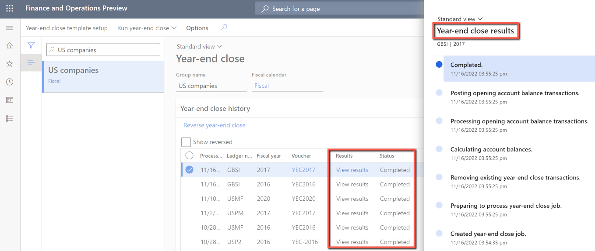
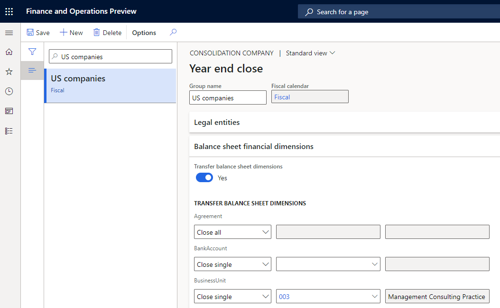
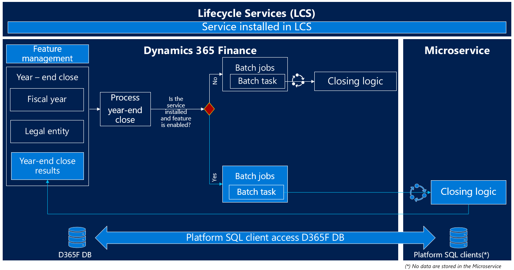

---
# required metadata

title: Optimize year-end close
description: This article describes the Optimize year-end close service add-in that's available for the general ledger year-end close process.
author: moaamer
ms.date: 12/02/2022
ms.topic: article
ms.prod: 
ms.technology: 

# optional metadata

ms.search.form: LedgerClosingSheet
# ROBOTS: 
audience: Application User
# ms.devlang: 
ms.reviewer: twheeloc
# ms.tgt_pltfrm: 
ms.assetid: c64eed1d-df17-448e-8bb6-d94d63b14607
ms.search.region: Global
# ms.search.industry: 
ms.author: moaamer
ms.search.validFrom: 2022-11-28
ms.dyn365.ops.version: AX 10.0.0

---

# Optimize year-end close 

The Optimize year-end close service add-in for Microsoft Dynamics 365 Finance enables year-end close processing to run outside the Application Object Server (AOS) instance for Dynamics 365 Finance resources. It uses microservice technology. The benefits that are associated with the Optimize year-end close functionality include improved performance and minimized impact on the SQL database during year-end close processing.

>[!NOTE]
> The Optimized year-end close is available on Microsoft Dynamics 365 Finance version 10.0.31. This feature has been backported to Dynamics Finance versions 10.0.30 and 10.0.29 and you'll need to take the latest quality update.   

To use the Optimize year-end close functionality, you must complete the following tasks:

1. Install the Optimize year-end close service add-in from your project in Microsoft Dynamics Lifecycle Service.
2. Enable the **Optimize year-end close** feature in Feature management.

> [!NOTE]
> You can still use the current year-end close functionality for Finance by disabling the **Optimize year-end close** feature in Feature management.

## Improved performance

The **Optimize year-end close** feature is designed to accelerate year-end close processing, especially for customers who have large volumes of data. When the year-end close runs on a service, the heavy processing is offloaded from Finance resources to help reduce the processing time and free up the resources that might affect the daily operations of other users.

The **Optimize year-end close** feature can help you achieve the following goals:

- Improve the performance of the year-end close by reducing the runtime.
- Reduce the impact on other processes during the year-end close run.
- Improve reporting and adjustments for the year-end results, because the year-end close run takes less time.

## New options and visibility

When the **Optimize year-end close** feature is enabled, two new columns, **Results** and **Status**, are added in the following places:

- On the **Year-end close** page
- In the **Year-end close results** dialog box
- In the **Balance sheet financial dimension transfer** options on the **Year-end close template** page

The following illustration shows an example of the **Results** and **Status** columns on the **Year-end close** page. You can select the **View results** link in the **Results** column to open the results of the year-end close. The **Status** column shows the current state of the year-end close process. Therefore, the new columns provide visibility into the progress of the year-end close process.

In addition, when the **Optimize year-end close** feature is enabled, a **Balance sheet financial dimensions** FastTab becomes available on the **Year-end close template** page. You can use this FastTab to specify balance sheet financial dimensions in detail when you close a year. This capability is parallel to the capability that's already available for profit and loss accounts.

## Architecture and data flow

To use **Optimize year-end close** feature and run the year-end close on a microservice, you must install the **Optimize year-end close service add-in** from Lifecycle Services and then enable the **Optimize year-end close** feature in Feature management.

As the following illustration shows, the year-end close processing verifies that the add-in is installed and the feature is enabled. If both prerequisites are met, the year-end close runs on the microservice.

## High-level flow for year-end close processing

1. The year-end close process begins in Finance, go to **General ledger \> Period close \> Year-end close**. The process creates closing batch jobs and tasks for the legal entities that are being closed.
2. The year-end close determines whether the year-end close should be run on the microservice or on the current closing logic.

    - If the **Optimize year-end close service add-in** is installed in Lifecycle Services, and the **Optimize year-end close** feature is enabled in Feature management, the year-end close will run on the microservice.

        1. The Optimize year-end close functionality creates a year-end close service job for each legal entity that's being closed, and then runs the year-end close logic. The microservice performs the year-end close.
        2. Finance listens to the year-end close on the microservice to determine when the microservice has finished. The year-end close results are then updated on the **Year-end close** page in Finance.

    - Otherwise, the year-end close will run on the current closing logic.
