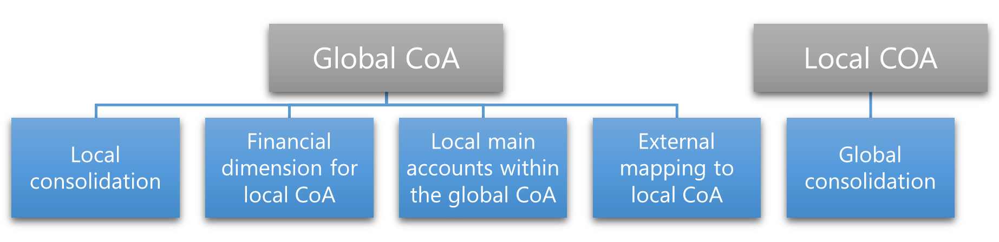

---
# required metadata

title: Plan your local chart of accounts
description: This article provides information that will help you plan the chart of accounts when you have requirements for statutory/local requirements for your organization.
author: VeselinaE
ms.date: 10/07/2021
ms.topic: article
ms.prod: 
ms.technology: 

# optional metadata

ms.search.form: DimensionConfigureAccountStructure, LedgerChartOfAccounts, LedgerConsolidateAccountGroup, MainAccountConsolidateAccount, DimensionDetails, MainAccountDetails
ROBOTS: 
audience: Application User
ms.devlang: 
ms.reviewer: twheeloc
ms.tgt_pltfrm: 
ms.assetid: 10edb129-33f0-4cf9-b2a7-4b7ffa09b229
ms.search.region: Global
ms.search.industry: 
ms.author: veneva
ms.search.validFrom: 10/07/2021
ms.dyn365.ops.version: AX 7.0.0

---

# Plan your local chart of accounts

[!include [banner](../includes/banner.md)]

This article provides information that will help you plan the chart of accounts when your organization includes legal entities that must meet requirements for specific localities where they do business. This article uses the following terms to describe charts of accounts:

- **Global** – The chart of accounts that the organization uses globally. In most cases, you will consolidate to this chart of accounts.
- **Local** – A chart of accounts that legal entities in a specific country or region use.
- **Shared** – A chart of accounts that more than one legal entity can use. Both the global chart of accounts and local charts of accounts can be shared.

You can create and share multiple charts of accounts. A shared chart of accounts can be used by more than one legal entity, but only one chart of accounts can be assigned to each legal entity. The chart of accounts that a legal entity uses is defined on the **Ledger** page.

When they design the chart of accounts, many organizations aim for a global chart of accounts. The shared chart of accounts capability allows for the creation of a global chart of accounts. There are benefits to creating and using a single chart of accounts. For example, governance and control, maintenance, and reporting are easier.

Most organizations prefer a global chart of accounts, and it's the easiest type to implement. Nevertheless, some legal entities require a local chart of accounts for the following reasons:

- Local statutory requirements
- Requirements of local accounting standards
- Industry requirements
- Company-specific reporting and analysis requirements

If your organization requires that a legal entity use a local chart of accounts, two options are available for implementing it:

- Assign the global chart of accounts, and define other means of meeting the local requirements.
- Assign a local chart of accounts to the legal entity, and define relations to the global chart of accounts.

The organization structure and the reporting structure determine the option that is used.

If the global chart of accounts is assigned to the legal entity, the following options are available for meeting local reporting requirements:

- Do local consolidation.
- Use a financial dimension to track the local chart of accounts.
- Create local main accounts in the global chart of accounts.
- Do external mapping to the local chart of accounts.

If a local chart of accounts is assigned to the legal entity, the only option that's currently available for meeting global reporting requirements is global consolidation.

## Global chart of accounts assigned to a legal entity

If you must assign the global chart of accounts to a legal entity, four options are available for configuring the system, as described earlier. For all four options, a single chart of accounts is configured and linked to each legal entity on the **Ledger** page. Each option then uses a different approach to meet the localization requirements. The following sections outline the high-level steps to configure the system for the localization requirements. They also describe the advantages and disadvantages of each option.

### Do local consolidation

Local consolidation is the recommended approach for meeting local chart of account requirements and taking advantage of the system functionality that was designed for this purpose.

#### Set up consolidation for a local chart of accounts

1. Create a single global chart of accounts that includes all the required main accounts.
2. In each legal entity, assign the global chart of accounts on the **Ledger** page.
3. Create a consolidation legal entity for each localization that is required.
4. Follow one of these steps:

    - If only one localization is required, configure the consolidation account on the **Main account** page, or use the **Consolidation groups** and **Additional consolidation accounts** pages.
    - If more than one localization is required, or if both the account number and the account name require translation, use the **Consolidation groups** and **Additional consolidation accounts** pages to represent the localization requirements.

5. Run the consolidation process to transform the value from the source legal entity that uses the global chart of accounts to the consolidation company that uses the local chart of accounts.

#### Advantages

- This approach provides a consistent way of working across the organization.
- One translation of the local position is done.
- This approach supports translation of both the main account ID and the name of each main account.
- It supports multiple localizations.

#### Disadvantages

- An additional consolidation company is created.
- An additional consolidation process is completed.
- This approach can report on the localized chart only after the consolidation process is completed.

### Use a financial dimension to track the local chart of accounts

This approach uses a financial dimension where the financial dimension values represent the local main accounts that are required for the localization. It works well if only one localization is required. However, it becomes less usable as you add more localizations and financial dimensions.

#### Set up a financial dimension for a local chart of accounts

1. Create a single global chart of accounts that includes all the required main accounts.
2. In each legal entity, assign the global chart of accounts on the **Ledger** page.
3. Create a financial dimension that represents the local chart of accounts.
4. Create financial dimension values that represent the main accounts in the local chart of accounts.
5. Update the account structure so that it includes the "local chart of accounts" financial dimension.
6. Ensure that the "local chart of accounts" financial dimension always has a value, and that it doesn't allow a blank value. Consider using derived dimensions or fixed dimensions.
7. Create a financial dimension set where the "local chart of accounts" financial dimension is the first selected financial dimension. The financial dimension set can be used when the trial balance is generated.

#### Advantages

- The main accounts of both global and local charts of accounts exist on the transaction level. The main account is global, and the financial dimension value is local.
- This approach provides real-time reporting and views of both the global finance position and the local finance position.

#### Disadvantages

- In General ledger parameters, if the **Values used for summary account** field is set to **Accounting distributions**, the financial dimensions that represent the main account for the expense/asset/revenue will be incorrectly used for the Accounts receivable and Accounts payable summary account. We recommended that you set the field to a source document instead to ensure that the correct financial dimension values are used.
- If many local charts of accounts are required, and one financial dimension is used for all of them, the list of financial dimension values that are used can become long and difficult to work with.
- If many local charts of accounts are required, and a separate financial dimension is used to represent each one, the usability and performance of the system can be affected when financial dimensions and financial dimension sets are added.
- We recommend that you carefully consider the number of financial dimensions that you require, the number of values in each one, and the number of financial dimension sets, because all these factors can affect system performance.

### Create local main accounts in the global chart of accounts
In this approach, the local main accounts in the local chart of accounts are included in the global chart of accounts.

#### Set up local main accounts in the global chart of accounts

1. Create a single chart of accounts that includes the main accounts for both the global chart of accounts and the local chart of accounts.
2. In each legal entity, assign the chart of accounts on the **Ledger** page.
3. Create total accounts in the chart of accounts to sum the main accounts that represent the same purpose.
4. Create legal entity overrides on each local account to prevent transactions from other legal entities that the local account wasn't designed for.
5. Create legal entity overrides on each global account to prevent transactions from the localization legal entities.

#### Advantages

- A real-time view of both the global finance position and the local finance position is available on specific reports and in specific views in the system, such as a balance sheet financial report. It can also be accessed by using the **Period** button on the total account.
- You don't have an additional segment in the ledger account.

#### Disadvantages

- Total account use and visibility are limited. For example, total accounts aren't visible on the **Trial balance** list page.
- Maintenance requires additional effort.
- The creation of financial reports requires additional manual effort.

### Do external mapping to the local chart of accounts

Adoption of a global chart of accounts assumes that you're managing the mapping and localizations outside the system. In this approach, you just create a single global chart of accounts in Microsoft Dynamics 365 Finance and handle the requirements outside the system.

#### Set up external mapping to a local chart of accounts

1. Create a single global chart of accounts that includes all the required main accounts.
2. In each legal entity, assign the global chart of accounts on the **Ledger** page.
3. Do the mapping to the local chart of accounts outside Finance.

#### Advantages

- This approach provides unified ways of working across the organization.

#### Disadvantages

- No local reporting from the system is available.
- This approach is prone to error when financial reports are created.

## Local chart of accounts assigned to legal entity

If your organization decides not to use a global chart of accounts across legal entities, a separate chart of accounts is created for each unique local chart of accounts. Each legal entity is then linked to the corresponding chart of accounts on the **Ledger** page.

### Do global consolidation

In this approach, a consolidation company is used to roll up and combine the balances from each source local company into the combined global chart of accounts in the consolidation company. This approach requires that you maintain a mapping of each local chart of accounts to the global chart of accounts in the consolidation company.

#### Set up global consolidation

1. Create a separate chart of accounts for each legal entity that has a different local chart of accounts. If any legal entities have the same local chart of accounts, only one local chart of accounts is required, and it can be shared.
2. In each legal entity, assign the appropriate chart of accounts on the **Ledger** page.
3. Optional: Create a chart of accounts for the global chart of accounts of each consolidation company that has a different global chart of accounts.
4. Create a consolidation legal entity for each consolidation level that is required, and assign the appropriate chart of accounts on the **Ledger** page.
5. Follow one of these steps:

    - If only one consolidation is required, configure the consolidation account on the **Main account** page.
    - If more than one consolidation is required, or if both the account number and the account name require translation, use the **Consolidation groups** and **Additional consolidation accounts** pages to represent the requirements for the global chart of accounts.

6. Run the consolidation process to transfer the balances from the local legal entities to the consolidated legal entity. This consolidated legal entity uses the consolidation accounts that you defined in step 5.

#### Advantages

- The local accounting standards format is applied natively.
- This approach gives the local finance team an easier way to work.

#### Disadvantages

- No real-time view of the global position is available.
- The consolidation process might be run more often.

## Additional resources

- [Plan your chart of accounts](plan-chart-of-accounts.md)
- [Configure ledgers](configure-ledger.md)
- [Financial dimensions and posting](Default-dimensions.md#balancing-dimension)
- [Financial dimension sets](financial-dimension-sets.md)
- [Consolidation and elimination overview](../budgeting/consolidation-elimination-overview.md)
- [Consolidation account groups and additional consolidation accounts](../budgeting/consolidation-account-groups-consolidation-accounts.md)

[!INCLUDE[footer-include](../../includes/footer-banner.md)]
