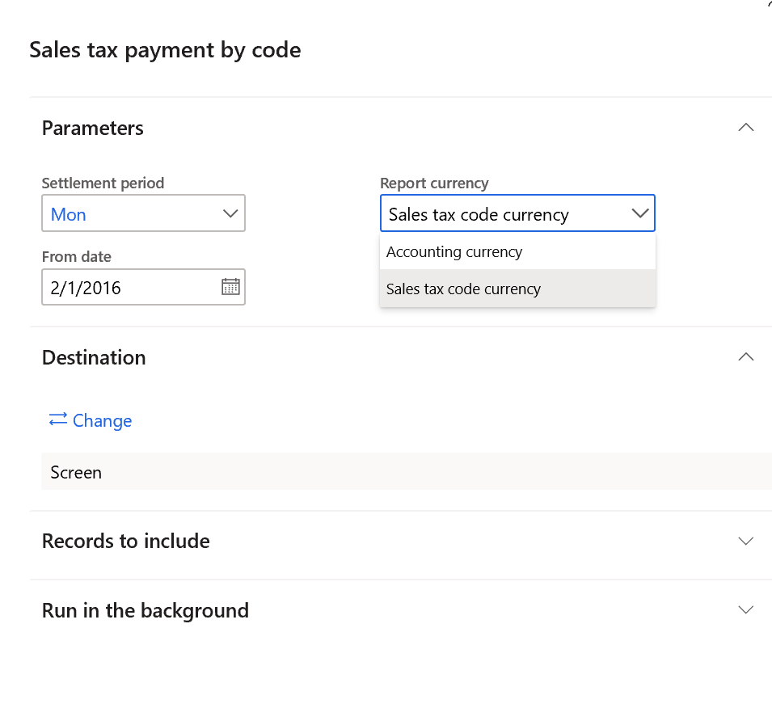
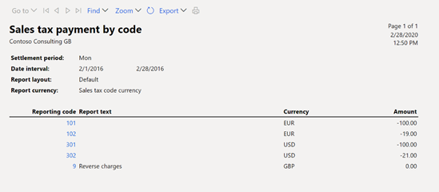

---
# required metadata
title: Print the Sales tax payment by code report 
description: This topic provides information about the settings and actions that are required to print the Sales tax payment by code report in the accounting or tax code currency.
author: anasyash
ms.date: 05/27/2020
ms.topic: article
ms.prod: 
ms.technology: 

# optional metadata
ms.search.form:  
audience: Application User
# ms.devlang: 
ms.reviewer: kfend
# ms.tgt_pltfrm: 
# ms.custom: 
ms.search.region: Global
# ms.search.industry: 
ms.author: anasyash
ms.search.validFrom: 2020-04-08
ms.dyn365.ops.version: 10.0.11

---

# Print the Sales tax payment by code report 

[!include [banner](../includes/banner.md)]

To print the **Sales tax payment by code** report, go to **Tax** \> **Inquiries and reports** \> **Sales tax reports** \> **Sales tax payment by code**. By default, report amounts are generated in the accounting currency of the legal entity for all reporting codes that are set up on the **Sales tax reporting codes** page.

You can also generate this report so that it shows the sales tax payment amounts in the currencies of sales tax codes for all reporting codes that are assigned to sales tax codes on the **Sales tax codes** page.

## Turn on the feature

In the **Feature management** workspace, turn on the following feature: **Generate the Sales tax payment by code report in the sales tax code currency**.

## Run the report

1. Go to **Tax** \> **Inquiries and reports** \> **Sales tax reports** \> **Sales tax payment by code**.
2. In the **Report currency** field, select one of the following values:

    - **Accounting currency** – Print the report amounts in the accounting currency.
    - **Sales tax code currency** – Print the report amounts in the currencies of sales tax codes.

    

The following illustration shows an example of the report that is generated. The report shows that reporting code **101** has the **EUR** currency if the **Sales tax currency** field is set to **EUR** for the sales tax code that the reporting code is assigned to.

[!INCLUDE[footer-include](../../includes/footer-banner.md)]