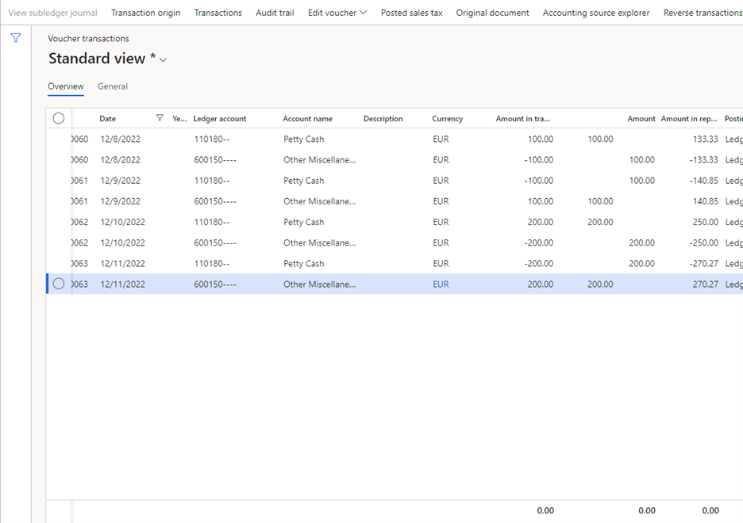
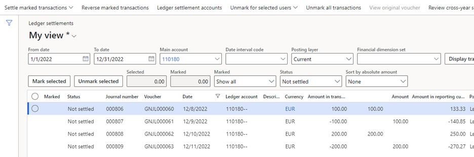
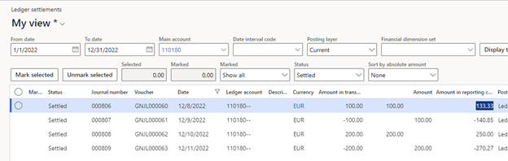
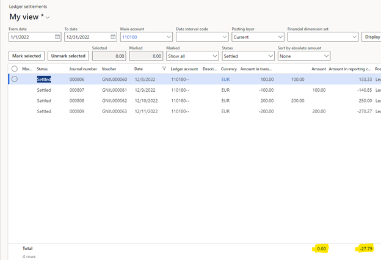
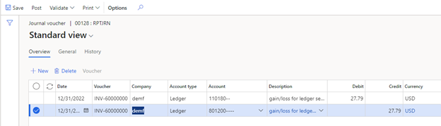
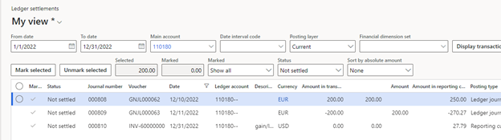
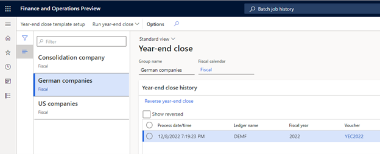

# Reporting currency out of balance when the year-end close is run

> [Note]
> Beginning in Dynamics 365 Finance version 10.0.40, the **Awareness between ledger settlement** feature, along with its associated features **Automate ledger settlement process** and **Post foreign currency realized gains/losses for ledger settlements**, can be found on the **General Ledger parameters**, specifically under the **Ledger settlements** tab. These features are managed through parameters titled **Enable advanced awareness options**, **Enable process automation for ledger settlement**, and **Enable post currency realized gains/losses for ledger settlements** respectively.

After you select the **Enable advanced awareness options** parameter, ledger transactions that have been settled will no longer be included in the opening balance of the next fiscal year when the general ledger year-end close is run. The exclusion of ledger transactions that are settled might present a challenge for customers at year-end close if a reporting currency is defined for the ledger.

Ledger settlement is done only for the accounting currency. When ledger transactions are settled, validation confirms only that the accounting currency debits equal the accounting currency credits. The reporting currency amounts for those ledger transactions aren't validated, and debits might not equal credits for them. In addition, ledger settlement doesn't automatically calculate and post a gain/loss in the reporting currency.

Because of these limitations, a gain/loss transaction must exist in the reporting currency when ledger settlement is done. If no gain/loss is included in the ledger settlement, an out-of-balance message will be shown when the year-end close is run.

The following example goes through the steps for addressing this issue before the year-end close is run.

## Example setup

To set up this example, select the **Enable advanced awareness options** parameter, and set up main account 110180 for ledger settlement. The following illustration shows the ledger transactions that were posted in the DEMF legal entity. The accounting currency for DEMF is US dollars (USD), and the reporting currency is euros (EUR).

The **Ledger settlements** page shows the ledger transactions for main account 110180. Select and hold (or right-click) in the grid, and then select **Insert columns**. Add the **Amount in reporting currency** column so that the transaction currency, accounting currency, and reporting currency amounts are all shown.

The first two ledger transactions for 100.00 EUR are settled as one group, and the next two ledger transactions for 200.00 EUR are settled as another group. (The two transactions will have different settlement IDs.) This setup shows that organizations will have multiple groups of ledger transactions that are settled at different times and have different settlement dates. After settlement is completed, the **Ledger settlements** page shows the following information when it's filtered to show transactions that have a status of **Settled**.

On the **Ledger settlements** page, select and hold (or right-click) in the **Amount** column, and then select **Total this column**. Repeat this step for the **Amount in reporting currency** columns. The accounting currency must have a difference of 0 (zero) for settlement to occur. However, there's no validation of the settlement amount for the reporting currency. The following illustration shows a difference of -27.79 USD for the reporting currency.

## Year-end close

If the year-end close is now run for 2022, the process will end in an out-of-balance error. This error is directly caused by the fact that the reporting currency doesn't have a ledger settlement amount that nets to 0 (zero).

## Posting reporting currency gain/loss

For the year-end close to be run successfully, the difference in the reporting currency amount must be accounted for, typically as a gain or loss, and included in the ledger settlement. The reporting currency gain/loss can be posted multiple ways:

- If the main account is accounts payable or accounts receivable, the AR/AP settlement of those documents will generate the required gain/loss. That accounting entry must be included in the ledger settlement when the corresponding ledger transactions from the invoice, payments, credit notes, and so on, are settled.
- If the main account is any account besides accounts payable or account receivable, the gain/loss must be manually entered. When the gain/loss is posted, the level of detail for the accounting entry is determined by your organization.
- For each main account, identify the reporting currency gain/loss amount that must be posted.

As described earlier, this posting can be done on the **Ledger settlements** page.

1. Filter to the date range that you want to post the gain/loss for. If you plan to post a gain/loss per month, filter for each month. If you plan to post a gain/loss per fiscal year, filter for the whole year.
2. Filter on the main account.
3. Filter on the status, so that only **Settled** transactions are shown.
4. Add a total on the **Amount in reporting currency** column.
5. If you want to post the gain/loss at a more granular level, you can do additional filtering on the settlement ID, financial dimensions, and so on. The total amount for the **Amount in reporting currency** column represents the amount that the gain/loss will be posted for.
6. Go to **General ledger \> Journal entries \> Reporting currency adjustment journals**.
7. Enter the transaction for the gain/loss. This journal will post an adjustment only in the reporting currency. The transaction currency and accounting currency amounts that are posted are always 0 (zero). If this journal hasn't been used before, you might have to create a journal name that has a journal type of **Reporting currency adjustment** at **General ledger \> Journal setup \> Journal names**.
8. If the main account doesn't allow for manual entry, this adjustment won't be posted. Therefore, you might have to temporarily turn off the **Do not allow manual entry** parameter on the **Main account** page.

After you post the adjustment journal, return to the **Ledger settlements** page, and select the main account that you posted the gain/loss for. The gain/loss adjustment must be included in a ledger settlement. Because the reporting currency amount doesn't have to net to 0 (zero), you can unsettle any previous transactions and then settle them again, but include the gain/loss this time. How precise you want to be for the posting of the gain/loss and the settlement of that gain/loss in ledger settlements is up to your organization.

The following illustration shows that the transactions for 200 EUR were unsettled and then marked for settlement again. This time, they will include the gain/loss adjustment.

After the transactions are settled, change the **Status** filter so that the page shows **Settled** transactions. The total for the **Amount in reporting currency** column is now 0 (zero). The year-end close can now be run successfully.

