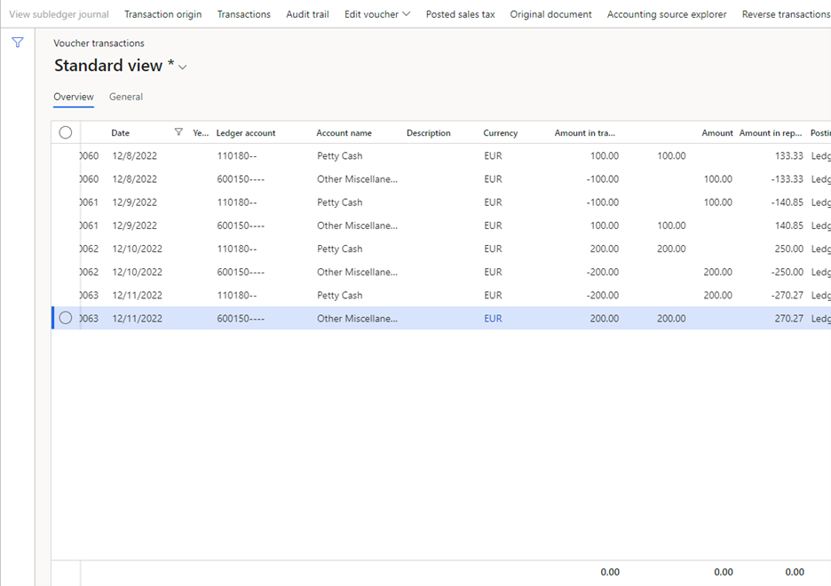
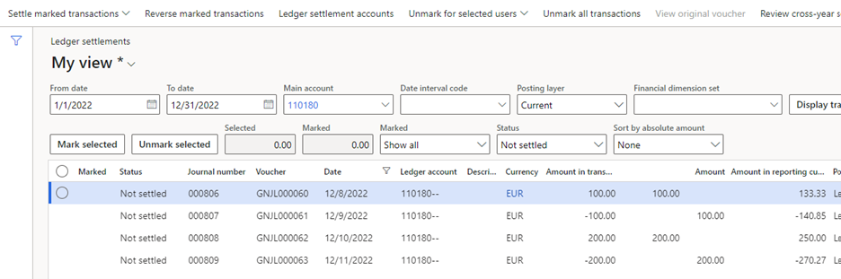
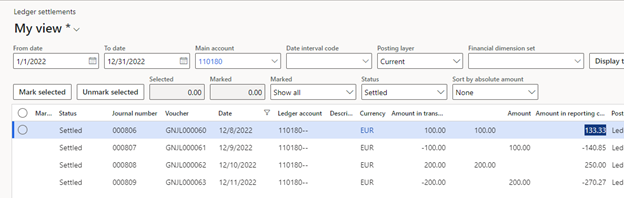
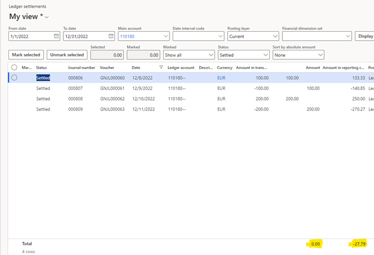
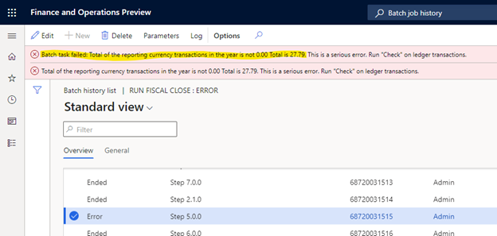
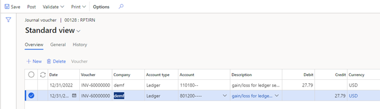
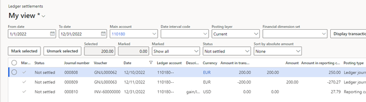
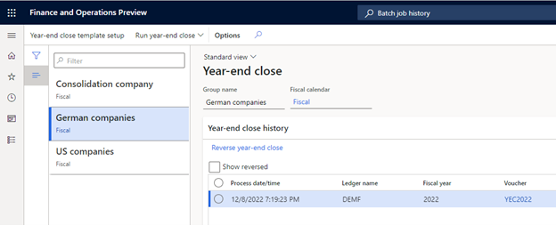

# Reporting currency out of balance when the year-end close is run

The **Awareness between ledger settlement** feature, along with its associated features **Automate ledger settlement process** and **Post foreign currency realized gains/losses for ledger settlements**, is found on the **General Ledger parameters**, specifically under the **Ledger settlements** tab. Manage these features through the **Enable advanced awareness options**, **Enable process automation for ledger settlement**, and **Enable post currency realized gains/losses for ledger settlements** parameters.

When you select the **Enable advanced awareness options** parameter, settled ledger transactions no longer appear in the opening balance of the next fiscal year when the general ledger year-end close runs. The exclusion of settled ledger transactions might present a challenge for customers at year-end close if a reporting currency is defined for the ledger.

Ledger settlement is done only for the accounting currency. When you settle ledger transactions, validation confirms only that the accounting currency debits equal the accounting currency credits. The reporting currency amounts for those ledger transactions aren't validated, and debits might not equal credits for them. In addition, ledger settlement doesn't automatically calculate and post a gain or loss in the reporting currency.

Because of these limitations, a gain or loss transaction must exist in the reporting currency when ledger settlement is done. If you don't include a gain or loss in the ledger settlement, an out-of-balance message appears when the year-end close runs.

The following example goes through the steps for addressing this issue before the year-end close runs.

## Example setup

To set up this example, select the **Enable advanced awareness options** parameter, and set up main account 110180 for ledger settlement. The following illustration shows the ledger transactions that you posted in the DEMF legal entity. The accounting currency for DEMF is US dollars (USD), and the reporting currency is euros (EUR).

The **Ledger settlements** page shows the ledger transactions for main account 110180. Select and hold (or right-click) in the grid, and then select **Insert columns**. Add the **Amount in reporting currency** column so that the transaction currency, accounting currency, and reporting currency amounts are all shown.

The first two ledger transactions for 100.00 EUR are settled as one group, and the next two ledger transactions for 200.00 EUR are settled as another group. (The two transactions have different settlement IDs.) This setup shows that organizations have multiple groups of ledger transactions that are settled at different times and have different settlement dates. After settlement is completed, the **Ledger settlements** page shows the following information when it's filtered to show transactions that have a status of **Settled**.

On the **Ledger settlements** page, select and hold (or right-click) in the **Amount** column, and then select **Total this column**. Repeat this step for the **Amount in reporting currency** columns. The accounting currency must have a difference of 0 (zero) for settlement to occur. However, there's no validation of the settlement amount for the reporting currency. The following illustration shows a difference of -27.79 USD for the reporting currency.

## Year-end close

If you run the year-end close for 2022, the process ends in an out-of-balance error. This error occurs because the reporting currency doesn't have a ledger settlement amount that nets to 0 (zero).

## Posting reporting currency gain or loss

For the year-end close to run successfully, you must account for the difference in the reporting currency amount, typically as a gain or loss, and include it in the ledger settlement. You can post the reporting currency gain or loss in several ways:

- If the main account is accounts payable or accounts receivable, the AR/AP settlement of those documents generates the required gain or loss. Include that accounting entry in the ledger settlement when you settle the corresponding ledger transactions from the invoice, payments, credit notes, and so on.
- If the main account is any account besides accounts payable or account receivable, enter the gain or loss manually. When you post the gain or loss, your organization determines the level of detail for the accounting entry.
- For each main account, identify the reporting currency gain or loss amount that you must post.

As described earlier, you can perform this posting on the **Ledger settlements** page.

1. Filter to the date range that you want to post the gain or loss for. If you plan to post a gain or loss per month, filter for each month. If you plan to post a gain or loss per fiscal year, filter for the whole year.
1. Filter on the main account.
1. Filter on the status, so that only **Settled** transactions are shown.
1. Add a total on the **Amount in reporting currency** column.
1. If you want to post the gain or loss at a more granular level, you can do additional filtering on the settlement ID, financial dimensions, and so on. The total amount for the **Amount in reporting currency** column represents the amount that the gain or loss will be posted for.
1. Go to **General ledger \> Journal entries \> Reporting currency adjustment journals**.
1. Enter the transaction for the gain or loss. This journal posts an adjustment only in the reporting currency. The transaction currency and accounting currency amounts that are posted are always 0 (zero). If this journal isn't used before, you might have to create a journal name that has a journal type of **Reporting currency adjustment** at **General ledger \> Journal setup \> Journal names**.
1. If the main account doesn't allow for manual entry, you can't post this adjustment. Therefore, you might have to temporarily turn off the **Do not allow manual entry** parameter on the **Main account** page.

After you post the adjustment journal, return to the **Ledger settlements** page, and select the main account that you posted the gain or loss for. The gain or loss adjustment must be included in a ledger settlement. Because the reporting currency amount doesn't have to net to 0 (zero), you can unsettle any previous transactions and then settle them again, but include the gain or loss this time. How precise you want to be for the posting of the gain or loss and the settlement of that gain or loss in ledger settlements is up to your organization.

The following illustration shows that the transactions for 200 EUR were unsettled and then marked for settlement again. This time, they include the gain or loss adjustment.

After the transactions are settled, change the **Status** filter so that the page shows **Settled** transactions. The total for the **Amount in reporting currency** column is now 0 (zero). The year-end close can now run successfully.

